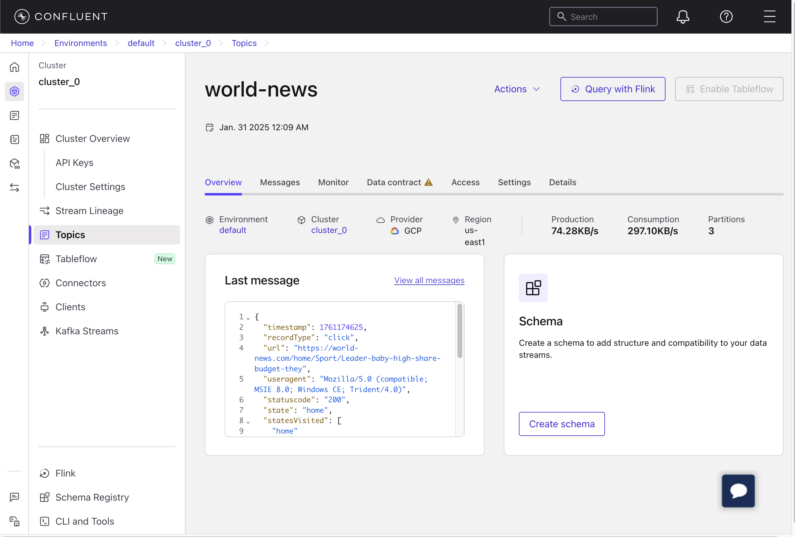
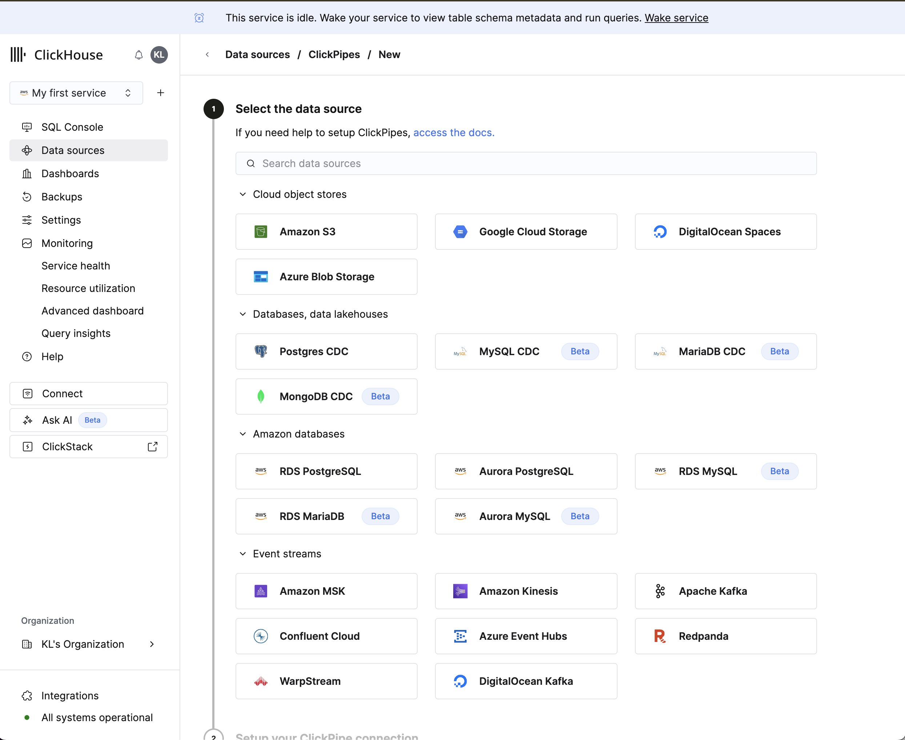
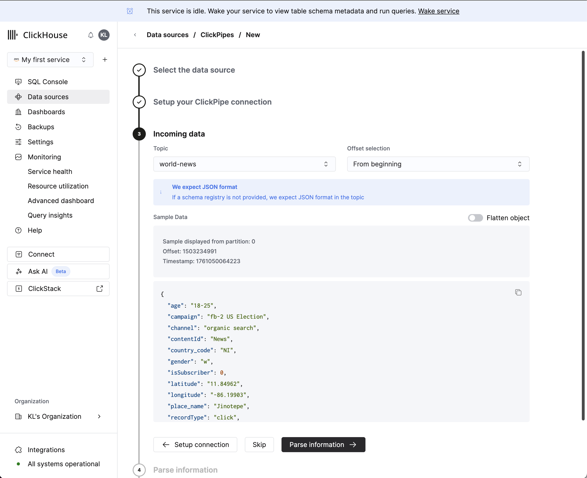
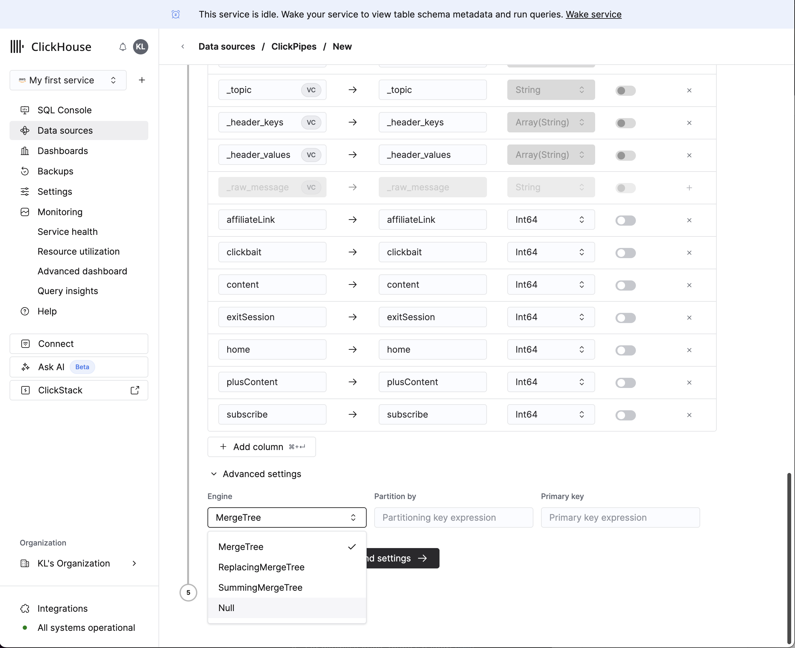
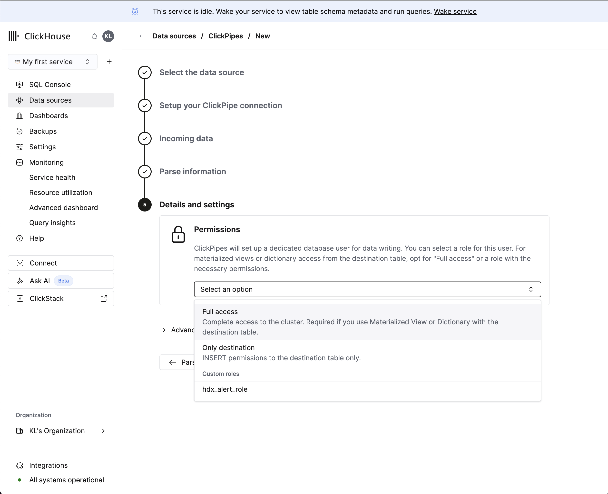
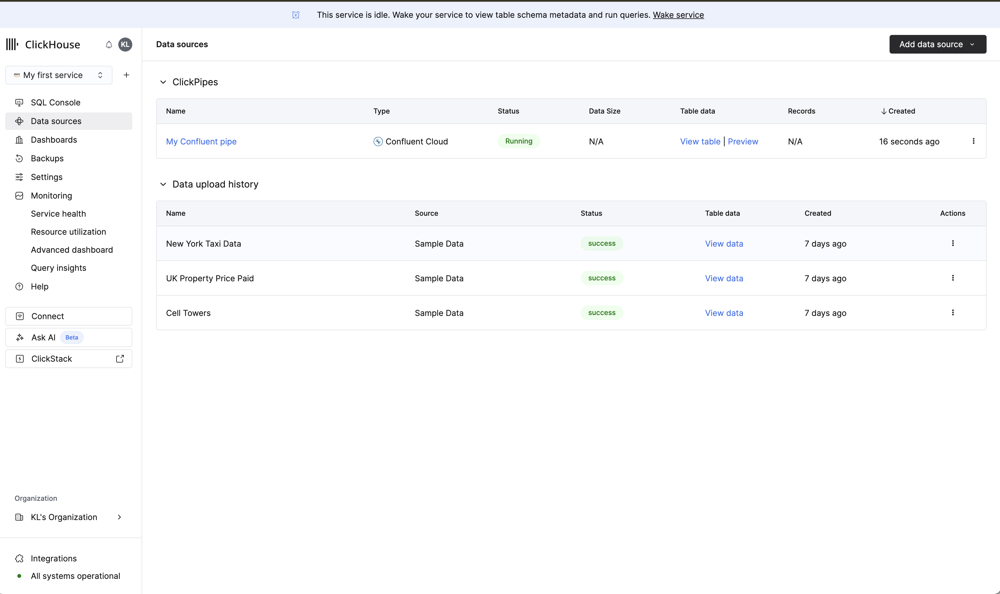
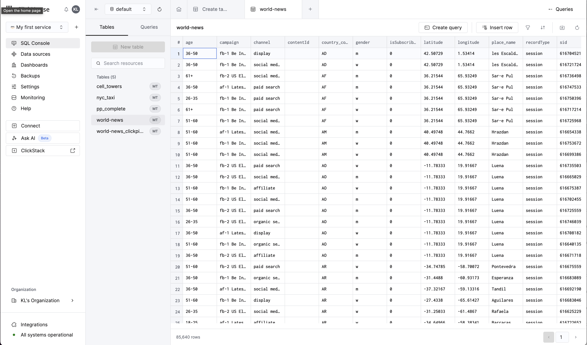

# Ingesting Kafka with ClickPipes

[English](#english) | [한국어](#한국어)

---

## English

> **Migrated, not verified.** Moved on 2026-10-06 from the author's notes site (clickhouse.kr), as written there. The steps and numbers have not been re-run in this repository. The English text is an LLM-assisted translation of the Korean original.

> **Related notes** (Korean): [ClickPipes 소개](https://clickhouse.litkhai.dev/articles/cloud/clickpipes/)

### Introduction to ClickPipes

ClickPipes introduction

As covered in the previous post, ClickPipes is a service attached to ClickHouse Cloud that provides various ingestion pipes as a managed service.

This post looks at how to ingest real-time data into ClickHouse Cloud using Kafka as the data source. Kafka is a distributed messaging system for large-scale real-time data streaming, and ClickPipes makes it easy to connect it to ClickHouse.

### Ingesting Kafka data

ClickPipes is not the only way to ingest Kafka data into ClickHouse. The official documentation summarizes the options as follows. https://clickhouse.com/docs/integrations/kafka

#### Three ways to ingest Kafka data into ClickHouse

According to the official ClickHouse documentation, there are three main ways to ingest Kafka data into ClickHouse:

##### 1. ClickPipes for Kafka

- **Description:** A fully managed integration platform provided by ClickHouse Cloud
- **Key features:**
    - Optimized for ClickHouse Cloud, giving the best performance
    - Horizontal and vertical scalability for high throughput
    - Built-in automatic retries and failure recovery
    - Deployment and management through UI, API and Terraform
    - Secure connections through IAM authentication and PrivateLink
    - Supports serialization formats such as JSON and Avro
- **Recommended for:** The recommended option for ClickHouse Cloud users
- **Limitations:** Cannot push data to Kafka; at-least-once semantics

##### 2. Kafka Connect Sink

- **Description:** An open-source framework for data integration between Apache Kafka and other data systems
- **Key features:**
    - Can support exactly-once semantics
    - Fine-grained control over data transformation, batching and error handling
    - Can be deployed in private networks
    - Supports serialization formats such as JSON, Avro and Protobuf
    - Enables real-time database replication through Debezium
- **Recommended for:** When high configurability is needed or Kafka Connect is already in use
- **Limitations:** Cannot push data to Kafka; complex to set up and maintain; requires Kafka Connect expertise

##### 3. Kafka Table Engine

- **Description:** A Kafka table engine bundled with ClickHouse
- **Key features:**
    - Supports both reading from and writing to Kafka
    - Included in open-source ClickHouse, so available in every deployment type
    - Supports serialization formats such as JSON, Avro and Protobuf
    - Relatively simple to set up
- **Recommended for:** Self-hosted ClickHouse where a low barrier to entry is needed, or when you need to write data to Kafka
- **Limitations:** At-least-once semantics; limited horizontal scalability; limited error handling and debugging options

##### Guide to choosing a method

- **ClickHouse Cloud users:** ClickPipes for Kafka is recommended (fully managed, best performance)
- **When fine-grained control is needed:** Kafka Connect Sink is recommended
- **Self-hosted environments, or when you need to write data to Kafka:** Kafka Table Engine is recommended

### Hands-on environment

To keep the implementation simple, this exercise uses Confluent Kafka together with ClickPipes for Kafka.

#### Setting up the Confluent Kafka environment

To set up Confluent Kafka, first create a Confluent Cloud account and configure a cluster. Then create a topic and issue an API key, which completes the preparation for connecting to ClickHouse Cloud.

#### Setting up ClickPipes

In the ClickHouse Cloud console, choose Data sources to see the ClickPipes screen. Select Confluent and proceed.

A window appears for entering the Confluent details; fill in the required information. Because ClickPipes reads the Kafka topic directly, you only need to pass the broker information.

Once all the required information is entered, you can pick one of the topics available in that Confluent account. When you select it, sample data appears.

You can define the schema layout for that message and choose the table engine for it. The engines can be summarized as follows; a later post will cover them in more detail.

- MergeTree: the default table
- ReplacingMergeTree: for requirements such as upserts
- SummingMergeTree: for real-time aggregation
- Null: used only as a landing table, feeding other tables (for example through materialized views)

After this is set, configure the permissions.

You can confirm that the ClickPipe is running.

#### Checking real-time data

You can check the data with an immediate query and run aggregation queries on it.

---

## 한국어

> **이관본, 미검증.** 2026-10-06 작성자의 노트 사이트(clickhouse.kr)에서 원문 그대로 옮겼습니다. 이 저장소에서 단계와 수치를 다시 실행하지 않았습니다. 영어본은 한국어 원문을 LLM 도움으로 번역한 것입니다.

> **관련 글**: [ClickPipes 소개](https://clickhouse.litkhai.dev/articles/cloud/clickpipes/)

### Clickpipes 소개 및 개요

ClickPipes 소개

이전 글에서 소개한 것과 같이 Clickpipes는 다양한 입수 파이프에 대해서 Managed Service로 제공되는 ClickHouse Cloud에 연결된 서비스 입니다. 

이번 글에서는 Kafka를 데이터 소스로 사용하여 ClickHouse Cloud로 실시간 데이터를 입수하는 방법에 대해 알아보겠습니다. Kafka는 대규모 실시간 데이터 스트리밍을 위한 분산 메시징 시스템으로, Clickpipes를 통해 간편하게 ClickHouse와 연동할 수 있습니다.

### Kafka 데이터 입수

Kafka의 데이터를 Kafka로 입수하는 방법은 Clickpipes만 존재하는 것은 아니며, 공식 문서에서는 다음과 같이 정리하여 이를 설명하고 있습니다. https://clickhouse.com/docs/integrations/kafka

#### ClickHouse의 Kafka 데이터 입수 방법 3가지

ClickHouse 공식 문서에 따르면, Kafka 데이터를 ClickHouse로 입수하는 주요 방법은 다음과 같이 3가지로 구분됩니다:

##### 1. ClickPipes for Kafka

- **설명:** ClickHouse Cloud에서 제공하는 완전 관리형(Fully Managed) 통합 플랫폼
- **주요 특징:**
    - ClickHouse Cloud에 최적화되어 최고의 성능 제공
    - 수평 및 수직 확장성으로 높은 처리량 지원
    - 자동 재시도 및 장애 복구 기능 내장
    - UI, API, Terraform을 통한 배포 및 관리
    - IAM 인증 및 PrivateLink를 통한 보안 연결 지원
    - JSON, Avro 등 다양한 직렬화 형식 지원
- **권장 사용:** ClickHouse Cloud 사용자에게 권장되는 옵션
- **제한사항:** Kafka로 데이터 푸시 불가, At-least-once 시맨틱스

##### 2. Kafka Connect Sink

- **설명:** Apache Kafka와 다른 데이터 시스템 간의 데이터 통합을 위한 오픈소스 프레임워크
- **주요 특징:**
    - Exactly-once 시맨틱스 지원 가능
    - 데이터 변환, 배치 처리 및 오류 처리에 대한 세밀한 제어
    - 프라이빗 네트워크 배포 가능
    - JSON, Avro, Protobuf 등 다양한 직렬화 형식 지원
    - Debezium을 통한 데이터베이스 실시간 복제 가능
- **권장 사용:** 높은 구성 가능성이 필요하거나 이미 Kafka Connect를 사용 중인 경우
- **제한사항:** Kafka로 데이터 푸시 불가, 설정 및 유지보수가 복잡, Kafka Connect 전문 지식 필요

##### 3. Kafka Table Engine

- **설명:** ClickHouse에 번들로 제공되는 Kafka 테이블 엔진
- **주요 특징:**
    - Kafka에서 데이터 읽기와 쓰기 모두 지원
    - 오픈소스 ClickHouse에 포함되어 모든 배포 유형에서 사용 가능
    - JSON, Avro, Protobuf 등 다양한 직렬화 형식 지원
    - 설정이 비교적 간단
- **권장 사용:** Self-hosted ClickHouse 환경에서 진입 장벽이 낮은 옵션이 필요하거나, Kafka로 데이터를 쓰기(write)해야 하는 경우
- **제한사항:** At-least-once 시맨틱스, 제한된 수평 확장성, 제한된 오류 처리 및 디버깅 옵션

##### 방법 선택 가이드

- **ClickHouse Cloud 사용자:** ClickPipes for Kafka 권장 (완전 관리형, 최고 성능)
- **세밀한 제어가 필요한 경우:** Kafka Connect Sink 권장
- **Self-hosted 환경 또는 Kafka로 데이터 쓰기가 필요한 경우:** Kafka Table Engine 권장

### 실습 환경

본 실습에서는 간단한 기능 구현을 위하여 Confluent Kafka를 사용하고, Clickpipes for Kafka를 사용할 계획입니다. 

#### Confluent Kafka 환경 설정

Confluent Kafka 환경을 설정하기 위해서는 먼저 Confluent Cloud 계정을 생성하고, 클러스터를 구성해야 합니다. 그 다음 토픽을 생성하고 API Key를 발급받아 ClickHouse Cloud와 연동할 준비를 마칩니다.

#### Clickpipes 설정

ClickHouse Cloud 콘솔에서 Data sources 를 선택하면 Clickpipes 화면을 확인할 수 있습니다. Confluent를 선택하고 다음으로 넘어갑니다.

Confluent 정보를 입력하는 창이 나타나며, 필요한 정보들을 입력합니다. Clickpipes는 Kafka Topic을 바로 읽어들이기 때문에 broker의 정보를 전달해주면 됩니다.

필요한 정보를 모두 입력하고 나면, 해당 Confluent 계정에서 선택 가능한 Topic을 선택할 수 있습니다. 이를 선택하면 샘플 데이터가 나타납니다.

해당 메세지에 대한 스키마 레이아웃을 정의할 수 있으며, 이에 대한 Table Engine을 선택합니다. 각 엔진에 대한 설명은 다음과 같이 요약할 수 있으며, 추후 다른 글에서 더욱 세밀한 내용을 다루도록 하겠습니다.

- MergeTree: 기본 테이블
- ReplacingMergeTree: Upsert 등의 요건에 대응
- SummingMergeTree: 실시간 집계에 대응
- Null: Landing Table로만 활용하고 다른 테이블로 연계 (MView 등)

이를 설정하고 나면 권한 설정을 수행합니다.

Clickpipes가 동작 중인 것을 확인할 수 있습니다.

#### 실시간 데이터 확인

즉각적인 쿼리를 통하여 데이터를 확인하고 이에 대한 집계 쿼리 수행 등의 작업이 가능합니다.

