# Elasticity and Idling in ClickHouse Cloud

[English](#english) | [한국어](#한국어)

---

## English

> **Migrated, not verified.** Moved on 2026-10-06 from the author's notes site (clickhouse.kr), as written there. The steps and numbers have not been re-run in this repository. The English text is an LLM-assisted translation of the Korean original.

This post covers Elasticity and Idling (automatic idle mode), key features of ClickHouse Cloud.

---

---

### 1. Elasticity and automatic idle mode in ClickHouse Cloud

#### 1.1 Background

Elasticity and Idle Mode in ClickHouse Cloud are key features for maximizing cost efficiency and operational efficiency when running a cloud database.

Elasticity is the ability to scale compute resources up or down in response to workload changes, either vertically (to a larger instance) or horizontally (by adding more replicas). ClickHouse Cloud supports both autoscaling and manual scaling on the Scale and Enterprise tiers, and resources are adjusted dynamically to actual usage, which avoids over-provisioning and wasted resources.

Idle Mode (auto idling) is a feature that saves cost by automatically scaling down or pausing compute resources when the database receives no traffic such as queries for a certain period. Thanks to the object-storage-based architecture, data is kept safe even when compute is stopped, and when the user runs a query again, compute is reallocated immediately and the service resumes. As a result, there is no over-allocation of resources for peak load, cost is incurred only when the service is actually used, and operational efficiency improves significantly.

Combining the two, ClickHouse Cloud can deliver optimal performance and cost efficiency from large-scale real-time analytics workloads to intermittent use. Automatic scaling and auto idling reduce the complexity of a managed service, so users can focus on business logic and data analysis.

#### 1.2 Using the features

- **Auto Scaling**: Automatically increases or decreases compute resources with the workload. Cost is optimized to actual usage without over-provisioning for peak.
- **Auto Idling**: Automatically scales down resources when there is no usage to save cost.

The documentation describes autoscaling as starting to scale up when resource usage passes 50%, with the scaled-up resources kept for 30 hours before scaling down again.

#### 1.3 Real-world use

- Global companies such as OpenAI, Anthropic and Tesla use ClickHouse Cloud's large-scale scalability and failure recovery to run petabyte-scale log, metric and real-time data analytics. [OpenHouse introduction]

---

### 2. Main features

#### 2.1. Elasticity

- **Vertical scaling:** Scales the CPU/memory of compute nodes automatically or manually; the Scale/Enterprise tiers support autoscaling.

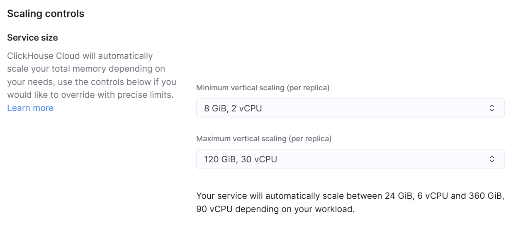

- **Horizontal scaling**: Distributes the workload by adding replicas; the Scale/Enterprise tiers support manual scaling through the UI or API. Up to 20 replicas are supported. [[1]](https://clickhouse.com/docs/cloud/manage/jan-2025-faq/scaling)[[2]](https://clickhouse.com/blog/horizontal-scaling-in-clickHouse-cloud?utm_content=bufferb5b2f&utm_medium=social&utm_source=twitter&utm_campaign=buffer)[[3]](https://clickhouse.com/docs/manage/scaling)
    
    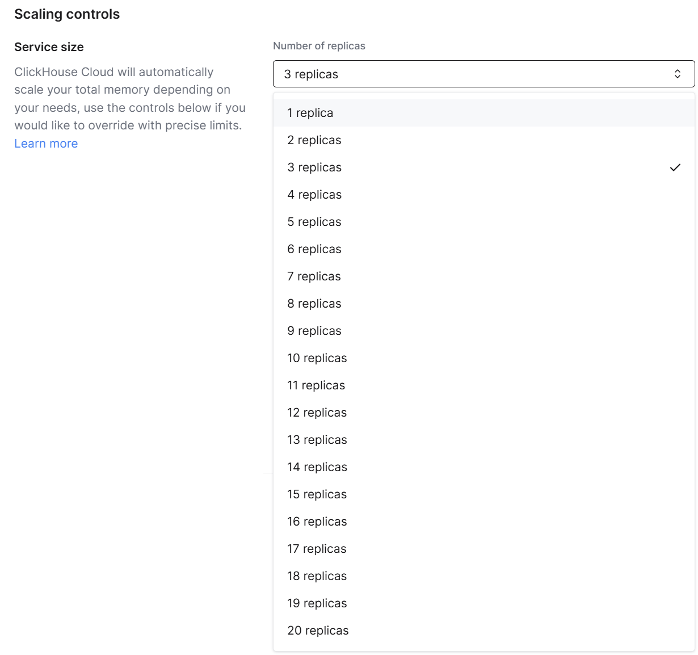
    
- **Make Before Break**: When scaling, new resources are added first and the old ones are then removed safely, guaranteeing non-disruptive scale-out and scale-in[[5]](https://clickhouse.com/blog/make-before-break-faster-scaling-mechanics-for-clickhouse-cloud)[[4]](https://clickhouse.com/docs/manage/scaling).

#### 2.2. Auto Idling

- **Auto idling**: Automatically scales down resources when there is no usage to save cost.[4].

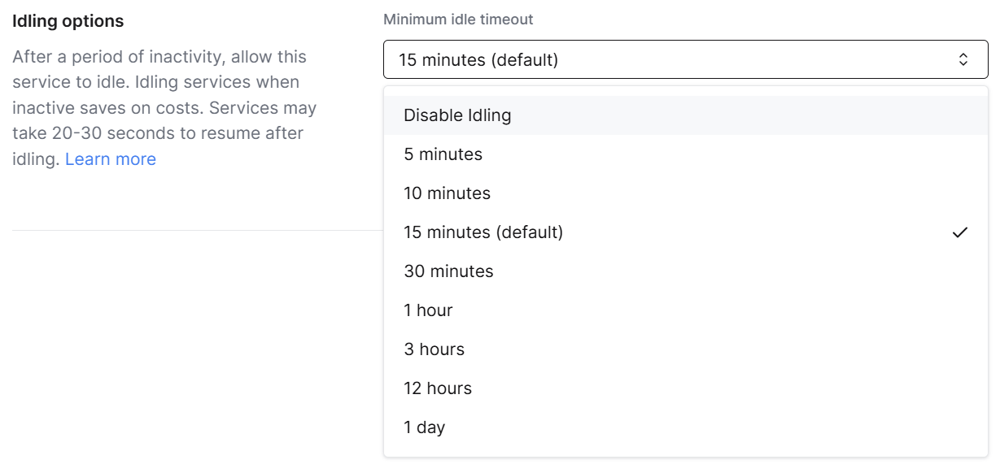

Now let us test these features.

---

### 3. ClickHouse Cloud hands-on

#### 3.1 Preparing the workload (click-benchmark)

- click-benchmark is a tool for testing and benchmarking ClickHouse performance, and it can evaluate ClickHouse's processing performance under various workloads and scenarios. With it, users can practically measure a database's scalability, processing speed and resource utilization. click-benchmark generates test data that reflects real use cases, and helps derive optimal settings by comparing and analyzing query performance and resource consumption.
- It is shipped together with the clickhouse client. It can be installed as follows.
1. To install the latest version (Python 3.8 or later required):

```bash
curl <https://clickhouse.com/> | sh
```

1. **Verify the installation**

```bash
click-benchmark --version
```

1. **Configure the connection to the ClickHouse database**:
Before running it, you need to set the URL, user name, password and so on of the ClickHouse database that `click-benchmark` will connect to. By default, run the command in the following form.

```bash
click-benchmark --host <ClickHouse_URL> --user <user name> --password <password>
```

#### 3.2 Configuring Elasticity and Idling

- Scaling is not available on the most basic plan. Change the plan to Scale.

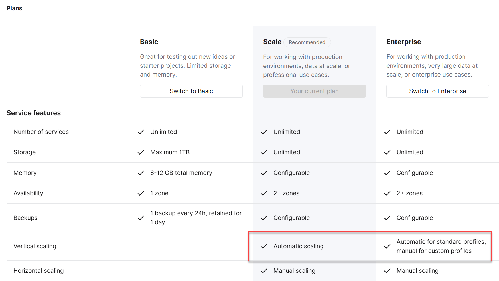

- Once the Scale plan is enabled, you can configure the settings shown below

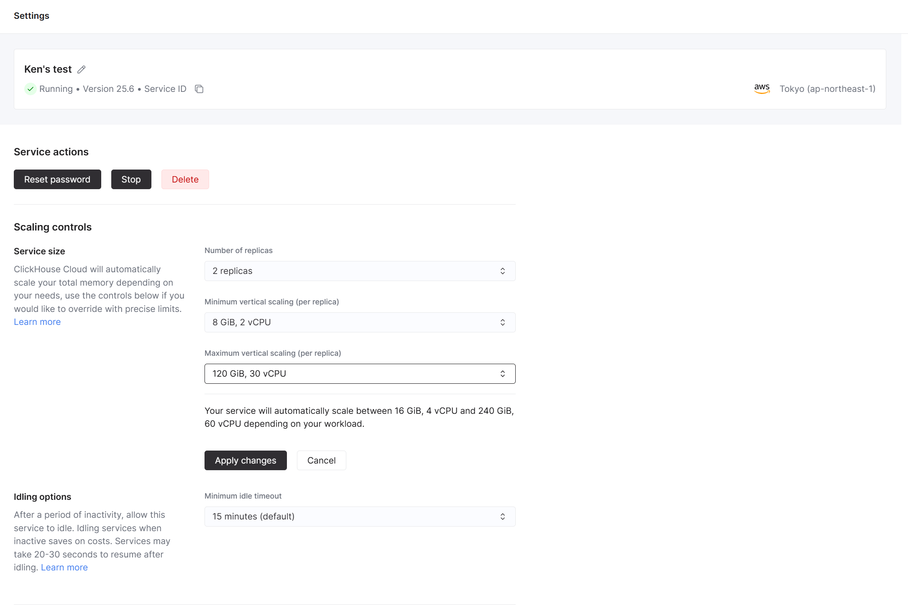

- To make the test more conclusive, the replicas were expanded to 3

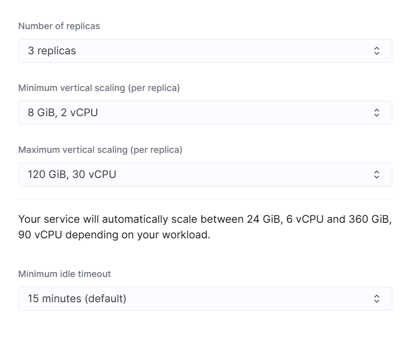

#### 3.3 Running the workload and monitoring scaling

- To run the workload, the TPC-DS dataset was loaded and 5 high-complexity queries were prepared. With click-benchmark they can be run as follows

```bash
  clickhouse-benchmark \
  --host=<ClickHouse_URL> \
  --port=9440 \
  --user=default \
  --password=<password> \
  --secure \
  --database=tpcds \
  --iterations=500 \
  --concurrency=20 \
  --reconnect=1 \
  --randomize \
  --use_uncompressed_cache=0 \
  < queries.sql
```

- When the workload runs, you can see resource utilization rise as shown below

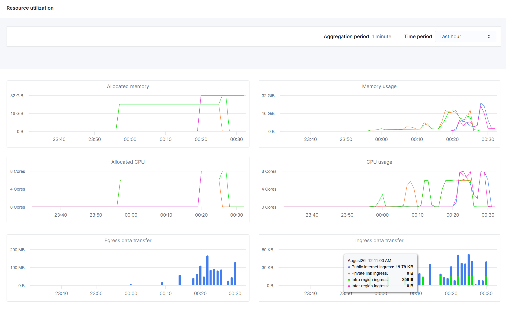

If a sudden workload arrives while load is being applied, failures occur as shown above

- As the workload rises, check Service Health (the workload keeps running)

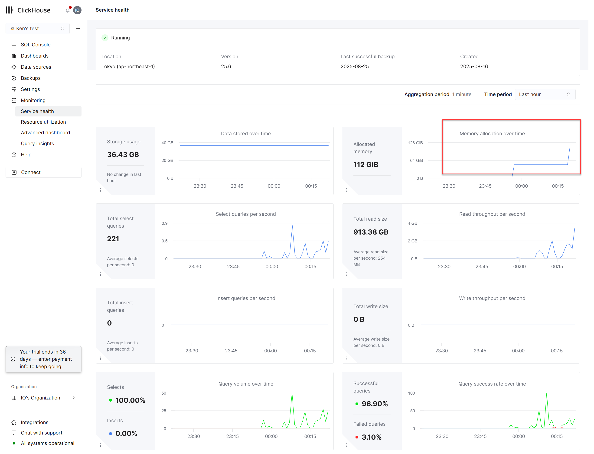

The amount of memory ClickHouse has allocated under the current policy is shown

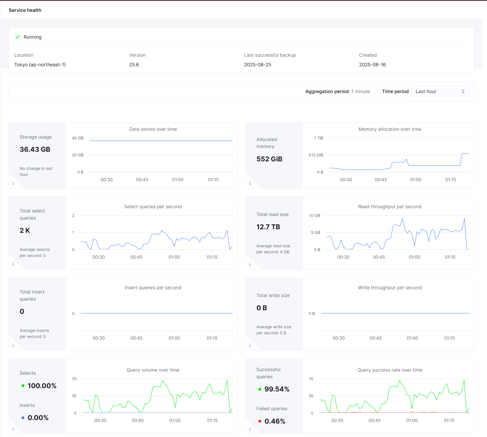

You can see that memory increased right away with the workload

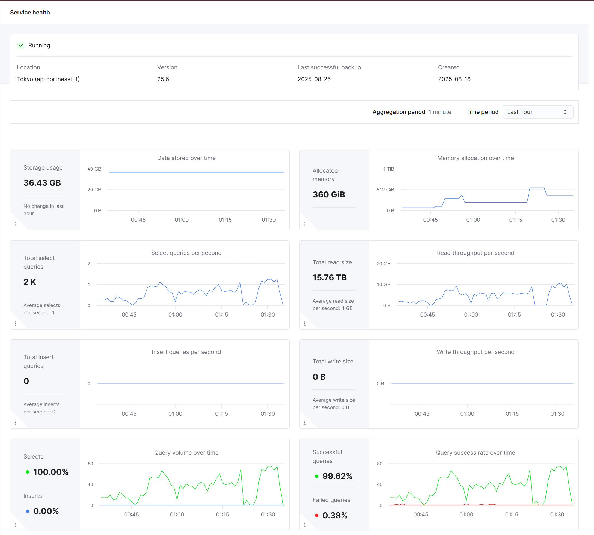

As the workload decreased, the memory that had grown sharply was adjusted down to some extent

- click-benchmark had a few failures, but by running it repeatedly, all of the workload was finally completed

#### 3.4 Confirming the switch to idle mode

- After the default 15 minutes passed, the service switched to idle mode right away, resource usage dropped to 0, and billing stopped.

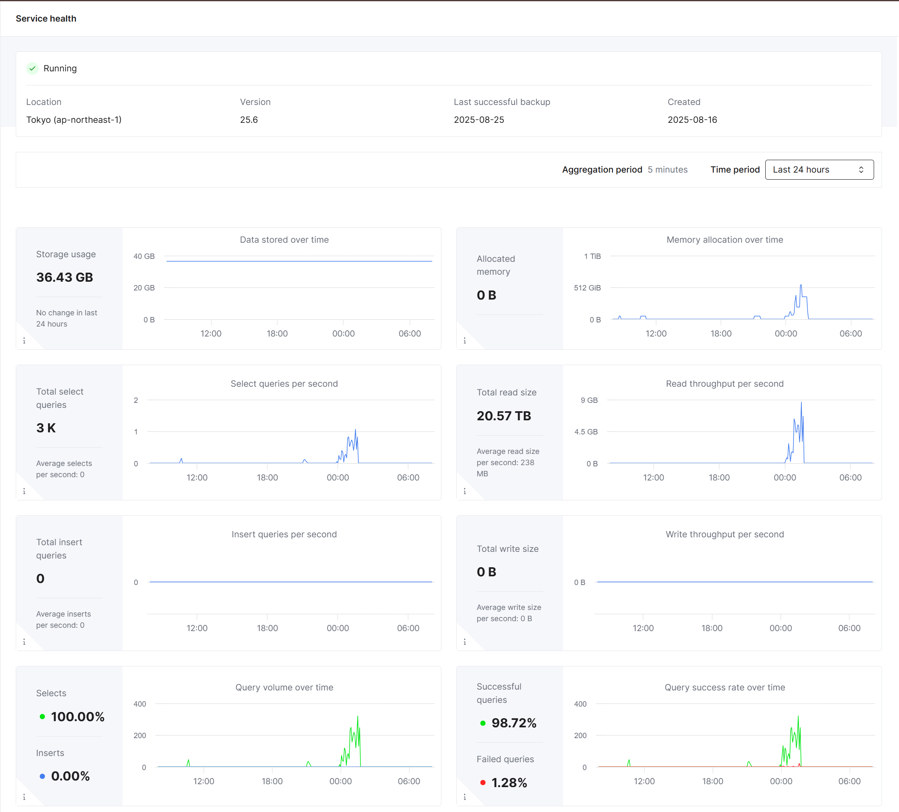

---

### Conclusion

Elasticity and Auto Idling in ClickHouse Cloud are powerful tools for managing cost and resources efficiently when running a cloud database. Elasticity adjusts resources automatically to workload changes, and automatic idle mode is designed to save cost when there is no traffic. Through real cases and hands-on work, we could see how these two features contribute to maximizing operational efficiency and reducing cost. This gives users an environment where they can focus on data analysis and business logic instead of complex administration.

---

## 한국어

> **이관본, 미검증.** 2026-10-06 작성자의 노트 사이트(clickhouse.kr)에서 원문 그대로 옮겼습니다. 이 저장소에서 단계와 수치를 다시 실행하지 않았습니다. 영어본은 한국어 원문을 LLM 도움으로 번역한 것입니다.

ClickHouse Cloud의 주요 기능인 Elasticity(확장성) & Ideling(자동 유휴 모드)에 대해서 다루고자 합니다.

---

---

### 1. ClickHouse Cloud 의 확장성과 자동 유휴모드

#### 1.1 배경

ClickHouse Cloud의 Elasticity(탄력적 확장성)와 Idle Mode(자동 유휴 모드)는 클라우드 데이터베이스 운영에서 비용 효율성과 운영 효율을 극대화하는 핵심 기능입니다.

Elasticity란 서비스의 워크로드 변화에 따라 컴퓨트 리소스를 수직(더 큰 인스턴스로) 또는 수평(더 많은 레플리카 추가)으로 확장하거나 축소할 수 있는 기능을 의미합니다. ClickHouse Cloud는 Scale 및 Enterprise 티어에서 오토스케일링(자동 확장/축소)과 수동 확장 모두 지원하며, 실제 사용량에 따라 리소스가 동적으로 조정되어 과도한 프로비저닝이나 리소스 낭비를 방지합니다.

Idle Mode(오토 아이들링)는 데이터베이스에 쿼리 등 트래픽이 일정 시간 이상 발생하지 않을 경우, 컴퓨트 리소스를 자동으로 축소하거나 일시 중단하여 비용을 절감하는 기능입니다. 오브젝트 스토리지 기반의 아키텍처 덕분에, 컴퓨트가 중단되어도 데이터는 안전하게 보존되며, 사용자가 다시 쿼리를 실행하면 즉시 컴퓨트가 재할당되어 서비스가 재개됩니다. 이로써 Peak 대비 리소스 과잉 할당 없이, 실제 사용 시점에만 비용이 발생하게 되어 운영 효율성이 크게 향상됩니다.

이 두 기능을 결합하면, ClickHouse Cloud는 대규모 실시간 분석 워크로드부터 간헐적 사용까지 모두 최적의 성능과 비용 효율을 제공할 수 있습니다. 자동 스케일링과 오토 아이들링은 관리형 서비스의 복잡성을 줄이고, 사용자는 비즈니스 로직과 데이터 분석에 집중할 수 있게 됩니다

#### 1.2 기능의 활용

- **Auto Scaling**: 워크로드에 따라 자동으로 컴퓨트 리소스를 증감. Peak 대비 과도한 프로비저닝 없이 실제 사용량에 맞춰 비용 최적화합니다.
- **Auto Ideling**: 사용량이 없을 때 리소스를 자동으로 축소하여 비용 절감합니다.

오토 스케일링은 리소스가 사용량이 50%가 넘어가기 시작할 때 자동으로 확장을 시작하며, 확장된 리소스는 30시간 유지된 후 다시 Scale Down 된다고 설명하고 있습니다.

#### 1.3 실사용 사례

- OpenAI, Anthropic, Tesla 등 다양한 글로벌 기업이 ClickHouse Cloud의 대규모 확장성과 장애 복구 능력을 활용하여 페타바이트 규모의 로그, 메트릭, 실시간 데이터 분석을 운영 중입니다. [OpenHouse 소개]

---

### 2. 주요 기능 설명

#### 2.1. 탄력적 확장성 (Elasticity)

- **수직 확장(Vertical Scaling):** 컴퓨트 노드의 CPU/메모리 자원을 자동 또는 수동으로 확장 기능으로, Scale/Enterprise 티어에서는 오토스케일링 지원합니다.


- **수평 확장(Horizontal Scaling)**: 다수의 레플리카를 추가하여 워크로드를 분산 처리하는 방식으로, Scale/Enterprise 티어에서 UI 또는 API를 통한 수동 확장 지원. 최대 20개 레플리카까지 확장 가능합니다. [[1]](https://clickhouse.com/docs/cloud/manage/jan-2025-faq/scaling)[[2]](https://clickhouse.com/blog/horizontal-scaling-in-clickHouse-cloud?utm_content=bufferb5b2f&utm_medium=social&utm_source=twitter&utm_campaign=buffer)[[3]](https://clickhouse.com/docs/manage/scaling)
    
    
    
- **Make Before Break 방식**: 확장 시 신규 리소스를 먼저 추가한 뒤 기존 리소스를 안전하게 제거하여 무중단 확장/축소를 보장[[5]](https://clickhouse.com/blog/make-before-break-faster-scaling-mechanics-for-clickhouse-cloud)[[4]](https://clickhouse.com/docs/manage/scaling).

#### 2.2. 자동 유휴모드 (Auto Ideling)

- **오토 아이들링**: 사용량이 없을 때 리소스를 자동으로 축소하여 비용 절감합니다.[4].


이제 본 기능을 테스트해보도록 하겠습니다.

---

### 3. ClickHouse Cloud 실습

#### 3.1 워크로드 준비 (click-benchmark)

- click-benchmark는 ClickHouse의 성능을 테스트하고 벤치마크를 수행하기 위한 도구로, 다양한 워크로드와 시나리오에서 ClickHouse의 처리 성능을 평가할 수 있습니다. 이를 통해 사용자는 데이터베이스의 확장성, 처리 속도, 리소스 활용 등을 실질적으로 측정할 수 있습니다. click-benchmark는 실제 사용 사례를 반영한 테스트 데이터를 생성하며, 쿼리 성능과 리소스 소모를 비교 분석하여 최적의 설정을 도출하는 데 도움을 줍니다.
- clickhouse client 설치 시 함께 제공됩니다. 다음과 같이 설치 수행이 가능합니다.
1. 최신 버전을 설치하려면 (Python 3.8 이상 필요):

```bash
curl <https://clickhouse.com/> | sh
```

1. **설치 확인**

```bash
click-benchmark --version
```

1. **ClickHouse 데이터베이스 연결 설정**:
실행하기 전에 `click-benchmark`가 연결할 ClickHouse 데이터베이스의 URL, 사용자 이름, 비밀번호 등을 설정해야 합니다. 기본적으로 아래와 같은 형식으로 명령어를 실행합니다.

```bash
click-benchmark --host <ClickHouse_URL> --user <사용자이름> --password <비밀번호>
```

#### 3.2 Elasticity, Ideling 설정

- 스케일링은 가장 기본 플랜에서는 제공되지 않습니다. 플랜을 Scale로 변경해줍니다.


- Scale 플랜을 활성화 하면 아래와 같이 설정이 가능합니다


- 좀 더 확실한 테스트 진행을 위해 Replica를 3개로 확장하였습니다


#### 3.3 워크로드 실행 및 확장성 모니터링

- 워크로드 실행을 위해서 TPC-DS 데이터 셋을 적재하고 5개의 복잡도 높은 쿼리를 설정하였습니다. click-benchmark에서는 다음과 같이 이를 실행할 수 있습니다

```bash
  clickhouse-benchmark \
  --host=<ClickHouse_URL> \
  --port=9440 \
  --user=default \
  --password=<password> \
  --secure \
  --database=tpcds \
  --iterations=500 \
  --concurrency=20 \
  --reconnect=1 \
  --randomize \
  --use_uncompressed_cache=0 \
  < queries.sql
```

- 워크로드를 실행하면 다음과 같이 리소스 사용률이 올라가는 것을 확인할 수 있습니다


부하를 주는 과정에서 급격한 워크로드가 들어오면 위와 같이 실패가 발생합니다

- 워크로드가 올라감에 따라 Service Health를 확인합니다 (워크로드는 지속적으로 수행하고 있습니다)


현재 정책에 따라서 ClickHouse가 할당한 메모리양이 보여집니다


메모리가 워크로드에 따라 바로 늘어난 것을 확인할 수 있습니다


워크로드가 줄어드니, 급격히 늘었던 메모리는 어느 정도 조정되는 모습을 보입니다

- click-benchmark가 몇 번의 실패가 있었지만 반복적으로 수행하여 최종적으로는 모든 워크로드를 수행하는 결과를 확인하였습니다

#### 3.4 자동 유휴 모드 전환 확인

- 기본 설정된 15분의 시간이 흐르고 나니 바로 유휴모드로 전환되어 리소스 사용량이 0으로 떨어지고, 과금이 중단됩니다.


---

### 결론

ClickHouse Cloud의 Elasticity와 Auto Ideling 기능은 클라우드 데이터베이스 운영에서 비용과 리소스를 효율적으로 관리할 수 있는 강력한 도구입니다. 탄력적 확장성은 워크로드 변화에 따라 자원을 자동으로 조정해주며, 자동 유휴 모드는 트래픽이 없을 때 비용을 절감할 수 있도록 설계되었습니다. 실제 사례와 실습을 통해 이 두 기능이 실질적으로 운영 효율성을 극대화하고 비용을 감소시키는 데 어떻게 기여하는지 확인할 수 있었습니다. 이를 통해 사용자는 복잡한 관리 작업 대신 데이터 분석과 비즈니스 로직에 집중할 수 있는 환경을 제공받을 수 있습니다.
