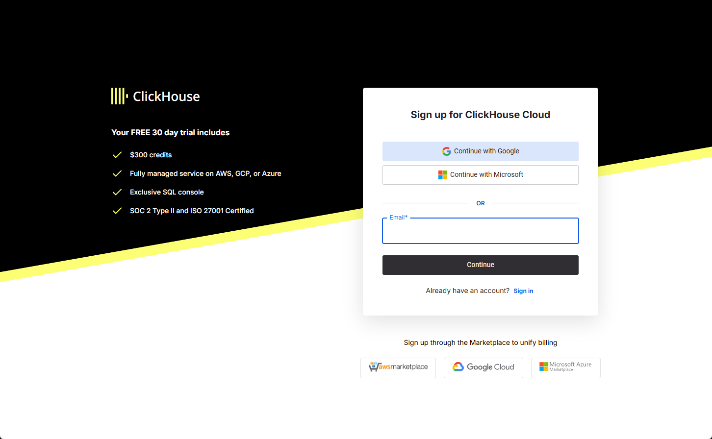
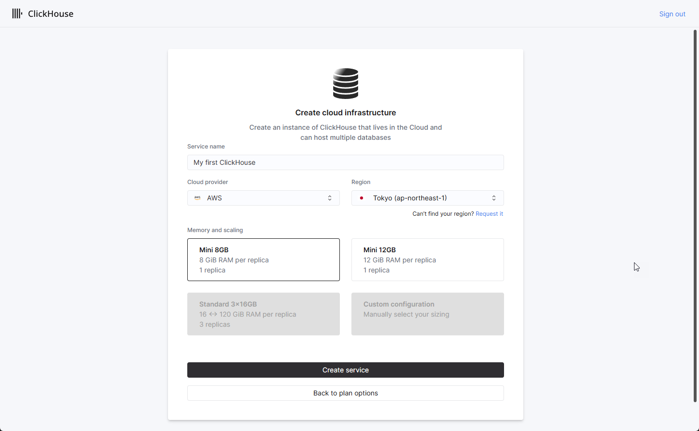
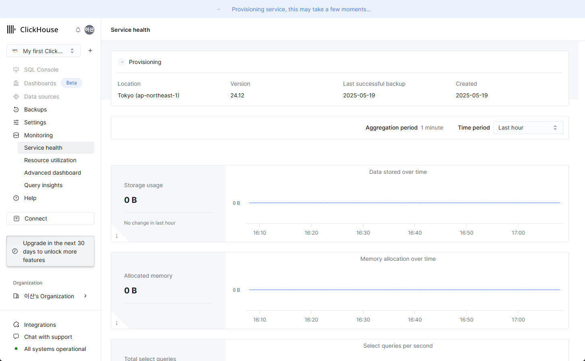
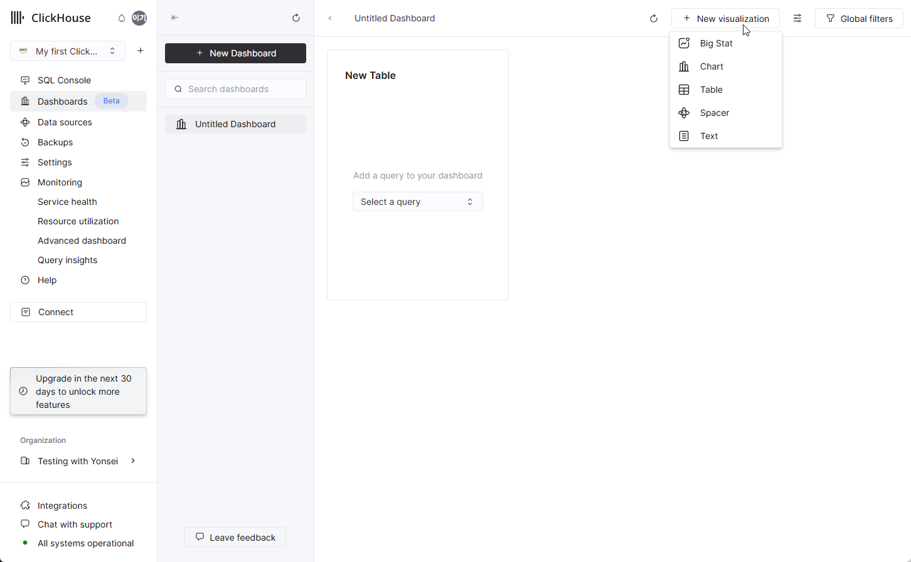
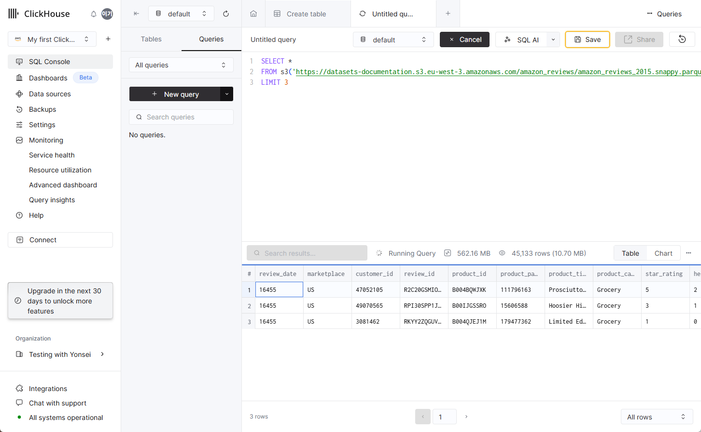
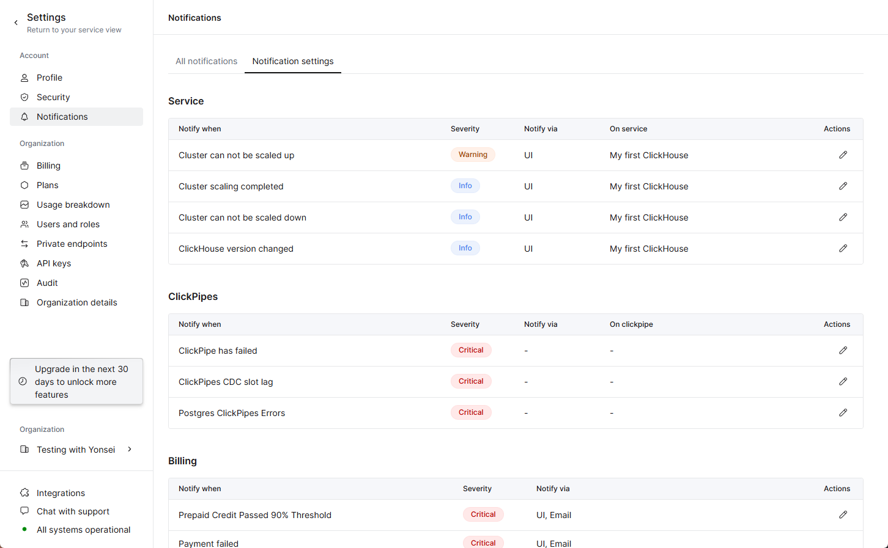
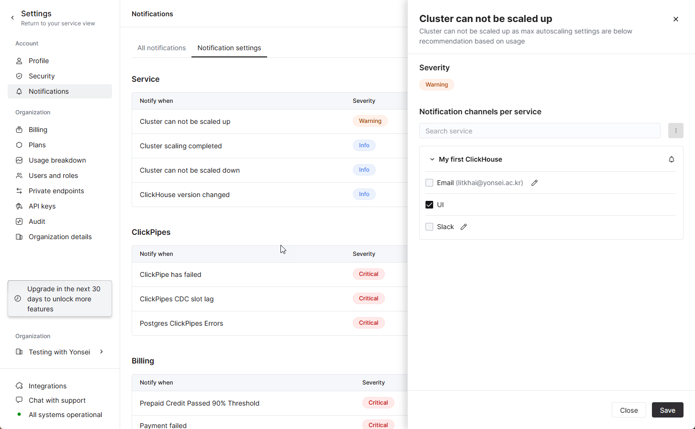
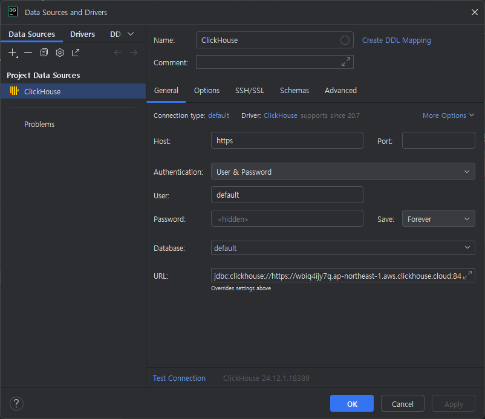

# Getting Started with ClickHouse Cloud

[English](#english) | [한국어](#한국어)

---

## English

> **Migrated, not verified.** Moved on 2026-10-06 from the author's notes site (clickhouse.kr), as written there. The steps and numbers have not been re-run in this repository. The English text is an LLM-assisted translation of the Korean original.

### What is ClickHouse Cloud?

ClickHouse Cloud is a fully managed cloud service that makes the high-performance analytical database ClickHouse easy to use. This guide goes step by step from creating a ClickHouse Cloud account to setting up your first database. With ClickHouse Cloud you can use powerful analytical features without managing complex infrastructure.

#### ClickHouse Cloud history and major updates

ClickHouse was first released as open source by Yandex in 2016, and ClickHouse Cloud became generally available in October 2022.

##### Major updates

- October 2022: ClickHouse Cloud generally available - the service started on AWS
- Q2 2023: Google Cloud Platform (GCP) support added
- Q4 2023: support extended to the Microsoft Azure platform
- 2024: advanced security and enterprise-grade features strengthened

#### Background of the ClickHouse Cloud test

##### Free credits for ClickHouse Cloud

ClickHouse Cloud gives new users free credits worth 300 dollars. The credits can be used for 30 days after the account is created, and you can test all features of the service without restriction. The free credits let you experience the performance and features of ClickHouse Cloud in a real environment.

##### ClickHouse Cloud regions

**AWS (Amazon Web Services) regions**

- US East (N. Virginia) - us-east-1
- US West (Oregon) - us-west-2
- Europe (Frankfurt) - eu-central-1
- Asia Pacific (Singapore) - ap-southeast-1

**GCP (Google Cloud Platform) regions**

- US Central (Iowa) - us-central1
- Europe (Belgium) - europe-west1
- Asia East (Tokyo) - asia-northeast1

**Azure (Microsoft Azure) regions**

- East US - eastus
- West Europe - westeurope
- East Asia - eastasia

Each region provides:

- multi-availability-zone (AZ) support for high availability
- regional data storage for data sovereignty and compliance
- low latency and fast data access
- automatic backup and disaster recovery

So in this environment we test with ClickHouse's free credits in the AWS Tokyo region.

### Provisioning ClickHouse Cloud

#### Getting started with ClickHouse Cloud

Go to [clickhouse.com](http://clickhouse.com) and click Sign-in at the top right to create an account right away.

Choose the region and size you want, then provision.

A ClickHouse tenant is created quickly and you are taken to its console.

#### Creating a ClickHouse Cloud table

You can create tables directly in the console.

You can also run queries right away, and the details are shown at the bottom.

#### Checking ClickHouse Cloud logs

It shows detailed cluster logs, which you can wire up as events.

An example of configuring a workflow.

#### Connecting a SQL client to ClickHouse Cloud

You can also connect using DataGrip.

That was a quick look at ClickHouse Cloud. Going forward, we will explore various ways to manage and analyse data efficiently with ClickHouse Cloud.

---

## 한국어

> **이관본, 미검증.** 2026-10-06 작성자의 노트 사이트(clickhouse.kr)에서 원문 그대로 옮겼습니다. 이 저장소에서 단계와 수치를 다시 실행하지 않았습니다. 영어본은 한국어 원문을 LLM 도움으로 번역한 것입니다.

### ClickHouse Cloud 란?

ClickHouse Cloud는 완전 관리형 클라우드 서비스로, 고성능 분석 데이터베이스인 ClickHouse를 손쉽게 사용할 수 있게 해줍니다. 이 가이드에서는 ClickHouse Cloud 계정 생성부터 첫 번째 데이터베이스 설정까지의 과정을 단계별로 살펴보겠습니다. ClickHouse Cloud를 통해 복잡한 인프라 관리 없이도 강력한 분석 기능을 활용할 수 있습니다.

#### ClickHouse Cloud 연혁 및 주요 업데이트

ClickHouse는 2016년 Yandex에서 오픈소스로 처음 공개되었으며, ClickHouse Cloud는 2022년 10월에 정식 출시되었습니다.

##### 주요 업데이트 사항

- 2022년 10월: ClickHouse Cloud 정식 출시 - AWS 기반의 서비스 시작
- 2023년 2분기: Google Cloud Platform(GCP) 지원 추가
- 2023년 4분기: Microsoft Azure 플랫폼 지원 확장
- 2024년: 고급 보안 기능 및 엔터프라이즈급 기능 강화

#### ClickHouse Cloud 테스트 배경

##### ClickHouse Cloud의 무료 크레딧

ClickHouse Cloud는 신규 사용자를 위해 300달러 상당의 무료 크레딧을 제공합니다. 이 크레딧은 계정 생성 후 30일 동안 사용할 수 있으며, 서비스의 모든 기능을 제한 없이 테스트해볼 수 있습니다. 무료 크레딧을 통해 ClickHouse Cloud의 강력한 성능과 기능을 실제 환경에서 경험해볼 수 있습니다.

##### ClickHouse Cloud 리전 현황

**AWS (Amazon Web Services) 리전**

- 미국 동부 (버지니아 북부) - us-east-1
- 미국 서부 (오레곤) - us-west-2
- 유럽 (프랑크푸르트) - eu-central-1
- 아시아 태평양 (싱가포르) - ap-southeast-1

**GCP (Google Cloud Platform) 리전**

- 미국 중부 (아이오와) - us-central1
- 유럽 (벨기에) - europe-west1
- 아시아 동부 (도쿄) - asia-northeast1

**Azure (Microsoft Azure) 리전**

- 미국 동부 - eastus
- 서유럽 - westeurope
- 동아시아 - eastasia

각 리전은 다음과 같은 특징을 제공합니다:

- 고가용성을 위한 다중 가용영역(AZ) 지원
- 데이터 주권 및 규정 준수를 위한 지역별 데이터 저장
- 낮은 지연시간과 빠른 데이터 접근성
- 자동 백업 및 재해 복구 기능

따라서, 본 환경에서는 ClickHouse의 무료 크레딧으로 AWS Tokyo 리전에서 테스트를 진행해보겠습니다

### ClickHouse Cloud 프로비저닝

#### ClickHouse Cloud 시작하기

[clickhouse.com](http://clickhouse.com) 으로 접속하여 우측 상단의 Sign-in을 클릭하면 바로 생성이 가능합니다.

원하는 리전과 규모를 선택하고 프로비저닝을 선택할 수 있습니다.

빠르게 클릭하우스 테넌트가 생성되고 그에 대한 콘솔로 연결됩니다.

#### ClickHouse Cloud 테이블 생성

테이블을 콘솔에서 바로 생성할 수 있습니다.

쿼리도 바로 수행이 가능하며, 상세 정보가 하단에 표기됩니다.

#### ClickHouse Cloud 로그 확인

상세한 클러스터 로그들을 보여주며, 이를 이벤트로 연동할 수 있습니다.

Workflow를 구성하는 예시입니다.

#### ClickHouse Cloud SQL Editor 연동

DataGrip을 활용하여 접속하는 것도 가능합니다.

이렇게 ClickHouse Cloud에 대하여 간단히 확인해보았습니다. 향후에는 ClickHouse Cloud를 활용하여 데이터를 효율적으로 관리하고 분석할 수 있는 다양한 방법들을 탐구해 보겠습니다.
