# ClickHouse MCP with Claude Desktop (feat. Claude)

[English](#english) | [한국어](#한국어)

---

## English

> **Migrated, not verified.** Moved on 2026-10-06 from the author's notes site (clickhouse.kr), as written there. The steps and numbers have not been re-run in this repository. The English text is an LLM-assisted translation of the Korean original.

This document is a hands-on guide to the whole process of setting up an MCP (Model Context Protocol) server in a ClickHouse Cloud environment, connecting it to the database and running it properly.

---

### 1. ClickHouse MCP overview

#### 1.1. What is MCP (Model Context Protocol)?

MCP (Model Context Protocol) is a standard protocol that supports safe reading, creating and updating of data between AI tools (for example ChatGPT, Claude) and external systems (for example Notion, ClickHouse). Through an MCP server, the AI can read and write the contents of a database directly, which makes integration with many data sources easier.

#### 1.2. Why is ClickHouse MCP needed?

ClickHouse MCP enables fast and efficient data management and analysis through tight integration between the database and AI tools. This simplifies complex links between data sources and strengthens AI-based decision support. It is becoming an important tool above all because it provides both performance and scalability for large-scale data processing.

#### 1.3. Use cases based on ClickHouse MCP

- **CDC (Change Data Capture):** With ClickPipes you can track changes in a database in real time and, on top of that, analyse data in real time through a natural-language model. For example, you can extract key keywords from customer support records, or support immediate decisions through trend analysis.
- **Large-scale data integration for AI chatbots**: Based on ClickHouse MCP you can integrate various data sources (for example CRM data and log data) to raise the answer accuracy of an AI chatbot. It can be used to quickly retrieve data that matches a user question and turn it into natural language for a real-time response.
- **Data-driven recommendation systems**: With ClickHouse MCP you can analyse user behaviour data in real time and build a personalised recommendation system on it. For example, an e-commerce platform can offer product recommendations in real time, or a streaming service can recommend content based on a user's viewing history.

---

### 2. Preparing the ClickHouse Cloud environment

#### 2.1 Creating a ClickHouse Cloud account and preparing data

We use the ClickHouse Cloud trial introduced earlier. (Go to [https://clickhouse.com](https://clickhouse.com/) and sign up to get an environment.)

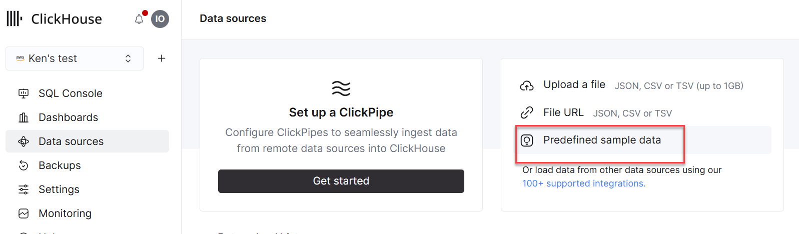

Use the Predefined Sample Data

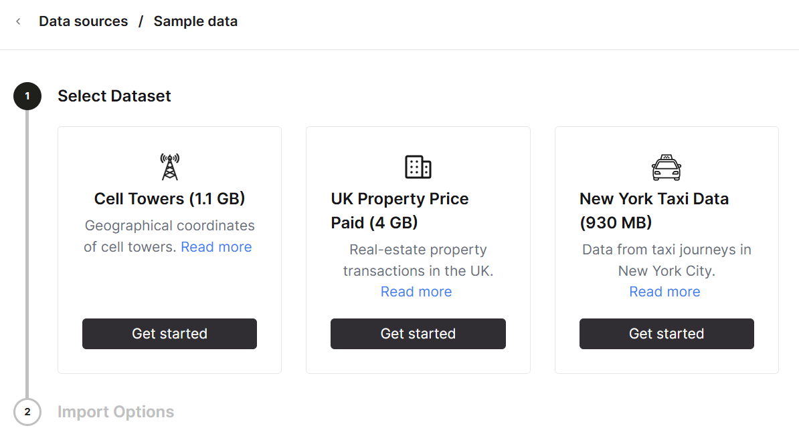

Load all of the data

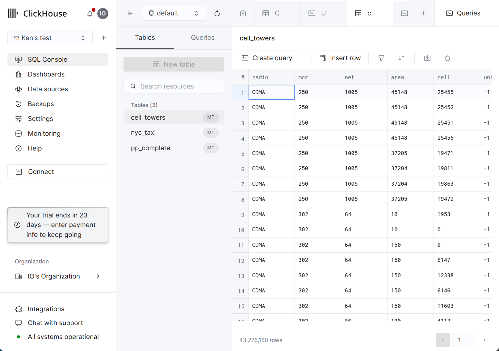

You can see a screen like the one above

#### 2.2 Checking the database connection details

ClickHouse Cloud makes the information needed to connect remotely easy to get.

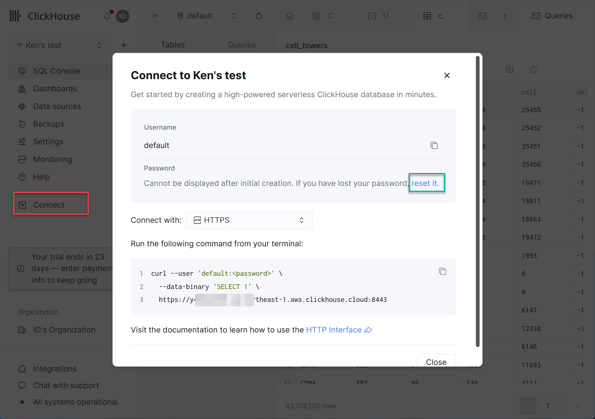

If you do not know the connection details, use "reset it" to generate them again and save them.

You can check them as in the example below.

```bash

curl --user 'default:<your-password>' --data-binary 'SELECT 1' https://<your-service-host>.clickhouse.cloud:8443

1
```

---

### 3. MCP configuration

An MCP server enables communication between an AI tool and a database and plays an important role in handling and managing data safely. A typical MCP configuration consists of the following elements:

- Server settings: configuring the HTTP/HTTPS endpoint and the authentication mechanism
- Data source connections: configuring connections to various databases and APIs
- Permission management: setting access permissions per AI model and user
- Logging and monitoring: configuring a system to trace requests and responses

In this hands-on, we learn step by step how to configure and operate such an MCP server effectively using Claude.

#### 3.1 Using Claude (Pro version)

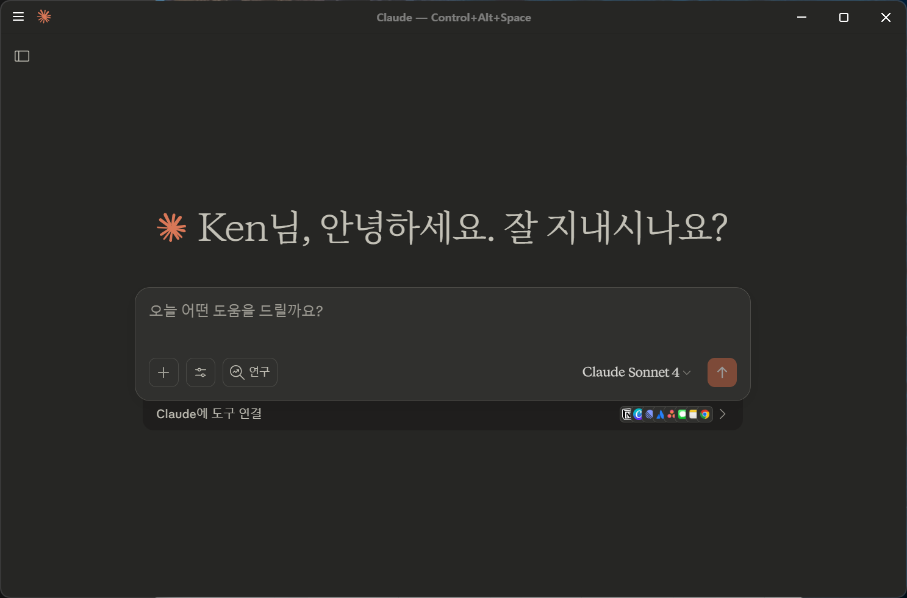

Claude is currently the most widely used tool for MCP hands-ons. However, it appears that the Pro version is required.

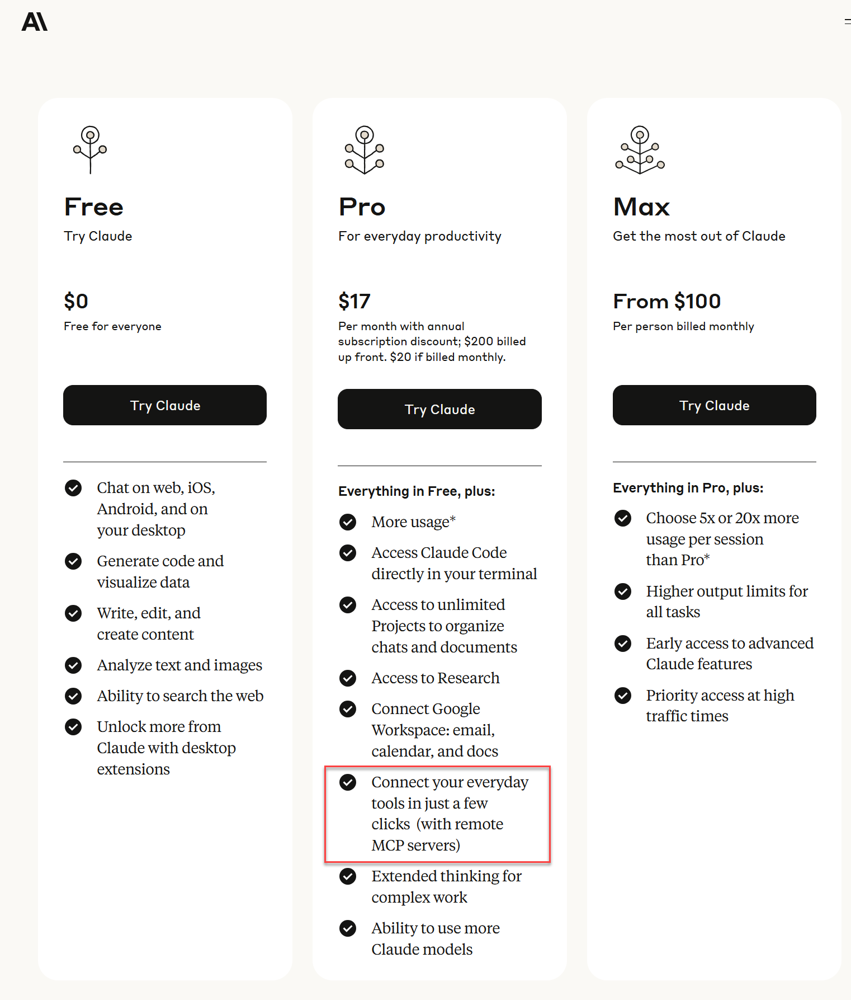

#### 3-2. Installing the UV package

Installing `uv` is essential for handling asynchronous I/O efficiently in systems such as an MCP server and ClickHouse Cloud. `uv` is based on libuv, an asynchronous I/O library, and helps perform asynchronous work such as network requests, file I/O and timers quickly and reliably. This optimises the communication speed between the MCP server and the database and prevents performance degradation even in large-scale data processing.

**Windows users:**

```powershell
# Run PowerShell as administrator
powershell -ExecutionPolicy ByPass -c "irm https://astral.sh/uv/install.ps1 | iex"
```

**macOS users:**

```bash
# Run in Terminal
brew install uv
```

**Verify the installation:**

```text
PS C:\Users\<user>> uv --version
uv 0.8.13 (ede75fe62 2025-08-21)
```

#### 3-3. ClickHouse Playground

You can run the Playground as follows. First, set the environment variables in the shell.

**Windows users:**

```powershell
$env:CLICKHOUSE_HOST = "<your-service-host>.clickhouse.cloud"
$env:CLICKHOUSE_PORT = "8443"
$env:CLICKHOUSE_USER = "default"
$env:CLICKHOUSE_PASSWORD = "<your-password>"
$env:CLICKHOUSE_SECURE = "true"
```

**macOS users:**

```bash
export CLICKHOUSE_HOST="<your-service-host>.clickhouse.cloud"
export CLICKHOUSE_PORT="8443"
export CLICKHOUSE_USER="default"
export CLICKHOUSE_PASSWORD="<your-password>"
export CLICKHOUSE_SECURE="true"
```

You can run the Playground as follows

```bash
uv run --with mcp-clickhouse --python 3.13 mcp-clickhouse
```

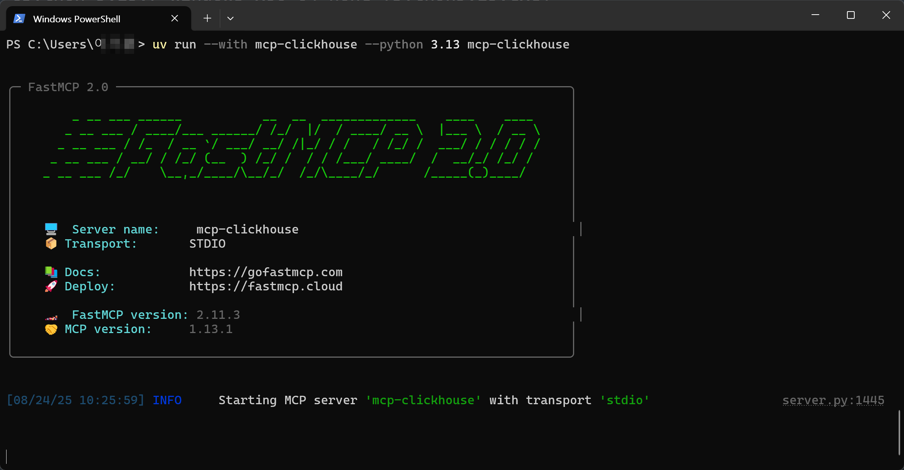

---

### 4. Connecting Claude and ClickHouse Cloud

#### 4.1 Editing or creating the configuration file at the right location

**Windows:**

1. Press `Win+R` → type `%APPDATA%\Claude` and press Enter
2. If the folder does not exist, start Claude Desktop once and try again

**macOS:**

1. In Finder, press `Cmd+Shift+G`
2. Type `~/Library/Application Support/Claude`

If the `claude_desktop_config.json` file does not exist, create it and enter the following.

```json
{
  "mcpServers": {
    "clickhouse": {
      "command": "uv",
      "args": [
        "run",
        "--with",
        "mcp-clickhouse",
        "--python",
        "3.13",
        "mcp-clickhouse"
      ],
      "env": {
        "CLICKHOUSE_HOST": "<your-service-host>.clickhouse.cloud",
        "CLICKHOUSE_PORT": "8443",
        "CLICKHOUSE_USER": "default",
        "CLICKHOUSE_PASSWORD": "<your-password>",
        "CLICKHOUSE_SECURE": "true"
      }
    }
  }
}
```

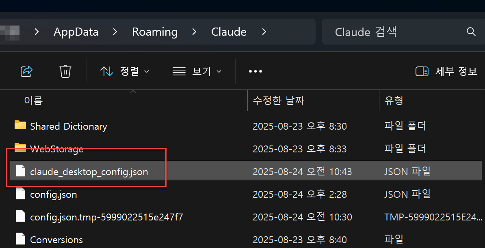

#### 4.2 Restart Claude and try a query

Quit Claude completely and restart it.

If the connection did not work properly, a screen like the following appears.

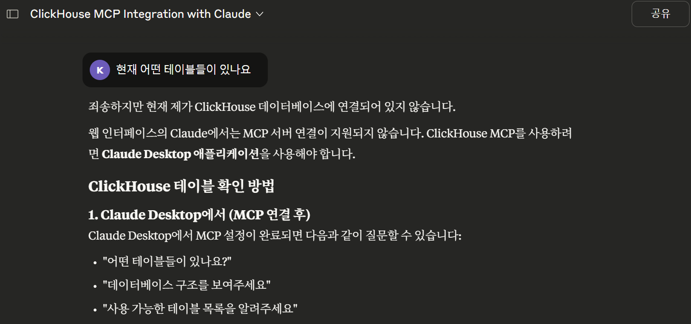

If it connected properly, you can see it respond immediately, as follows.

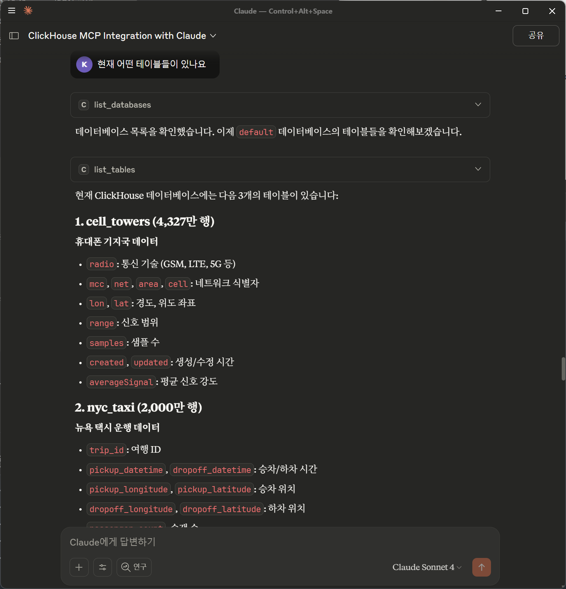

---

### 5. Running natural-language queries

Let's run queries in natural language. Since we have UK real-estate data, we will use it to get the answers we want.

#### 5-1. Asking for a trend analysis

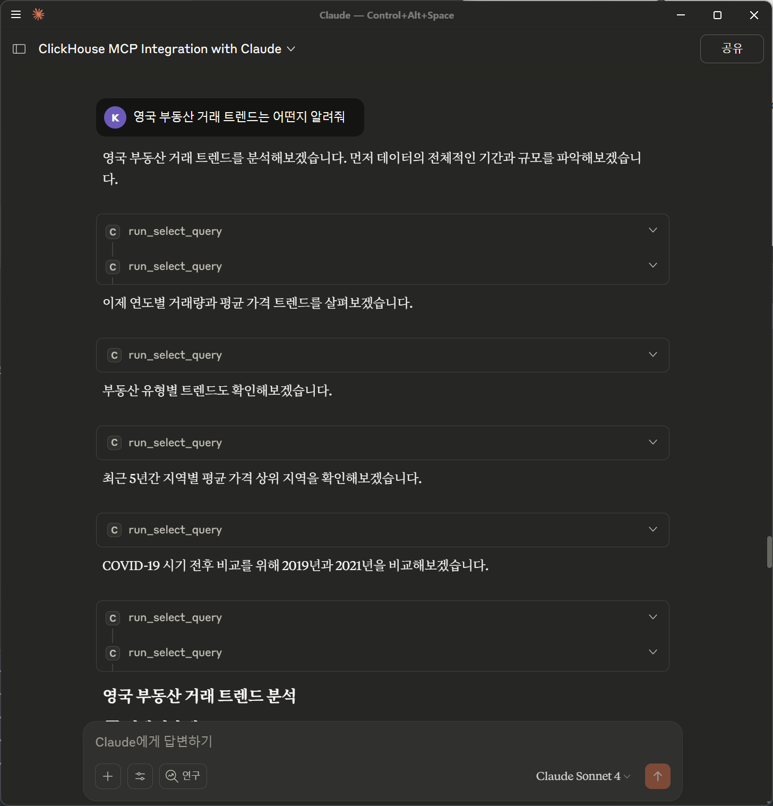

When you ask for a trend analysis as above, it generates the SQL it needs automatically.

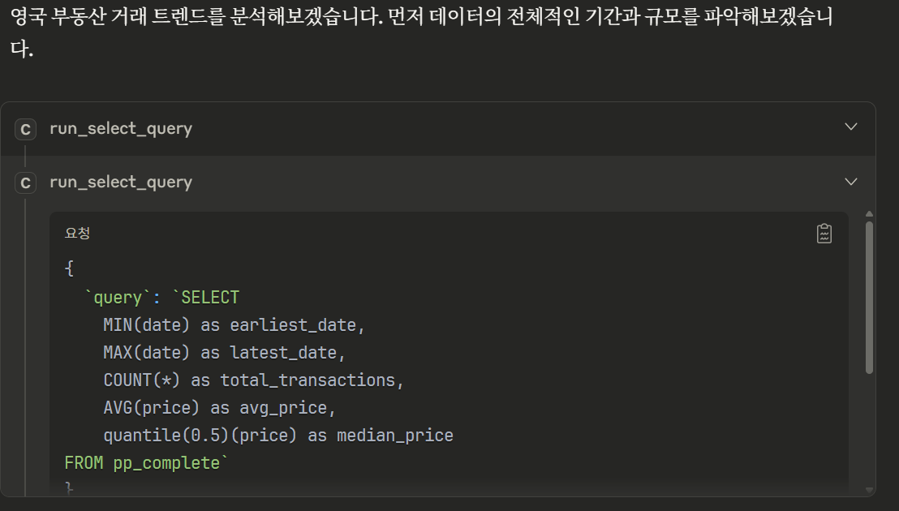

Click a detail item to see the query.

As a result, you can get content like the following. (The response is in Korean, as Claude produced it.)

```text
영국 부동산 거래 트렌드 분석
📊 전체 시장 개요

데이터 기간: 1995년 1월 ~ 2024년 1월 (29년간)
총 거래량: 2,892만 건
전체 평균 가격: £222,552
중간값: £150,000

📈 장기 가격 트렌드 (2000-2023)
가격 상승 패턴:

2000년: £107,496 → 2023년: £381,322 (255% 상승)
가장 큰 상승기: 2000-2007년 (연평균 12-15% 상승)
2008 금융위기: 가격 정체 및 소폭 하락
2010년대: 점진적 회복 및 상승
최고점: 2022년 £408,154

🏠 부동산 유형별 특성

연립주택 (Terraced): 864만 건, 평균 £161,615
반독립주택 (Semi-detached): 790만 건, 평균 £177,121
독립주택 (Detached): 667만 건, 평균 £296,001
아파트 (Flat): 520만 건, 평균 £204,502
기타 (Other): 50만 건, 평균 £1,211,540

🌍 지역별 가격 순위 (2019-2023)
최고가 지역:

런던 (Greater London): £829,970
윈저 앤 메이든헤드: £712,388
서리 (Surrey): £657,801
버킹엄셔: £564,038
하트퍼드셔: £553,986

🦠 COVID-19 영향 분석
2020년 팬데믹 시기:

거래량 급감: 2020년 4-5월 최저점
2020년 하반기: 급속한 회복 및 가격 상승
2021년 붐: 거래량 126만 건으로 급증
스탬프 듀티 홀리데이 효과: 2021년 3월, 6월 거래 급증

💡 주요 트렌드 포인트

계절성: 여름(6-8월)에 거래량 증가, 12월-1월 상대적 저조
최근 둔화: 2023년 거래량 58만 건으로 급감 (금리 상승 영향)
가격 조정: 2023년 평균가격 £381,322로 전년 대비 6.6% 하락
지역 격차 확대: 런던과 지방의 가격 격차 지속 확대

🔮 시장 전망 시사점

금리 상승으로 인한 거래량 감소 지속
어포더빌리티 크라이시스로 첫 주택 구매자들의 시장 진입 어려움
지역별 양극화 심화: 런던 및 남동부 vs 북부/중부 지역
2024년 초: 시장 안정화 조짐 (소량 데이터로 판단 제한적)

영국 부동산 시장은 장기적으로 꾸준한 상승세를 보이고 있으나, 최근 금리 인상과 경제 불확실성으로 조정 국면에 있습니다.
```

#### 5-2 Asking for a visualisation

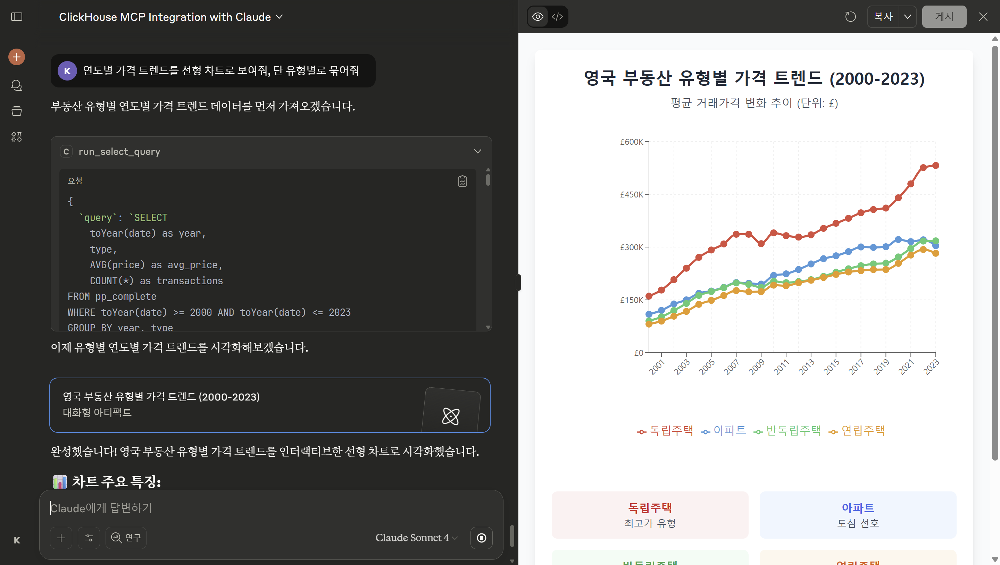

Claude immediately starts drawing a visualised graph.

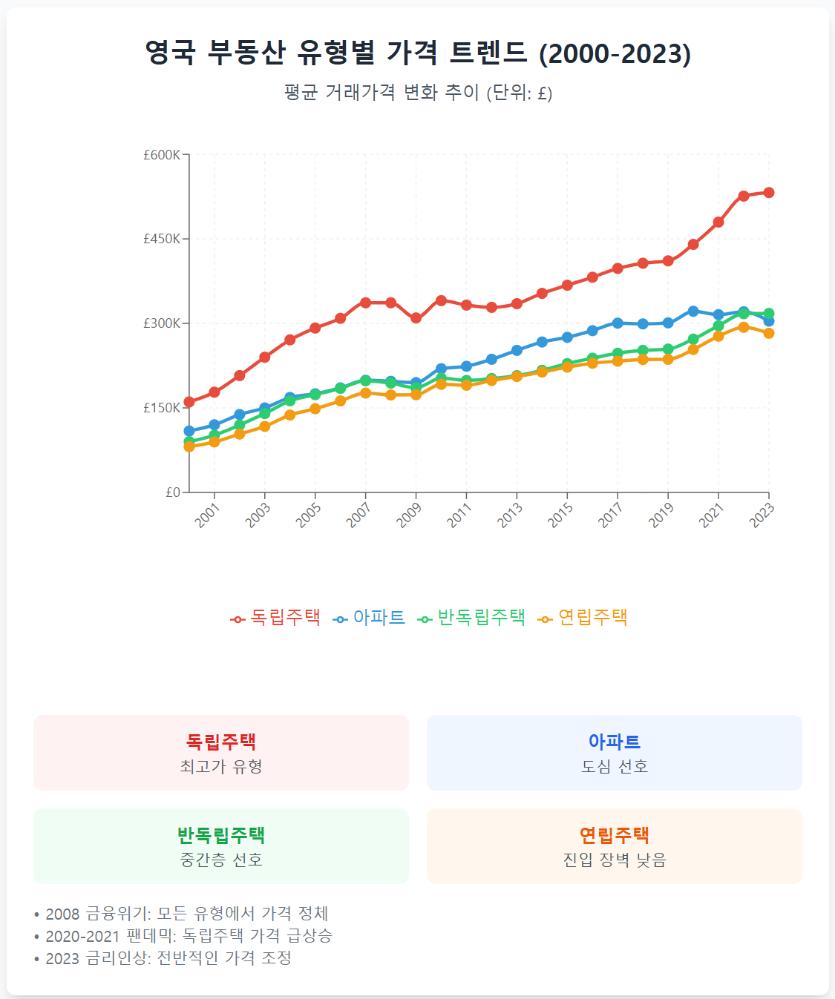

In this way you can get responses from natural-language queries right away.

---

### Conclusion

This hands-on guide covered in detail the whole process of connecting ClickHouse Cloud and MCP (Model Context Protocol) to build an environment in which an AI tool can interact with the database directly. It presented every step as a hands-on: from MCP server setup, to connecting with Claude, to natural-language data analysis.

With this, users can ask for a trend analysis or visualisation of the UK real-estate data in natural language, without writing complex SQL queries, and get instant insight. This kind of AI-based data processing and analysis environment can greatly simplify data engineering and analysis, and can significantly improve the speed and efficiency of a company's decision-making.

---

### Addendum: resolving the mcp-clickhouse FastMCP version conflict

**Problem**

```text
TypeError: FastMCP.__init__() got an unexpected keyword argument 'dependencies'

```

The mcp-clickhouse package can be incompatible with the latest FastMCP version.

**Cause**

- mcp-clickhouse uses the `dependencies` parameter of the older FastMCP
- the latest FastMCP removed this parameter
- uv installs the latest version by default, which causes the conflict

**Fix**

**Edit the Claude Desktop configuration**

`~/Library/Application Support/Claude/claude_desktop_config.json`:

```json
{
  "mcpServers": {
    "mcp-clickhouse": {
      "command": "uv",
      "args": [
        "run",
        "--with",
        "mcp-clickhouse",
        "--with",
        "fastmcp<0.2.0",
        "--with",
        "pyarrow",
        "--python",
        "3.13",
        "mcp-clickhouse"
      ],
      "env": {
        "CLICKHOUSE_HOST": "your-host.clickhouse.cloud",
        "CLICKHOUSE_USER": "default",
        "CLICKHOUSE_PASSWORD": "your-password",
        "CLICKHOUSE_DATABASE": "default"
      }
    }
  }
}

```

Key change

**Before:**

```text
"--with", "mcp-clickhouse",
"--with", "pyarrow",

```

**After:**

```jsonc
"--with", "mcp-clickhouse",
"--with", "fastmcp<0.2.0",  // added
"--with", "pyarrow",

```

**Order of steps**

1. Edit the configuration file
2. Quit Claude Desktop completely
3. Restart Claude Desktop
4. Check the connection

**Verification**

Test directly in a terminal:

```bash
uv run --with mcp-clickhouse --with "fastmcp<0.2.0" --python 3.13 mcp-clickhouse

```

If it runs without errors and waits for input, it succeeded (exit with Ctrl+C).

---

## 한국어

> **이관본, 미검증.** 2026-10-06 작성자의 노트 사이트(clickhouse.kr)에서 원문 그대로 옮겼습니다. 이 저장소에서 단계와 수치를 다시 실행하지 않았습니다. 영어본은 한국어 원문을 LLM 도움으로 번역한 것입니다.

이 문서는 ClickHouse Cloud 환경에서 MCP(Model Context Protocol) 서버를 설정하고, 데이터베이스와 연동하여 정상적으로 운영하는 전 과정을 실습 형태로 안내합니다. 

---

### 1. ClickHouse MCP 개요

#### 1.1. MCP(Model Context Protocol)란?

MCP(Model Context Protocol)는 AI 도구(예: ChatGPT, Claude 등)와 외부 시스템(예: Notion, ClickHouse 등) 간의 안전한 데이터 참조, 생성, 업데이트를 지원하는 표준 프로토콜입니다. MCP 서버를 통해 AI가 직접 데이터베이스의 콘텐츠를 읽고 쓸 수 있으며, 다양한 데이터 소스와의 통합을 용이하게 합니다

#### 1.2. 왜 ClickHouse MCP가 필요한가?

ClickHouse MCP는 데이터베이스와 AI 도구 간의 긴밀한 통합을 통해 빠르고 효율적인 데이터 관리 및 분석을 가능하게 합니다. 이를 통해 데이터 소스 간의 복잡한 연계를 단순화하고, AI 기반의 의사결정 지원을 강화할 수 있습니다. 특히, 대규모 데이터 처리에서 성능과 확장성을 모두 확보할 수 있다는 점에서 중요한 도구로 자리잡고 있습니다.

#### 1.3. ClickHouse MCP 기반 Use-Case

- **CDC(Change Data Capture):** Clickpipe를 활용하면 데이터베이스에서 발생하는 변경 사항을 실시간으로 추적하고, 이를 기반으로 자연어 처리 모델을 통해 실시간 데이터 분석이 가능합니다. 예를 들어, 고객 지원 기록에서 주요 키워드를 추출하거나, 트렌드 분석을 통해 즉각적인 의사결정을 지원할 수 있습니다.
- **AI 챗봇을 위한 대규모 데이터 통합**: ClickHouse MCP를 기반으로 다양한 데이터 소스(예: CRM 데이터, 로그 데이터 등)를 통합하여 AI 챗봇의 응답 정확도를 높일 수 있습니다. 사용자 질의에 맞는 데이터를 빠르게 검색하고, 이를 자연어로 변환하여 실시간 응답을 제공하는 데 활용할 수 있습니다.
- **데이터 기반 추천 시스템**: ClickHouse MCP를 활용하여 사용자 행동 데이터를 실시간으로 분석하고, 이를 바탕으로 개인화된 추천 시스템을 구축할 수 있습니다. 예를 들어, e-커머스 플랫폼에서 실시간으로 상품 추천을 제공하거나, 스트리밍 서비스에서 사용자의 시청 이력을 기반으로 콘텐츠를 추천할 수 있습니다.

---

### 2. ClickHouse Cloud 환경 준비

#### 2.1 ClickHouse Cloud 계정 생성 및 데이터 준비

이전에 소개한 ClickHouse Cloud 트라이얼을 사용할 것입니다. ([https://clickhouse.com](https://clickhouse.com/) 접속 후 회원가입 을 통해 환경을 제공받을 수 있습니다)


Predefined Sample Data를 사용합다


데이터를 모두 적재해봅니다


위와 같은 화면 확인이 가능합니다

#### 2.2 데이터베이스 연결 정보 확인

ClickHouse Cloud 에서는 원격에서 접속하기 위한 정보를 손쉽게 제공하고 있습니다.


접속 정보를 모른다면, reset it 을 통하여 해당 정보를 새로 생성하고 저장합니다.

아래 예시로 제공된 것 처럼 확인이 가능합니다.

```bash

curl --user 'default:<your-password>' --data-binary 'SELECT 1' https://<your-service-host>.clickhouse.cloud:8443

1
```

---

### 3. MCP 구성

MCP 서버는 AI 도구와 데이터베이스 간의 통신을 가능하게 하며, 데이터를 안전하게 처리하고 관리하는 데 중요한 역할을 합니다. 일반적인 MCP 구성은 다음과 같은 요소로 이루어집니다:

- 서버 설정: HTTP/HTTPS 엔드포인트 구성 및 인증 메커니즘 설정
- 데이터 소스 연결: 다양한 데이터베이스 및 API 연결 설정
- 권한 관리: 각 AI 모델 및 사용자별 접근 권한 설정
- 로깅 및 모니터링: 요청 및 응답 추적을 위한 시스템 구성

본 실습에서는 Claude를 활용하여 이러한 MCP 서버를 효과적으로 구성하고 운영하는 방법을 단계별로 학습합니다.

#### 3.1 Claude 활용 (Pro Version)


Claude는 현재 다양한 MCP 실습에서 가장 널리 사용되고 있습니다. 단, Pro 버전이 필요한 것으로 확인됩니다.


#### 3-2. UV 패키지 설치하기

`uv`를 설치하는 과정은 MCP 서버 및 ClickHouse Cloud와 같은 시스템에서 비동기 I/O 작업을 효율적으로 처리하기 위해 필수적입니다. `uv`는 libuv라는 비동기 I/O 라이브러리를 기반으로 하며, 네트워크 요청, 파일 I/O, 타이머 등 다양한 비동기 작업을 빠르고 안정적으로 수행할 수 있도록 지원합니다. 이를 통해 MCP 서버와 데이터베이스 간의 통신 속도를 최적화하고, 대규모 데이터 처리에서도 성능 저하를 방지할 수 있습니다.

**Windows 사용자:**

```powershell
# PowerShell을 관리자 권한으로 실행
powershell -ExecutionPolicy ByPass -c "irm https://astral.sh/uv/install.ps1 | iex"
```

**macOS 사용자:**

```bash
# Terminal에서 실행
brew install uv
```

**설치 확인:**

```text
PS C:\Users\<user>> uv --version
uv 0.8.13 (ede75fe62 2025-08-21)
```

#### 3-3. ClickHouse Playground

다음과 같이 입력하여 Playground 수행이 가능합니다. 먼저, 쉘에 환경 변수를 입력합니다.

**Windows 사용자:**

```powershell
$env:CLICKHOUSE_HOST = "<your-service-host>.clickhouse.cloud"
$env:CLICKHOUSE_PORT = "8443"
$env:CLICKHOUSE_USER = "default"
$env:CLICKHOUSE_PASSWORD = "<your-password>"
$env:CLICKHOUSE_SECURE = "true"
```

**macOS 사용자:**

```bash
export CLICKHOUSE_HOST="<your-service-host>.clickhouse.cloud"
export CLICKHOUSE_PORT="8443"
export CLICKHOUSE_USER="default"
export CLICKHOUSE_PASSWORD="<your-password>"
export CLICKHOUSE_SECURE="true"
```

다음과 같이 Playgroud를 실행할 수 있습니다

```bash
uv run --with mcp-clickhouse --python 3.13 mcp-clickhouse
```


---

### 4. Claude와 ClickHouse Cloud 연결

#### 4.1 설정 파일 위치에 맞게 편집 또는 생성하기

**Windows:**

1. `Win+R` → `%APPDATA%\Claude` 입력 후 엔터
2. 폴더가 없으면 Claude Desktop 한 번 실행 후 다시 시도

**macOS:**

1. Finder에서 `Cmd+Shift+G`
2. `~/Library/Application Support/Claude` 입력

`claude_desktop_config.json` 파일이 없다면 생성 후 다음 내용을 입력합니다.

```json
{
  "mcpServers": {
    "clickhouse": {
      "command": "uv",
      "args": [
        "run",
        "--with",
        "mcp-clickhouse",
        "--python",
        "3.13",
        "mcp-clickhouse"
      ],
      "env": {
        "CLICKHOUSE_HOST": "<your-service-host>.clickhouse.cloud",
        "CLICKHOUSE_PORT": "8443",
        "CLICKHOUSE_USER": "default",
        "CLICKHOUSE_PASSWORD": "<your-password>",
        "CLICKHOUSE_SECURE": "true"
      }
    }
  }
}
```


#### 4.2 Claude 재시작 후 질의 시도

Caude를 완전히 재시작 합니다.

만약 제대로 연결이 되지 않았다면 다음과 같은 화면이 나타납니다.


제대로 연결이 되었다면 다음과 같이 바로 응답하는 것을 확인할 수 있습니다.


---

### 5. 자연어 기반 질의 수행

자연어 기반으로 질의를 수행해보겠습니다. 영국 부동산 데이터가 있었으므로 이를 통해 원하는 답을 얻어보겠습니다.

#### 5-1. 트렌드 분석 의뢰하기


위와 같이 트렌드 분석을 요청하면, 그에 따라 필요한 SQL들을 자동생성합니다.


세부 항목을 누르면 쿼리를 확인할 수 있습니다.

결과로 다음과 같은 내용을 공유 받을 수 있습니다.

```text
영국 부동산 거래 트렌드 분석
📊 전체 시장 개요

데이터 기간: 1995년 1월 ~ 2024년 1월 (29년간)
총 거래량: 2,892만 건
전체 평균 가격: £222,552
중간값: £150,000

📈 장기 가격 트렌드 (2000-2023)
가격 상승 패턴:

2000년: £107,496 → 2023년: £381,322 (255% 상승)
가장 큰 상승기: 2000-2007년 (연평균 12-15% 상승)
2008 금융위기: 가격 정체 및 소폭 하락
2010년대: 점진적 회복 및 상승
최고점: 2022년 £408,154

🏠 부동산 유형별 특성

연립주택 (Terraced): 864만 건, 평균 £161,615
반독립주택 (Semi-detached): 790만 건, 평균 £177,121
독립주택 (Detached): 667만 건, 평균 £296,001
아파트 (Flat): 520만 건, 평균 £204,502
기타 (Other): 50만 건, 평균 £1,211,540

🌍 지역별 가격 순위 (2019-2023)
최고가 지역:

런던 (Greater London): £829,970
윈저 앤 메이든헤드: £712,388
서리 (Surrey): £657,801
버킹엄셔: £564,038
하트퍼드셔: £553,986

🦠 COVID-19 영향 분석
2020년 팬데믹 시기:

거래량 급감: 2020년 4-5월 최저점
2020년 하반기: 급속한 회복 및 가격 상승
2021년 붐: 거래량 126만 건으로 급증
스탬프 듀티 홀리데이 효과: 2021년 3월, 6월 거래 급증

💡 주요 트렌드 포인트

계절성: 여름(6-8월)에 거래량 증가, 12월-1월 상대적 저조
최근 둔화: 2023년 거래량 58만 건으로 급감 (금리 상승 영향)
가격 조정: 2023년 평균가격 £381,322로 전년 대비 6.6% 하락
지역 격차 확대: 런던과 지방의 가격 격차 지속 확대

🔮 시장 전망 시사점

금리 상승으로 인한 거래량 감소 지속
어포더빌리티 크라이시스로 첫 주택 구매자들의 시장 진입 어려움
지역별 양극화 심화: 런던 및 남동부 vs 북부/중부 지역
2024년 초: 시장 안정화 조짐 (소량 데이터로 판단 제한적)

영국 부동산 시장은 장기적으로 꾸준한 상승세를 보이고 있으나, 최근 금리 인상과 경제 불확실성으로 조정 국면에 있습니다.
```

#### 5-2 시각화 요청하기


Claude는 바로 시각화 된 그래프를 그리기 시작합니다.


이렇게 자연어 질의를 통한 응답을 바로 제공받을 수 있습니다.

---

### 결론

본 실습 가이드는 ClickHouse Cloud와 MCP(Model Context Protocol)를 연동하여 AI 도구가 데이터베이스와 직접 상호작용할 수 있는 환경을 구축하는 전 과정을 상세히 다루었습니다. MCP 서버 설정부터 Claude와의 연결, 자연어 기반 데이터 분석까지 모든 단계를 실습 형태로 제시하였습니다. 

이를 통해 사용자는 복잡한 SQL 쿼리 작성 없이도 자연어로 영국 부동산 데이터의 트렌드 분석이나 시각화를 요청하고 즉각적인 인사이트를 얻을 수 있습니다. 이러한 AI 기반 데이터 처리 및 분석 환경은 데이터 엔지니어링과 분석 과정을 획기적으로 단순화하며, 기업의 의사결정 속도와 효율성을 크게 향상시킬 수 있습니다. 

---

### 추가: mcp-clickhouse FastMCP 버전 충돌 해결

**문제**

```text
TypeError: FastMCP.__init__() got an unexpected keyword argument 'dependencies'

```

mcp-clickhouse 패키지가 최신 FastMCP 버전과 호환되지 않는 문제가 발생할 수 있습니다

**원인**

- mcp-clickhouse는 구버전 FastMCP의 `dependencies` 파라미터를 사용
- 최신 FastMCP에서는 이 파라미터가 제거됨
- uv가 기본적으로 최신 버전을 설치하여 충돌 발생

**해결 방법**

**Claude Desktop 설정 수정**

`~/Library/Application Support/Claude/claude_desktop_config.json`:

```json
{
  "mcpServers": {
    "mcp-clickhouse": {
      "command": "uv",
      "args": [
        "run",
        "--with",
        "mcp-clickhouse",
        "--with",
        "fastmcp<0.2.0",
        "--with",
        "pyarrow",
        "--python",
        "3.13",
        "mcp-clickhouse"
      ],
      "env": {
        "CLICKHOUSE_HOST": "your-host.clickhouse.cloud",
        "CLICKHOUSE_USER": "default",
        "CLICKHOUSE_PASSWORD": "your-password",
        "CLICKHOUSE_DATABASE": "default"
      }
    }
  }
}

```

핵심 변경사항

**Before:**

```text
"--with", "mcp-clickhouse",
"--with", "pyarrow",

```

**After:**

```jsonc
"--with", "mcp-clickhouse",
"--with", "fastmcp<0.2.0",  // 추가
"--with", "pyarrow",

```

**적용 순서**

1. 설정 파일 수정
2. Claude Desktop 완전 종료
3. Claude Desktop 재시작
4. 연결 확인

**검증**

터미널에서 직접 테스트:

```bash
uv run --with mcp-clickhouse --with "fastmcp<0.2.0" --python 3.13 mcp-clickhouse

```

에러 없이 실행되고 입력을 기다리면 성공 (Ctrl+C로 종료)합니다.
