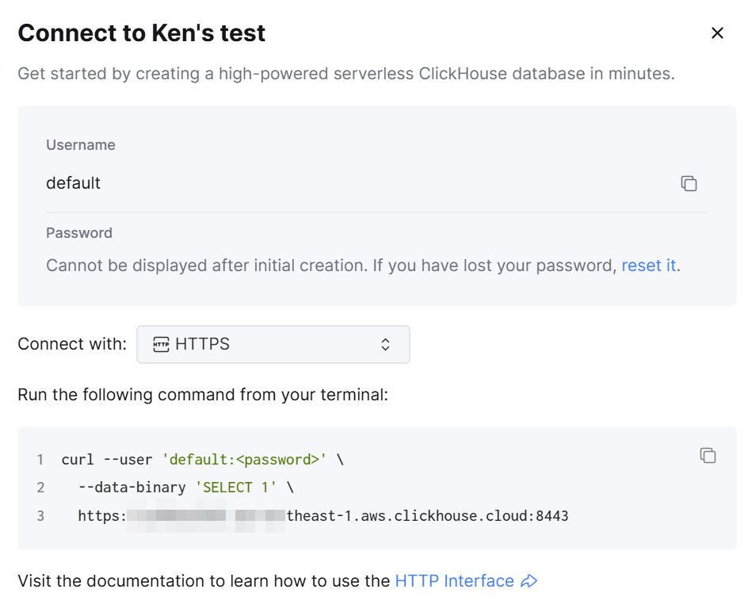
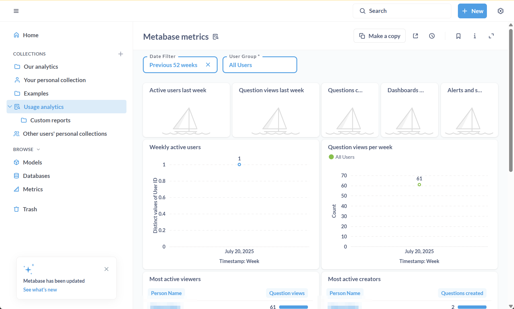
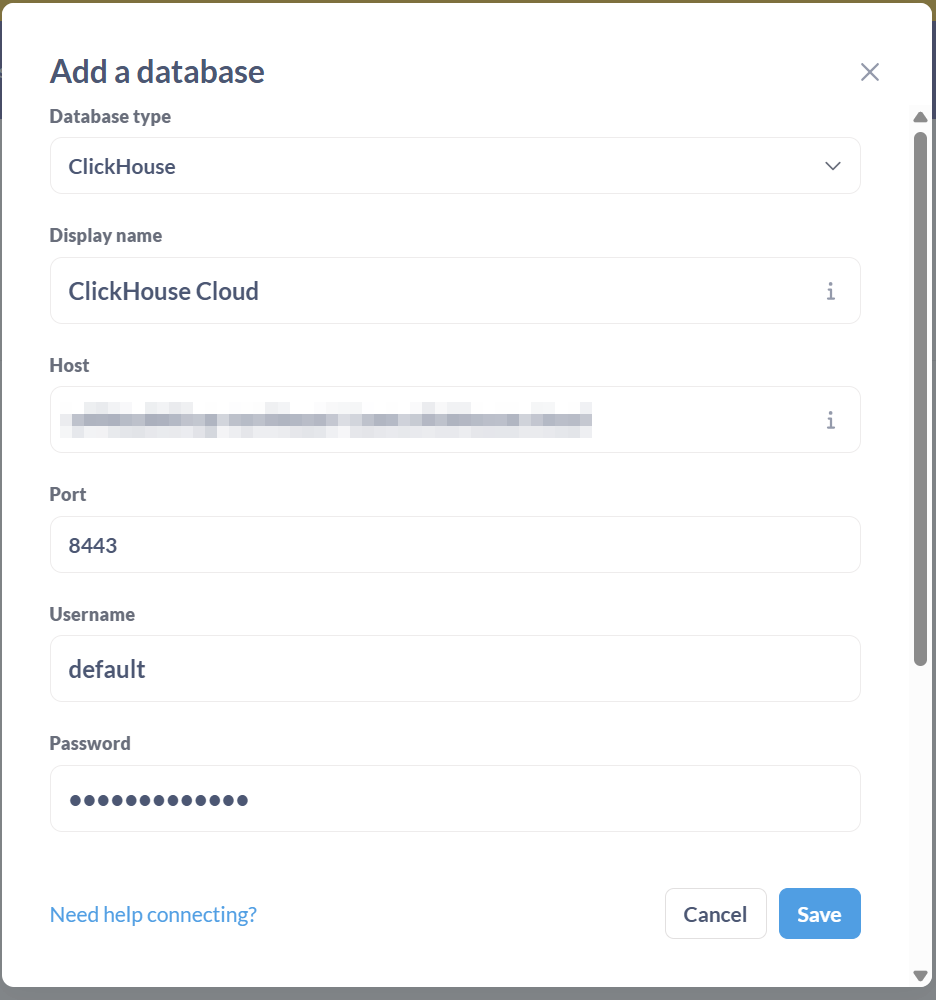
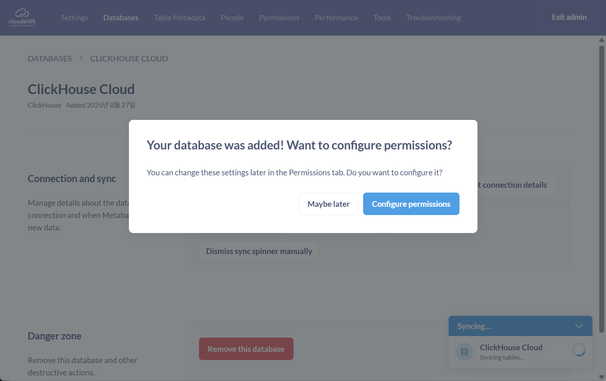
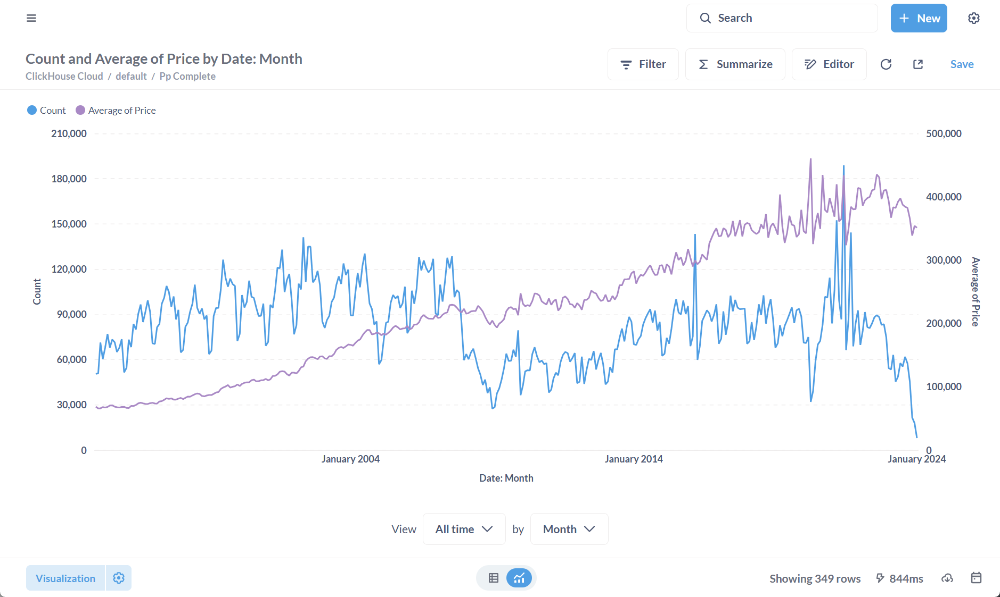

# Metabase Pro Integration with ClickHouse Cloud

[English](#english) | [한국어](#한국어)

---

## English

> **Migrated, not verified.** Moved on 2026-10-06 from the author's notes site (clickhouse.kr), as written there. The steps and numbers have not been re-run in this repository. The English text is an LLM-assisted translation of the Korean original.

ClickHouse Cloud supports integration with a variety of BI tools. This guide covers connecting Metabase.

---

---

### 1. Metabase

Metabase is an open-source data visualization and analysis tool designed so that you can explore and visualize data without writing complex SQL queries. It offers an intuitive user interface and can present data as tables, charts and dashboards. It also supports connecting to and syncing with databases, and includes permission management, data sharing and alert settings, which makes it effective in collaborative environments.

#### 1.1 Lab environment

- The lab was carried out in the Metabase Pro environment of CloudShift, the only partner of the Metabase Expert Program in Korea.
    - https://www.metabase.com/partners/cloudshift

#### 1.2 About CloudShift

CloudShift is a leading consulting company in IT infrastructure, cloud strategy, data analytics and digital transformation. It offers a range of services, including large-scale cloud projects, data center strategy, IT infrastructure risk assessment, DevOps/microservice architecture builds and vendor-neutral solution proposals. It is an expert organization with deep experience in adopting and optimizing BI tools such as Metabase and in integrating with modern data warehouses such as ClickHouse.

---

### 2. Integrating ClickHouse Cloud with Metabase

Metabase is an open-source data visualization/analysis tool. Connected to ClickHouse Cloud, it enables real-time analysis of large data volumes and intuitive dashboards. Metabase connects easily to cloud environments through the official JDBC driver for ClickHouse, and users who are not familiar with SQL can use the query builder, dashboards and a variety of visualizations[[1]](https://www.metabase.com/data-sources/clickhouse)[[2]](https://clickhouse.com/docs/integrations/metabase).

#### 2.1 Connecting to ClickHouse Cloud

- In the ClickHouse Cloud console, select the database you will connect to, then check the HTTPS host, the port (usually 8443), the database name, the user name and the password under the "Connect" menu.
- Example:
    - Host: [`your-service-name.clickhouse.cloud`](http://your-service-name.clickhouse.cloud) (confirm HTTPS)
    - Port: `8443`
    - Database: `default` (or the database you use)
    - Username/Password: issued in the console[[3]](https://clickhouse.com/docs/integrations/metabase).

#### 2.2 Accessing Metabase Pro

This lab uses Pro, the cloud edition of Metabase. If you use the open-source edition, install it from the official website.

#### 3. Connecting a ClickHouse database in Metabase

1. In Metabase, go to the **gear icon** at the top right → **Admin settings** → **Databases** → **Add a database**.
2. Select **ClickHouse** as the database type.
3. Enter the following:
    - **Display name**: the name shown inside Metabase (any name you choose)
    - **Host**: the ClickHouse Cloud host name
    - **Port**: 8443 (when using TLS)
    - **Username/Password**: the account issued by ClickHouse Cloud
    - **Database name**: the database to use
    - **Use a secure connection (SSL)**: check it (required for Cloud)
    
    
    
4. As needed, apply advanced settings such as extra JDBC options, sync/scan settings and SSH tunneling[[4]](https://www.metabase.com/docs/latest/databases/connections/clickhouse).
5. Click **Save**, and Metabase automatically scans the table information of the ClickHouse database.

#### 4. Exploring and visualizing data

- **Running queries**: Use Metabase's Query Builder or SQL Editor to query and visualize ClickHouse data.
- **Building dashboards**: Combine visualizations (tables, bar charts, line charts, maps and so on) to create a dashboard.
- **Permission management**: Combine Metabase's fine-grained permissions (row/column level, access limits per user group and so on) with ClickHouse's database permissions to strengthen security[[4]](https://www.metabase.com/data-sources/clickhouse).
- **Sharing and alerts**: Dashboards and charts can be exported as PDF or CSV, shared by email or Slack, embedded, and set up with alerts (subscriptions).

---

### Conclusion

Integrating ClickHouse Cloud with Metabase meets the needs of a modern analytics environment: large-scale data analysis, real-time visualization, easy dashboard building and fine-grained access control. The lab implemented in CloudShift's Metabase expert environment offers an integration method that can be applied directly in the field, along with practical management and operations know-how.

---

**Note:** This guide was written from the latest official documentation as of August 2025 and from CloudShift's practical experience.

---

## 한국어

> **이관본, 미검증.** 2026-10-06 작성자의 노트 사이트(clickhouse.kr)에서 원문 그대로 옮겼습니다. 이 저장소에서 단계와 수치를 다시 실행하지 않았습니다. 영어본은 한국어 원문을 LLM 도움으로 번역한 것입니다.

ClickHouse Cloud는 다양한 BI도구 연동을 지원합니다. 그 중 Metabase를 연동하는 과정을 다룹니다. 

---

---

### 1. Metabase

Metabase는 오픈소스 기반의 데이터 시각화 및 분석 도구로, 복잡한 SQL 쿼리를 작성하지 않아도 손쉽게 데이터를 탐색하고 시각화할 수 있도록 설계되었습니다. Metabase는 직관적인 사용자 인터페이스를 제공하며, 테이블, 차트, 대시보드 등의 다양한 방식으로 데이터를 표현할 수 있습니다. 또한, Metabase는 데이터베이스와의 연결 및 동기화를 지원하며, 권한 관리, 데이터 공유, 알림 설정과 같은 기능도 포함되어 있어 협업 환경에서 효과적으로 활용할 수 있는 도구입니다.

#### 1.1 실습 환경

- 한국 Metabase Expert Program의 유일한 파트너인 CloudShift의 Metabase Pro 환경을 통해 실습을 수행하였습니다.
    - https://www.metabase.com/partners/cloudshift

#### 1.2 CloudShift 소개

CloudShift는 IT 인프라, 클라우드 전략, 데이터 분석 및 디지털 트랜스포메이션 분야에서 선도적인 컨설팅 기업입니다. CloudShift는 대규모 클라우드 프로젝트, 데이터센터 전략 수립, IT 인프라 리스크 평가, DevOps/마이크로서비스 아키텍처 구축, 벤더 중립적 솔루션 제안 등 다양한 서비스를 제공합니다. 특히 Metabase와 같은 BI 도구의 도입 및 최적화, ClickHouse 등 최신 데이터 웨어하우스와의 연동 경험이 풍부한 전문가 조직입니다.

---

### 2. ClickHouse Cloud와 Metabase 연동

Metabase는 오픈소스 데이터 시각화/분석 도구로, ClickHouse Cloud와 연동 시 대용량 데이터에 대한 실시간 분석과 직관적인 대시보드 구성이 가능합니다. Metabase는 ClickHouse용 공식 JDBC 드라이버를 통해 클라우드 환경에서도 손쉽게 연동할 수 있으며, SQL이 익숙하지 않은 사용자도 쿼리 빌더, 대시보드, 다양한 시각화 기능을 활용할 수 있습니다[[1]](https://www.metabase.com/data-sources/clickhouse)[[2]](https://clickhouse.com/docs/integrations/metabase).

#### 2.1 ClickHouse Cloud 연동방안

- ClickHouse Cloud 콘솔에서 접속할 데이터베이스를 선택 후, "Connect" 메뉴에서 HTTPS 방식의 호스트, 포트(일반적으로 8443), 데이터베이스 이름, 사용자명, 비밀번호를 확인합니다.
- 예시:
    - Host: [`your-service-name.clickhouse.cloud`](http://your-service-name.clickhouse.cloud) (HTTPS 확인)
    - Port: `8443`
    - Database: `default` (또는 사용 중인 데이터베이스)
    - Username/Password: 콘솔에서 발급[[3]](https://clickhouse.com/docs/integrations/metabase).

#### 2.2 Metabase Pro 접속

본 실습에서는 Metabase의 Cloud 버전인 Pro를 사용합니다. 만약 오픈소스를 사용하신다면 공식 홈페이지를 통해 오픈소스를 설치하시면 됩니다.

#### 3. Metabase에서 ClickHouse 데이터베이결

1. Metabase 우측 상단의 **설정(gear icon)** → **Admin settings** → **Databases** → **Add a database**로 이동합니다.
2. Database type에서 **ClickHouse**를 선택합니다.
3. 아래 정보를 입력합니다:
    - **Display name**: Metabase 내에서 사용할 데이터베이스 표시 이름(임의로 지정)
    - **Host**: ClickHouse Cloud 호스트명
    - **Port**: 8443 (TLS 사용 시)
    - **Username/Password**: ClickHouse Cloud에서 발급받은 계정 정보
    - **Database name**: 사용할 데이터베이스명
    - **Use a secure connection (SSL)**: 체크(Cloud 환경에서는 필수)
    
    
    
4. 필요에 따라 추가 JDBC 옵션, 동기화/스캔 설정, SSH 터널링 등 고급 설정을 적용할 수 있습니다[[4]](https://www.metabase.com/docs/latest/databases/connections/clickhouse).
5. **Save**를 클릭하면 Metabase가 ClickHouse 데이터베이스의 테이블 정보를 자동으로 스캔합니다.

#### 4. 데이터 탐색 및 시각화

- **질의(Query) 실행**: Metabase의 Query Builder 또는 SQL Editor를 활용하여 ClickHouse 데이터에 대한 질의 및 시각화를 진행합니다.
- **대시보드 구성**: 다양한 시각화(테이블, 바 차트, 라인 차트, 지도 등)를 조합해 대시보드를 생성할 수 있습니다.
- **권한 관리**: Metabase의 세분화된 권한 설정(행/열 레벨, 사용자 그룹별 접근 제한 등)과 ClickHouse의 DB 권한을 연동해 보안성을 강화할 수 있습니다[[4]](https://www.metabase.com/data-sources/clickhouse).
- **공유 및 알림**: 대시보드/차트의 PDF, CSV 내보내기, 이메일/Slack 공유, 임베드, 알림(구독) 기능을 활용할 수 있습니다.

---

### 결론

ClickHouse Cloud와 Metabase의 연동은 대용량 데이터 분석, 실시간 시각화, 손쉬운 대시보드 구축, 세밀한 권한 제어 등 현대적 데이터 분석 환경의 요구를 충족합니다. CloudShift의 Metabase 전문가 환경에서 구현된 실습 사례는, 실무 현장에서 바로 적용 가능한 최적의 연동 방법과 실질적인 관리/운영 노하우를 제공합니다.

---

**참고:** 본 가이드는 2025년 8월 기준 최신 공식 문서 및 CloudShift 실무 경험을 기반으로 작성되었습니다.
