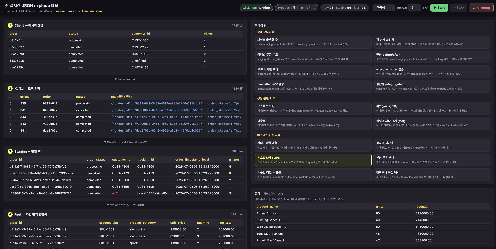

# Spark Streaming Conversion to ClickHouse Cloud

[English](#english) | [한국어](#한국어)

---

## English

> **Migrated, not verified.** Moved on 2026-10-06 from the author's notes site (clickhouse.kr), as written there. The steps and numbers have not been re-run in this repository. The English text is an LLM-assisted translation of the Korean original.



The combination of ClickHouse Cloud's ClickPipes and Materialized Views can be a cost-efficient alternative for converting real-time data pipelines.

---

### 1. Spark Streaming overview

Apache Spark Structured Streaming is a stream processing engine introduced in Apache Spark 2.0. It is built on the Spark SQL engine and processes streaming data with the same DataFrame/Dataset API as batch processing. Many companies use Spark Streaming as a pipeline that ingests real-time data from message queues such as Kafka and Kinesis, performs complex ETL transformations and loads the result into a data warehouse or analytics system.

#### 1.1 Strengths of Spark Streaming

**Unified batch-streaming API**: The biggest strength of Spark Structured Streaming is that batch and streaming share the same DataFrame API. Developers can build streaming applications in the familiar Spark SQL syntax without maintaining a separate technology stack.

**Rich transformations**: Complex data transformations such as JSON parsing, timestamp conversion, array expansion (explode), window functions and joins can be expressed declaratively. It supports languages such as Python, Scala, Java and R, and custom logic is easy to implement through UDFs (User Defined Functions).

**Fault tolerance**: Checkpointing and the write-ahead log guarantee exactly-once processing without data loss when a failure occurs. This is essential in domains such as finance and e-commerce, where data consistency matters.

**Scalability**: Cluster resources can be adjusted dynamically to follow changes in data volume, and mapping Kafka partitions to Spark partitions maximizes parallel processing performance.

#### 1.2 Issues faced in operation

Running Spark Streaming in production, however, brings several practical problems.

**Complex infrastructure management**: A Spark cluster consists of a driver node and many worker nodes, and the memory, CPU and number of shuffle partitions of each node must be tuned to the workload. For a streaming job that runs 24/7, the operational burden of cluster failure recovery, scaling and version upgrades is considerable.

**Difficult state management**: With stateful operations (aggregation, windowing, deduplication), the State Store can keep growing, and an inappropriate watermark causes memory pressure. Checkpoint directory management and compatibility on schema changes also need attention.

**Monitoring complexity**: Unlike batch jobs, streaming applications run continuously, so processing lag, batch duration and input/output rates must be monitored in real time. The Spark UI alone is limited, and a separate metrics collection and dashboard are often needed.

#### 1.3 The cost problem: the biggest concern

The most practical concern in running Spark Streaming is **cost**. Especially when using a managed Spark service such as Databricks, it is important to understand and manage the cost structure precisely.

**Databricks cost structure**: Databricks bills in processing units called DBUs (Databricks Units). The DBU rate varies with the cluster type, the plan (Standard/Premium/Enterprise) and the cloud provider, and cloud infrastructure costs (EC2, EBS and so on) are added on top.

**The cost burden of 24/7 streaming**: Because streaming workloads are "always on", costs accumulate quickly. Below is the **estimated cost range** for a 10K-15K TPS workload. Actual costs can vary widely with cluster configuration, region and data complexity.

| Cost item | Estimated monthly cost (USD) | Notes |
| --- | --- | --- |
| Databricks DBU | $2,000 ~ $4,000 | Based on Jobs Compute; higher on the Premium plan |
| Cloud Compute (EC2 etc.) | $3,000 ~ $6,000 | Based on 8-12 workers; varies with instance type |
| Storage & Network | $300 ~ $800 | EBS, data transfer cost |
| **Estimated total** | **$5,000 ~ $11,000** | *Actual cost depends on the environment* |

> ⚠️ Caution: The figures above are estimates that assume a typical configuration. Accurate costs must be calculated with the Databricks pricing calculator and actual usage. Peak-hour autoscaling, development/test clusters and monitoring tool costs are not included.

---

### 2. The possibility of moving to ClickHouse Cloud

**ClickHouse Cloud** can be considered as an alternative that addresses these cost problems. ClickHouse is a column-oriented database specialized for real-time analytics, offering excellent compression and query performance.

#### 2.1 ClickPipes: managed data ingestion

**ClickPipes** is a managed data ingestion service provided by ClickHouse Cloud. It can ingest data directly from streaming sources such as Kafka, Confluent Cloud, Amazon MSK and Kinesis and load it into ClickHouse tables.

**ClickPipes transformation features**:

ClickPipes does not merely copy data; it can perform a variety of transformations at the ingestion stage.

| Transformation type | ClickPipes expression | Description |
| --- | --- | --- |
| Timestamp parsing | `parseDateTime64BestEffort(field)` | Convert strings in various formats to DateTime |
| Time zone conversion | `toTimezone(dt, 'Asia/Seoul')` | Convert UTC to a local time zone |
| Date extraction | `toDate(dt)` | Extract a Date from a DateTime |
| String formatting | `formatDateTime(dt, '%Y%m')` | Convert a date to a string in the desired format |
| NULL replacement | `nullIf(field, '(not set)')` | Convert a specific value to NULL |
| Conditional conversion | `if(cond, val1, val2)` | Choose a value according to a condition |
| String replacement | `replaceAll(field, ',', '')` | Clean up strings, such as removing commas |
| Type conversion | `toInt32OrNull(field)` | Safe integer conversion |
| Default handling | `coalesce(a, b, c)` | Choose the first non-null value |
| JSON parsing | `JSONExtractString(json, 'key')` | Extract a JSON field |

**Strengths of ClickPipes**:

- No separate infrastructure to manage
- Automatic scaling follows traffic changes
- Transforming at ingestion reduces the downstream load
- A predictable cost structure of $0.04 per GB

#### 2.2 Materialized View: real-time data transformation

For complex transformations that are hard to do in ClickPipes, especially array explosion, use a Materialized View (MV).

**Characteristics of a Materialized View**:

- Triggered at INSERT time to transform in real time
- No separate scheduling or batch jobs needed
- Source data and transformed data are managed independently
- Complex transformation logic can be expressed in SQL

**Transformations possible with an MV**:

```sql
-- Array expansion with ARRAY JOIN
SELECT
    order_id,
    customer_id,
    JSONExtractString(line, 'sku') AS product_sku,
    JSONExtractString(line, 'name') AS product_name,
    toDecimal64OrNull(JSONExtractString(line, 'unit_price'), 2) AS unit_price
FROM orders_staging
ARRAY JOIN JSONExtractArrayRaw(order_lines_json) AS line

```

---

### 3. A worked conversion example

#### 3.1 Sample Spark Streaming code

The following is typical Spark Streaming code that processes online order data. It ingests order events, expands the order lines array into individual rows and loads them into an analytics table.

```python
from pyspark.sql import SparkSession
from pyspark.sql.functions import *

def process_order_events(spark, kafka_options, clickhouse_options):
    """Process the online order event stream"""

    # Read the stream from Kafka
    df = (spark.readStream
          .format("kafka")
          .options(**kafka_options)
          .load())

    # Parse JSON
    schema = "order_id STRING, order_status STRING, created_at STRING, ..."
    orders = df.select(from_json(col("value").cast("string"), schema).alias("data")).select("data.*")

    # Filter by order status
    valid_statuses = ['completed', 'processing', 'shipped', 'delivered']

    processed = (orders
        # Set order_lines to null for cancelled/returned orders
        .withColumn("order_lines",
            when(col("order_status").isin("cancelled", "returned"), None)
            .otherwise(col("order_lines")))

        # Timestamp conversion (string -> timestamp -> timezone conversion)
        .withColumn("order_timestamp",
            to_timestamp(col("created_at"), "yyyy-MM-dd HH:mm:ss.SSS"))
        .withColumn("order_timestamp_local",
            from_utc_timestamp(col("order_timestamp"), "Asia/Seoul"))

        # Create derived date columns
        .withColumn("order_date", to_date(col("order_timestamp_local")))
        .withColumn("year_month", date_format(col("order_timestamp_local"), "yyyyMM"))
        .withColumn("hour", date_format(col("order_timestamp_local"), "HH"))
        .withColumn("minute", date_format(col("order_timestamp_local"), "mm"))

        # Flatten customer info
        .withColumn("customer_id", col("customer.customer_id"))
        .withColumn("customer_email", col("customer.email"))
        .withColumn("customer_tier", col("customer.membership_tier"))

        # Clean up NULL values (convert placeholder values to NULL)
        .withColumn("customer_id",
            when(col("customer_id").isin("(not set)", "undefined", "", "null"), None)
            .otherwise(col("customer_id")))

        # Create a composite ID
        .withColumn("tracking_id", coalesce(col("customer_id"), col("session_id")))

        # Expand the order_lines array (explode_outer keeps a row for an empty array)
        .select("*", explode_outer(col("order_lines")).alias("line_item"))

        # Extract line item fields
        .withColumn("product_sku", col("line_item.sku"))
        .withColumn("product_name", col("line_item.name"))
        .withColumn("product_category", col("line_item.category"))

        # Clean up the price (remove commas, then convert to decimal)
        .withColumn("unit_price",
            regexp_replace(col("line_item.unit_price"), ",", "").cast("decimal(10,2)"))
        .withColumn("quantity", col("line_item.qty").cast("int"))
        .withColumn("line_total",
            col("unit_price") * col("quantity"))

        # Validity filter: process only orders in a valid status
        .filter(col("order_status").isin(valid_statuses))

        # Drop unneeded columns
        .drop("line_item", "order_lines", "customer")
    )

    # Write to ClickHouse
    query = (processed.writeStream
        .foreachBatch(lambda df, id: write_to_clickhouse(df, clickhouse_options))
        .option("checkpointLocation", "/checkpoints/orders")
        .trigger(processingTime="10 seconds")
        .start())

    return query

def write_to_clickhouse(batch_df, options):
    """Load the batch into ClickHouse"""
    (batch_df.write
        .format("jdbc")
        .options(**options)
        .option("dbtable", "analytics.order_lines_fact")
        .option("batchsize", 10000)
        .mode("append")
        .save())

```

#### 3.2 Converting to a ClickHouse Cloud architecture

When migrating the Spark code above to ClickHouse Cloud, two architecture options can be considered.

#### Option A: ClickPipes transform + MV explode (recommended)

```text
Kafka → ClickPipes (Transform) → Staging Table → MV (ARRAY JOIN) → Final Table

```

**Staging table** (the ClickPipes target):

```sql
CREATE TABLE analytics.orders_staging
(
    order_id String,
    order_status LowCardinality(String),

    -- Already transformed in ClickPipes
    order_timestamp DateTime64(3),
    order_timestamp_local DateTime64(3),
    order_date Date,
    year_month String,
    hour String,
    minute String,

    -- Customer info (flattened, nulls already replaced)
    customer_id Nullable(String),
    customer_email Nullable(String),
    customer_tier LowCardinality(Nullable(String)),
    session_id Nullable(String),
    tracking_id String,

    -- order_lines JSON (kept as an array)
    order_lines String,

    _timestamp DateTime DEFAULT now()
)
ENGINE = MergeTree()
PARTITION BY toYYYYMM(order_date)
ORDER BY (order_date, order_status, tracking_id)
TTL order_date + INTERVAL 7 DAY;

```

**ClickPipes Transform settings**:

| Target Column | Transform Expression |
| --- | --- |
| order_timestamp | `parseDateTime64BestEffort(created_at)` |
| order_timestamp_local | `toTimezone(parseDateTime64BestEffort(created_at), 'Asia/Seoul')` |
| order_date | `toDate(toTimezone(parseDateTime64BestEffort(created_at), 'Asia/Seoul'))` |
| year_month | `formatDateTime(toTimezone(parseDateTime64BestEffort(created_at), 'Asia/Seoul'), '%Y%m')` |
| hour | `formatDateTime(toTimezone(parseDateTime64BestEffort(created_at), 'Asia/Seoul'), '%H')` |
| minute | `formatDateTime(toTimezone(parseDateTime64BestEffort(created_at), 'Asia/Seoul'), '%i')` |
| order_lines | `if(order_status IN ('cancelled', 'returned'), '[]', order_lines)` |
| customer_id | `nullIf(nullIf(nullIf(nullIf(customer_id, '(not set)'), 'undefined'), ''), 'null')` |
| tracking_id | `coalesce(nullIf(customer_id, ''), session_id)` |

**Materialized View** (handles only the ARRAY JOIN):

```sql
CREATE MATERIALIZED VIEW analytics.order_lines_mv
TO analytics.order_lines_fact
AS
WITH
    ['completed', 'processing', 'shipped', 'delivered'] AS valid_statuses
SELECT
    -- Pass through existing columns
    order_id,
    order_status,
    order_timestamp,
    order_timestamp_local,
    order_date,
    year_month,
    hour,
    minute,
    customer_id,
    customer_email,
    customer_tier,
    tracking_id,

    -- Expand order_lines + extract fields
    JSONExtractString(line, 'sku') AS product_sku,
    JSONExtractString(line, 'name') AS product_name,
    JSONExtractString(line, 'category') AS product_category,
    toDecimal64OrNull(replaceAll(JSONExtractString(line, 'unit_price'), ',', ''), 2) AS unit_price,
    toInt32OrNull(JSONExtractString(line, 'qty')) AS quantity,
    toDecimal64OrNull(replaceAll(JSONExtractString(line, 'unit_price'), ',', ''), 2)
        * toInt32OrNull(JSONExtractString(line, 'qty')) AS line_total

FROM analytics.orders_staging

-- explode_outer implementation: for an empty array, keep the row with an empty object
ARRAY JOIN
    if(JSONLength(order_lines) > 0, JSONExtractArrayRaw(order_lines), ['{}']) AS line

-- Filter to valid order statuses only
WHERE order_status IN valid_statuses;

```

#### Option B: MV-centered processing

```text
Kafka → ClickPipes (Minimal) → Raw Table → MV (All Transforms) → Final Table

```

In this approach, ClickPipes only parses JSON and the MV handles all transformations. The implementation is simpler, but the load concentrates on ClickHouse.

#### 3.3 Benchmark results

In the actual benchmark test, **Option A performed better on every metric**.

| Metric | Option A (ClickPipes transform) | Option B (MV-centered) | Difference |
| --- | --- | --- | --- |
| Raw table size | 84.32 KiB | 181.63 KiB | **53% smaller** |
| Total disk usage | 163.40 KiB | 264.99 KiB | **38% saved** |
| MV processing operations | 1 (ARRAY JOIN) | 4+ | **4x lighter** |
| ClickHouse CPU load | Low | High | A is better |
| Scalability | Good | Limited | A is better |

**Why Option A is recommended**:

- Transformation happens in ClickPipes, so small, type-converted data is stored
- The MV handles only the ARRAY JOIN, minimizing the load on ClickHouse
- Spreading the load prevents bottlenecks
- The raw table size is halved, reducing storage cost

---

### 4. Cost savings (estimated)

> ⚠️ Important notice: The cost comparison below is an estimate that assumes a typical workload. Actual costs can vary widely with data volume, query patterns, cluster configuration, region and so on. For an accurate cost estimate, use each service's official pricing calculator and measure actual usage through a pilot test.

#### 4.1 Expected cost comparison

**Estimated** monthly cost for a 10K-15K TPS workload:

| Item | Databricks Spark (estimate) | ClickHouse Cloud (estimate) |
| --- | --- | --- |
| Compute | $4,000 ~ $8,000 | $1,000 ~ $3,000 |
| Storage | $200 ~ $500 | $300 ~ $800 |
| Data Ingestion | Included | ClickPipes billed separately |
| **Estimated monthly total** | **$5,000 ~ $11,000** | **$1,500 ~ $4,500** |

**Points to consider when estimating cost**:

- Databricks: the DBU rate is $0.15~$0.75, a 5x difference depending on the plan and compute type
- ClickHouse Cloud: hourly pricing per compute unit; autoscaling reduces the cost of idle time
- For both services, prices differ by region and cloud provider

#### 4.2 Cost-saving potential

Main factors expected to reduce cost when moving to ClickHouse Cloud:

**Simpler infrastructure**:

- No Spark cluster management (driver/worker node tuning, failure recovery and so on)
- ClickPipes' managed ingestion removes the need to run a separate Kafka consumer

**Resource efficiency**:

- ClickHouse's high compression ratio reduces storage cost
- Columnar storage scans only the data a query needs
- Autoscaling minimizes idle resources

**Lower operating cost**:

- Less dependence on specialized Spark engineers
- Simpler monitoring and alert setup

> 📌 Recommendation: Before an actual migration, analyze your current Databricks bill and run a PoC on ClickHouse Cloud with the same workload to compare real costs.

---

### 5. Spark → ClickHouse function mapping reference

| Spark function | ClickHouse function | Notes |
| --- | --- | --- |
| `to_timestamp(col, fmt)` | `parseDateTime64BestEffort(col)` | Automatic format detection |
| `from_utc_timestamp(col, tz)` | `toTimezone(col, tz)` |  |
| `to_date(col)` | `toDate(col)` |  |
| `date_format(col, 'yyyyMM')` | `formatDateTime(col, '%Y%m')` |  |
| `date_format(col, 'HH')` | `formatDateTime(col, '%H')` |  |
| `date_format(col, 'mm')` | `formatDateTime(col, '%i')` | `%M` is the month name |
| `when(cond, val).otherwise(default)` | `if(cond, val, default)` |  |
| `coalesce(a, b, c)` | `coalesce(a, b, c)` | Same |
| `explode_outer(arr)` | `ARRAY JOIN if(length(arr)>0, arr, [default])` |  |
| `regexp_replace(col, pattern, repl)` | `replaceAll(col, pattern, repl)` |  |
| `col.cast('int')` | `toInt32OrNull(col)` | Null-safe recommended |
| `col.isin([...])` | `col IN [...]` |  |
| `~col.rlike(pattern)` | `NOT match(col, pattern)` |  |

---

### 6. Migration checklist

Things to check when migrating to ClickHouse Cloud.

**Preparation**:

- [ ]  Document the transformation logic in the current Spark code
- [ ]  Map each transformation function to its ClickHouse counterpart and test it
- [ ]  Measure the current data volume and TPS
- [ ]  Analyze the current Databricks cost in detail
- [ ]  Choose a ClickHouse Cloud region (close to the data source)

**ClickPipes setup**:

- [ ]  Configure the Kafka connection information
- [ ]  Write the Transform expressions and test each function individually
- [ ]  Design the staging table schema
- [ ]  Optimize the partition key and ORDER BY

**Materialized View implementation**:

- [ ]  Implement and verify the ARRAY JOIN logic
- [ ]  Test the correctness of the filter conditions
- [ ]  Design the target table schema
- [ ]  Set the TTL and retention policy

**Verification and monitoring**:

- [ ]  Write data consistency check queries (compare with the Spark results)
- [ ]  Set up processing lag monitoring
- [ ]  Set alert thresholds
- [ ]  Prepare a rollback plan

---

### 7. Conclusion

Spark Streaming offers powerful stream processing, but the operational complexity and cost in production are a burden that cannot be ignored. For a streaming pipeline that runs 24/7 in particular, cost keeps accumulating.

The **ClickPipes + Materialized View** combination in ClickHouse Cloud can be an effective alternative to these problems. Most Spark transformation functions map one-to-one to ClickHouse native functions, so you can improve cost efficiency while enjoying the benefits of a managed service.

Of course, not every workload is suited to migration. If you have a complex ML pipeline, multi-stream joins or a deep dependency on specific libraries in the Spark ecosystem, careful review is needed. But for a pipeline made up mostly of common ETL transformations such as **JSON parsing, type conversion, array expansion and filtering**, a move to ClickHouse Cloud is worth considering.

---

*The transformation functions covered in this article were verified through actual testing in a ClickHouse Cloud environment. If you are considering an actual migration, first validate the architecture best suited to your workload with a small pilot, and compare costs precisely.*

[clickhouse-hols/usecase/json-explode-confluent-clickpipes at main · litkhai/clickhouse-hols](https://github.com/litkhai/clickhouse-hols/tree/main/usecase/json-explode-confluent-clickpipes)

This is the demo code written for the webinar.

---

## 한국어

> **이관본, 미검증.** 2026-10-06 작성자의 노트 사이트(clickhouse.kr)에서 원문 그대로 옮겼습니다. 이 저장소에서 단계와 수치를 다시 실행하지 않았습니다. 영어본은 한국어 원문을 LLM 도움으로 번역한 것입니다.


ClickHouse Cloud의 Clickpipes와 MView 기능의 조합은 실시간 데이터 파이프라인의 비용 효율적 전환 대안이 될 수 있습니다.

---

### 1. Spark Streaming 개요

Apache Spark Structured Streaming은 Apache Spark 2.0에서 도입된 스트림 처리 엔진으로, Spark SQL 엔진 위에 구축되어 배치 처리와 동일한 DataFrame/Dataset API로 스트리밍 데이터를 처리할 수 있습니다. 많은 기업들이 Kafka, Kinesis 등의 메시지 큐에서 실시간 데이터를 수집하고, 복잡한 ETL 변환을 수행한 후 데이터 웨어하우스나 분석 시스템에 적재하는 파이프라인으로 Spark Streaming을 활용하고 있습니다.

#### 1.1 Spark Streaming의 장점

**통합된 배치-스트리밍 API**: Spark Structured Streaming의 가장 큰 강점은 배치와 스트리밍 처리에 동일한 DataFrame API를 사용할 수 있다는 점입니다. 개발자는 별도의 기술 스택을 유지할 필요 없이 익숙한 Spark SQL 문법으로 스트리밍 애플리케이션을 개발할 수 있습니다.

**풍부한 변환 기능**: JSON 파싱, 타임스탬프 변환, 배열 전개(explode), 윈도우 함수, 조인 등 복잡한 데이터 변환을 선언적으로 표현할 수 있습니다. Python, Scala, Java, R 등 다양한 언어를 지원하며, UDF(User Defined Function)를 통해 커스텀 로직도 쉽게 구현할 수 있습니다.

**내결함성(Fault Tolerance)**: 체크포인팅과 Write-Ahead Log를 통해 장애 발생 시에도 데이터 손실 없이 정확히 한 번(exactly-once) 처리를 보장합니다. 이는 금융, 이커머스 등 데이터 정합성이 중요한 도메인에서 필수적인 기능입니다.

**확장성**: 클러스터 리소스를 동적으로 조절하여 데이터 볼륨 변화에 대응할 수 있으며, Kafka 파티션과 Spark 파티션을 매핑하여 병렬 처리 성능을 극대화할 수 있습니다.

#### 1.2 운영 시 직면하는 이슈들

그러나 프로덕션 환경에서 Spark Streaming을 운영하다 보면 여러 현실적인 문제들에 직면하게 됩니다.

**복잡한 인프라 관리**: Spark 클러스터는 Driver 노드와 다수의 Worker 노드로 구성되며, 각 노드의 메모리, CPU, 셔플 파티션 수 등을 워크로드에 맞게 튜닝해야 합니다. 24/7 운영되는 스트리밍 잡의 경우, 클러스터 장애 복구, 스케일링, 버전 업그레이드 등의 운영 부담이 상당합니다.

**상태 관리의 어려움**: Stateful 연산(aggregation, windowing, deduplication)을 사용할 경우 State Store의 크기가 지속적으로 증가할 수 있으며, 워터마크 설정이 적절하지 않으면 메모리 압박이 발생합니다. 체크포인트 디렉토리 관리와 스키마 변경 시 호환성 문제도 주의가 필요합니다.

**모니터링의 복잡성**: 스트리밍 애플리케이션은 배치 잡과 달리 지속적으로 실행되므로, 처리 지연(processing lag), 배치 지속 시간, 입력/출력 비율 등을 실시간으로 모니터링해야 합니다. Spark UI만으로는 한계가 있어 별도의 메트릭 수집 및 대시보드 구축이 필요한 경우가 많습니다.

#### 1.3 비용 문제: 가장 큰 고민거리

Spark Streaming 운영에서 가장 현실적인 고민은 **비용**입니다. 특히 Databricks와 같은 관리형 Spark 서비스를 사용할 경우, 비용 구조를 정확히 이해하고 관리하는 것이 중요합니다.

**Databricks 비용 구조**: Databricks는 DBU(Databricks Unit)라는 처리 단위로 과금합니다. DBU 단가는 클러스터 유형, 플랜(Standard/Premium/Enterprise), 클라우드 제공자에 따라 달라지며, 여기에 클라우드 인프라 비용(EC2, EBS 등)이 추가됩니다.

**24/7 스트리밍의 비용 부담**: 스트리밍 워크로드는 "항상 켜져 있는" 특성 때문에 비용이 빠르게 누적됩니다. 아래는 10K-15K TPS 워크로드에 대한 **예상 비용 범위**입니다. 실제 비용은 클러스터 구성, 리전, 데이터 복잡도 등에 따라 크게 달라질 수 있습니다.

| 비용 항목 | 월 예상 비용 (USD) | 비고 |
| --- | --- | --- |
| Databricks DBU | $2,000 ~ $4,000 | Jobs Compute 기준, Premium 플랜 시 상승 |
| Cloud Compute (EC2 등) | $3,000 ~ $6,000 | Worker 8-12대 기준, 인스턴스 타입에 따라 변동 |
| Storage & Network | $300 ~ $800 | EBS, 데이터 전송 비용 |
| **추정 합계** | **$5,000 ~ $11,000** | *실제 비용은 환경에 따라 다름* |

> ⚠️ 주의: 위 수치는 일반적인 구성을 가정한 추정치입니다. 정확한 비용은 Databricks 가격 계산기와 실제 사용량을 기반으로 산정해야 합니다. 피크 시간 오토스케일링, 개발/테스트 클러스터, 모니터링 도구 비용 등은 포함되지 않았습니다.

---

### 2. ClickHouse Cloud로의 전환 가능성

이러한 비용 문제를 해결하기 위한 대안으로 **ClickHouse Cloud**를 고려해볼 수 있습니다. ClickHouse는 실시간 분석에 특화된 컬럼 기반 데이터베이스로, 뛰어난 압축률과 쿼리 성능을 제공합니다.

#### 2.1 ClickPipes: 관리형 데이터 수집

**ClickPipes**는 ClickHouse Cloud에서 제공하는 관리형 데이터 수집 서비스입니다. Kafka, Confluent Cloud, Amazon MSK, Kinesis 등의 스트리밍 소스에서 직접 데이터를 수집하여 ClickHouse 테이블에 적재할 수 있습니다.

**ClickPipes의 변환 기능**:

ClickPipes는 단순한 데이터 복사가 아닌, 수집 단계에서 다양한 변환을 수행할 수 있습니다.

| 변환 유형 | ClickPipes 표현식 | 설명 |
| --- | --- | --- |
| 타임스탬프 파싱 | `parseDateTime64BestEffort(field)` | 다양한 형식의 문자열을 DateTime으로 변환 |
| 타임존 변환 | `toTimezone(dt, 'Asia/Seoul')` | UTC를 로컬 타임존으로 변환 |
| 날짜 추출 | `toDate(dt)` | DateTime에서 Date 추출 |
| 문자열 포맷팅 | `formatDateTime(dt, '%Y%m')` | 날짜를 원하는 형식의 문자열로 변환 |
| NULL 치환 | `nullIf(field, '(not set)')` | 특정 값을 NULL로 변환 |
| 조건부 변환 | `if(cond, val1, val2)` | 조건에 따른 값 선택 |
| 문자열 치환 | `replaceAll(field, ',', '')` | 콤마 제거 등 문자열 정리 |
| 타입 변환 | `toInt32OrNull(field)` | 안전한 정수 변환 |
| 기본값 처리 | `coalesce(a, b, c)` | 첫 번째 non-null 값 선택 |
| JSON 파싱 | `JSONExtractString(json, 'key')` | JSON 필드 추출 |

**ClickPipes의 장점**:

- 별도의 인프라 관리 불필요
- 자동 스케일링으로 트래픽 변화에 대응
- 수집과 동시에 변환 처리로 downstream 부하 감소
- GB당 $0.04의 예측 가능한 비용 구조

#### 2.2 Materialized View: 실시간 데이터 변환

ClickPipes로 처리하기 어려운 복잡한 변환, 특히 배열 전개(Array Explosion)은 Materialized View(MV)를 활용합니다.

**Materialized View의 특징**:

- INSERT 시점에 트리거되어 실시간 변환 수행
- 별도의 스케줄링이나 배치 작업 불필요
- 원본 데이터와 변환된 데이터를 독립적으로 관리
- SQL 기반으로 복잡한 변환 로직 표현 가능

**MV로 가능한 변환**:

```sql
-- ARRAY JOIN을 활용한 배열 전개
SELECT
    order_id,
    customer_id,
    JSONExtractString(line, 'sku') AS product_sku,
    JSONExtractString(line, 'name') AS product_name,
    toDecimal64OrNull(JSONExtractString(line, 'unit_price'), 2) AS unit_price
FROM orders_staging
ARRAY JOIN JSONExtractArrayRaw(order_lines_json) AS line

```

---

### 3. 실제 변환 예시

#### 3.1 샘플 Spark Streaming 코드

다음은 온라인 주문 데이터를 처리하는 전형적인 Spark Streaming 코드입니다. 주문 이벤트를 수집하고, 주문 라인(order lines) 배열을 개별 행으로 전개시켜 분석용 테이블에 적재합니다.

```python
from pyspark.sql import SparkSession
from pyspark.sql.functions import *

def process_order_events(spark, kafka_options, clickhouse_options):
    """온라인 주문 이벤트 스트림 처리"""

    # Kafka에서 스트림 읽기
    df = (spark.readStream
          .format("kafka")
          .options(**kafka_options)
          .load())

    # JSON 파싱
    schema = "order_id STRING, order_status STRING, created_at STRING, ..."
    orders = df.select(from_json(col("value").cast("string"), schema).alias("data")).select("data.*")

    # 주문 상태별 필터링
    valid_statuses = ['completed', 'processing', 'shipped', 'delivered']

    processed = (orders
        # 취소/반품 주문의 order_lines를 null 처리
        .withColumn("order_lines",
            when(col("order_status").isin("cancelled", "returned"), None)
            .otherwise(col("order_lines")))

        # 타임스탬프 변환 (문자열 -> timestamp -> timezone 변환)
        .withColumn("order_timestamp",
            to_timestamp(col("created_at"), "yyyy-MM-dd HH:mm:ss.SSS"))
        .withColumn("order_timestamp_local",
            from_utc_timestamp(col("order_timestamp"), "Asia/Seoul"))

        # 날짜 파생 컬럼 생성
        .withColumn("order_date", to_date(col("order_timestamp_local")))
        .withColumn("year_month", date_format(col("order_timestamp_local"), "yyyyMM"))
        .withColumn("hour", date_format(col("order_timestamp_local"), "HH"))
        .withColumn("minute", date_format(col("order_timestamp_local"), "mm"))

        # 고객 정보 flatten
        .withColumn("customer_id", col("customer.customer_id"))
        .withColumn("customer_email", col("customer.email"))
        .withColumn("customer_tier", col("customer.membership_tier"))

        # NULL 값 정리 (placeholder 값들을 NULL로 변환)
        .withColumn("customer_id",
            when(col("customer_id").isin("(not set)", "undefined", "", "null"), None)
            .otherwise(col("customer_id")))

        # 복합 ID 생성
        .withColumn("tracking_id", coalesce(col("customer_id"), col("session_id")))

        # order_lines 배열 전개 (explode_outer로 빈 배열도 row 유지)
        .select("*", explode_outer(col("order_lines")).alias("line_item"))

        # line item 필드 추출
        .withColumn("product_sku", col("line_item.sku"))
        .withColumn("product_name", col("line_item.name"))
        .withColumn("product_category", col("line_item.category"))

        # 가격 정리 (콤마 제거 후 decimal 변환)
        .withColumn("unit_price",
            regexp_replace(col("line_item.unit_price"), ",", "").cast("decimal(10,2)"))
        .withColumn("quantity", col("line_item.qty").cast("int"))
        .withColumn("line_total",
            col("unit_price") * col("quantity"))

        # 유효성 필터: 유효 상태의 주문만 처리
        .filter(col("order_status").isin(valid_statuses))

        # 불필요한 컬럼 제거
        .drop("line_item", "order_lines", "customer")
    )

    # ClickHouse에 쓰기
    query = (processed.writeStream
        .foreachBatch(lambda df, id: write_to_clickhouse(df, clickhouse_options))
        .option("checkpointLocation", "/checkpoints/orders")
        .trigger(processingTime="10 seconds")
        .start())

    return query

def write_to_clickhouse(batch_df, options):
    """배치를 ClickHouse에 적재"""
    (batch_df.write
        .format("jdbc")
        .options(**options)
        .option("dbtable", "analytics.order_lines_fact")
        .option("batchsize", 10000)
        .mode("append")
        .save())

```

#### 3.2 ClickHouse Cloud 아키텍처로 변환

위의 Spark 코드를 ClickHouse Cloud로 마이그레이션할 때, 두 가지 아키텍처 옵션을 고려할 수 있습니다.

#### Option A: ClickPipes 변환 + MV Explode (권장)

```text
Kafka → ClickPipes (Transform) → Staging Table → MV (ARRAY JOIN) → Final Table

```

**Staging 테이블** (ClickPipes 대상):

```sql
CREATE TABLE analytics.orders_staging
(
    order_id String,
    order_status LowCardinality(String),

    -- ClickPipes에서 변환 완료
    order_timestamp DateTime64(3),
    order_timestamp_local DateTime64(3),
    order_date Date,
    year_month String,
    hour String,
    minute String,

    -- 고객 정보 (flatten, null 치환 완료)
    customer_id Nullable(String),
    customer_email Nullable(String),
    customer_tier LowCardinality(Nullable(String)),
    session_id Nullable(String),
    tracking_id String,

    -- order_lines JSON (배열 상태 유지)
    order_lines String,

    _timestamp DateTime DEFAULT now()
)
ENGINE = MergeTree()
PARTITION BY toYYYYMM(order_date)
ORDER BY (order_date, order_status, tracking_id)
TTL order_date + INTERVAL 7 DAY;

```

**ClickPipes Transform 설정**:

| Target Column | Transform Expression |
| --- | --- |
| order_timestamp | `parseDateTime64BestEffort(created_at)` |
| order_timestamp_local | `toTimezone(parseDateTime64BestEffort(created_at), 'Asia/Seoul')` |
| order_date | `toDate(toTimezone(parseDateTime64BestEffort(created_at), 'Asia/Seoul'))` |
| year_month | `formatDateTime(toTimezone(parseDateTime64BestEffort(created_at), 'Asia/Seoul'), '%Y%m')` |
| hour | `formatDateTime(toTimezone(parseDateTime64BestEffort(created_at), 'Asia/Seoul'), '%H')` |
| minute | `formatDateTime(toTimezone(parseDateTime64BestEffort(created_at), 'Asia/Seoul'), '%i')` |
| order_lines | `if(order_status IN ('cancelled', 'returned'), '[]', order_lines)` |
| customer_id | `nullIf(nullIf(nullIf(nullIf(customer_id, '(not set)'), 'undefined'), ''), 'null')` |
| tracking_id | `coalesce(nullIf(customer_id, ''), session_id)` |

**Materialized View** (ARRAY JOIN만 담당):

```sql
CREATE MATERIALIZED VIEW analytics.order_lines_mv
TO analytics.order_lines_fact
AS
WITH
    ['completed', 'processing', 'shipped', 'delivered'] AS valid_statuses
SELECT
    -- 기존 컬럼 전달
    order_id,
    order_status,
    order_timestamp,
    order_timestamp_local,
    order_date,
    year_month,
    hour,
    minute,
    customer_id,
    customer_email,
    customer_tier,
    tracking_id,

    -- order_lines 전개 + 필드 추출
    JSONExtractString(line, 'sku') AS product_sku,
    JSONExtractString(line, 'name') AS product_name,
    JSONExtractString(line, 'category') AS product_category,
    toDecimal64OrNull(replaceAll(JSONExtractString(line, 'unit_price'), ',', ''), 2) AS unit_price,
    toInt32OrNull(JSONExtractString(line, 'qty')) AS quantity,
    toDecimal64OrNull(replaceAll(JSONExtractString(line, 'unit_price'), ',', ''), 2)
        * toInt32OrNull(JSONExtractString(line, 'qty')) AS line_total

FROM analytics.orders_staging

-- explode_outer 구현: 빈 배열이면 빈 객체로 row 유지
ARRAY JOIN
    if(JSONLength(order_lines) > 0, JSONExtractArrayRaw(order_lines), ['{}']) AS line

-- 유효한 주문 상태만 필터
WHERE order_status IN valid_statuses;

```

#### Option B: MV 집중 처리

```text
Kafka → ClickPipes (Minimal) → Raw Table → MV (All Transforms) → Final Table

```

이 방식은 ClickPipes에서 JSON 파싱만 수행하고, 모든 변환을 MV에서 처리합니다. 구현은 단순하지만 ClickHouse에 부하가 집중됩니다.

#### 3.3 벤치마크 결과

실제 벤치마크 테스트 결과, **Option A가 모든 지표에서 우수**한 성능을 보였습니다.

| 지표 | Option A (ClickPipes 변환) | Option B (MV 집중) | 차이 |
| --- | --- | --- | --- |
| Raw Table 크기 | 84.32 KiB | 181.63 KiB | **53% 감소** |
| Total 디스크 사용 | 163.40 KiB | 264.99 KiB | **38% 절약** |
| MV 처리 연산 수 | 1개 (ARRAY JOIN) | 4개+ | **4배 경량** |
| ClickHouse CPU 부하 | 낮음 | 높음 | A 우수 |
| 확장성 | 우수 | 제한적 | A 우수 |

**Option A 권장 이유**:

- ClickPipes에서 변환 처리 → 타입 변환된 작은 데이터 저장
- MV는 ARRAY JOIN만 담당 → ClickHouse 부하 최소화
- 부하 분산으로 병목 현상 방지
- Raw Table 크기가 절반으로 감소하여 스토리지 비용 절감

---

### 4. 비용 절감 효과 (추정)

> ⚠️ 중요 고지: 아래 비용 비교는 일반적인 워크로드를 가정한 추정치입니다. 실제 비용은 데이터 볼륨, 쿼리 패턴, 클러스터 구성, 리전 등에 따라 크게 달라질 수 있습니다. 정확한 비용 산정을 위해서는 각 서비스의 공식 가격 계산기를 사용하고, 파일럿 테스트를 통해 실제 사용량을 측정하시기 바랍니다.

#### 4.1 예상 비용 비교

10K-15K TPS 워크로드 기준 **추정** 월 비용:

| 항목 | Databricks Spark (추정) | ClickHouse Cloud (추정) |
| --- | --- | --- |
| Compute | $4,000 ~ $8,000 | $1,000 ~ $3,000 |
| Storage | $200 ~ $500 | $300 ~ $800 |
| Data Ingestion | 포함 | ClickPipes 별도 |
| **월 추정 합계** | **$5,000 ~ $11,000** | **$1,500 ~ $4,500** |

**비용 추정 시 고려 사항**:

- Databricks: DBU 단가는 $0.15~$0.75로 플랜과 컴퓨트 타입에 따라 5배 차이
- ClickHouse Cloud: 컴퓨트 단위당 시간 요금제, 자동 스케일링으로 유휴 시간 비용 절감
- 두 서비스 모두 리전, 클라우드 제공자에 따라 가격 상이

#### 4.2 비용 절감 가능성

ClickHouse Cloud로의 전환 시 비용 절감이 기대되는 주요 요인:

**인프라 단순화**:

- Spark 클러스터 관리 불필요 (Driver/Worker 노드 튜닝, 장애 복구 등)
- ClickPipes의 관리형 수집으로 별도 Kafka Consumer 운영 불필요

**리소스 효율성**:

- ClickHouse의 높은 압축률로 스토리지 비용 절감
- 컬럼 기반 저장으로 쿼리 시 필요한 데이터만 스캔
- 자동 스케일링으로 유휴 리소스 최소화

**운영 비용 감소**:

- 전문 Spark 엔지니어 의존도 감소
- 모니터링 및 알럿 설정 간소화

> 📌 권장사항: 실제 마이그레이션 전에 현재 Databricks 청구서를 분석하고, ClickHouse Cloud에서 동일 워크로드로 PoC를 진행하여 실제 비용을 비교해보시기 바랍니다.

---

### 5. Spark → ClickHouse 함수 매핑 참조

| Spark 함수 | ClickHouse 함수 | 비고 |
| --- | --- | --- |
| `to_timestamp(col, fmt)` | `parseDateTime64BestEffort(col)` | 자동 포맷 인식 |
| `from_utc_timestamp(col, tz)` | `toTimezone(col, tz)` |  |
| `to_date(col)` | `toDate(col)` |  |
| `date_format(col, 'yyyyMM')` | `formatDateTime(col, '%Y%m')` |  |
| `date_format(col, 'HH')` | `formatDateTime(col, '%H')` |  |
| `date_format(col, 'mm')` | `formatDateTime(col, '%i')` | `%M`은 월 이름 |
| `when(cond, val).otherwise(default)` | `if(cond, val, default)` |  |
| `coalesce(a, b, c)` | `coalesce(a, b, c)` | 동일 |
| `explode_outer(arr)` | `ARRAY JOIN if(length(arr)>0, arr, [default])` |  |
| `regexp_replace(col, pattern, repl)` | `replaceAll(col, pattern, repl)` |  |
| `col.cast('int')` | `toInt32OrNull(col)` | Null-safe 권장 |
| `col.isin([...])` | `col IN [...]` |  |
| `~col.rlike(pattern)` | `NOT match(col, pattern)` |  |

---

### 6. 마이그레이션 체크리스트

ClickHouse Cloud로 마이그레이션을 진행할 때 확인해야 할 사항들입니다.

**사전 준비**:

- [ ]  현재 Spark 코드의 변환 로직 문서화
- [ ]  각 변환 함수의 ClickHouse 대응 함수 매핑 및 테스트
- [ ]  현재 데이터 볼륨 및 TPS 측정
- [ ]  현재 Databricks 비용 상세 분석
- [ ]  ClickHouse Cloud 리전 선택 (데이터 소스와 가까운 곳)

**ClickPipes 설정**:

- [ ]  Kafka 연결 정보 구성
- [ ]  Transform 표현식 작성 및 개별 함수 테스트
- [ ]  Staging 테이블 스키마 설계
- [ ]  파티션 키 및 ORDER BY 최적화

**Materialized View 구현**:

- [ ]  ARRAY JOIN 로직 구현 및 검증
- [ ]  필터 조건 정확성 테스트
- [ ]  Target 테이블 스키마 설계
- [ ]  TTL 및 보관 정책 설정

**검증 및 모니터링**:

- [ ]  데이터 정합성 검증 쿼리 작성 (Spark 결과와 비교)
- [ ]  처리 지연 모니터링 설정
- [ ]  알럿 임계값 설정
- [ ]  롤백 계획 수립

---

### 7. 결론

Spark Streaming은 강력한 스트림 처리 기능을 제공하지만, 프로덕션 환경에서의 운영 복잡성과 비용은 무시할 수 없는 부담입니다. 특히 24/7 운영되는 스트리밍 파이프라인의 경우, 비용이 지속적으로 누적됩니다.

ClickHouse Cloud의 **ClickPipes + Materialized View** 조합은 이러한 문제에 대한 효과적인 대안이 될 수 있습니다. 대부분의 Spark 변환 함수는 ClickHouse의 네이티브 함수로 1:1 매핑이 가능하며, 관리형 서비스의 이점을 누리면서 비용 효율성을 개선할 수 있습니다.

물론 모든 워크로드가 마이그레이션에 적합한 것은 아닙니다. 복잡한 ML 파이프라인, 다중 스트림 조인, 또는 Spark 생태계의 특정 라이브러리에 깊이 의존하는 경우라면 신중한 검토가 필요합니다. 그러나 **JSON 파싱, 타입 변환, 배열 전개, 필터링** 등 일반적인 ETL 변환이 주를 이루는 파이프라인이라면, ClickHouse Cloud로의 전환을 검토해볼 가치가 있습니다.

---

*이 글에서 다룬 변환 함수들은 ClickHouse Cloud 환경에서 실제 테스트를 거쳐 검증되었습니다. 실제 마이그레이션을 고려하신다면, 먼저 소규모 파일럿으로 워크로드 특성에 맞는 최적의 아키텍처를 검증하고, 비용을 정확히 비교해보시길 권장합니다.*

[clickhouse-hols/usecase/json-explode-confluent-clickpipes at main · litkhai/clickhouse-hols](https://github.com/litkhai/clickhouse-hols/tree/main/usecase/json-explode-confluent-clickpipes)

웨비나를 위해서 작성한 데모코드 입니다
