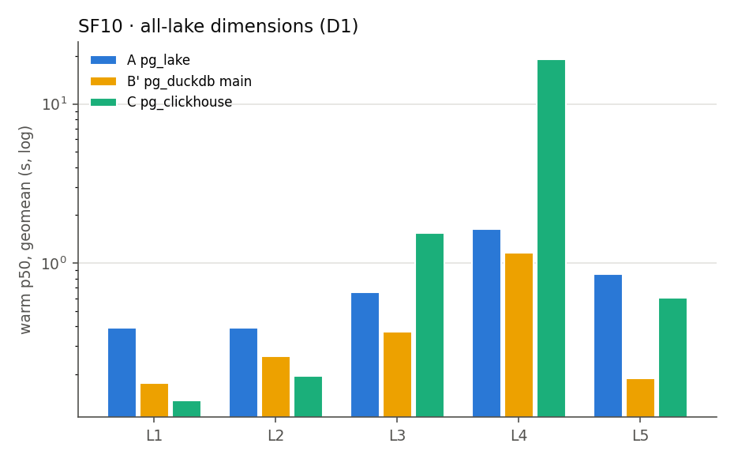

# Results — pg_duckdb vs pg_clickhouse on pg_lake's Iceberg (TPC-H SF10)

[English](#english) | [한국어](#한국어)

## English

Light run (`./run-all.sh 10`) on 2026-09-25, macOS Docker VM with 12 vCPU / 7.7 GB;
every engine container capped at 4 CPU / 4 GB. Raw rows are in
`results/sf10/bench.csv`, plans in `results/sf10/plans/`, the generated tables in
[results/SUMMARY.md](results/SUMMARY.md).

| Path | Versions |
|---|---|
| A pg_lake native (correctness reference) | PostgreSQL 18.6, pg_lake 3.5.3 (+ manifest patch), pgduck_server DuckDB v1.5.5 |
| B pg_duckdb release | `pgduckdb/pgduckdb:18-v1.1.1` (DuckDB v1.4.3) — Q6 and C1 only |
| B′ pg_duckdb main | `pgduckdb/pgduckdb:18-main`, pg_duckdb 1.2.0-dev, DuckDB v1.5.4 |
| C pg_clickhouse → ClickHouse | pg_clickhouse 0.3.2, ClickHouse 26.9.1.1629 `DataLakeCatalog` |

All paths read the same Iceberg snapshot through Apache Polaris 1.7.0: 73 monthly
files for `lineitem_cold` (53.9 M rows, 1.8 GB) and `orders_cold` (13.9 M rows);
rows from 1998-02 on stay in PG heap. Dimensions are Iceberg copies (D1). Numbers
are the median of 3 warm runs after one untimed warm-up.

### 1. Can pg_clickhouse read pg_lake's Iceberg files?

**Yes, but only with a pg_lake fix.** Stock pg_lake 3.5.3 writes manifests
without the key-value metadata the Iceberg spec requires, and ClickHouse rejects
them (`No partition-spec in iceberg manifest file`). With the patch in
`images/pg-main/patches/` (reported as
[pg_lake#659](https://github.com/Snowflake-Labs/pg_lake/issues/659)), all nine
queries except C6 return results identical to path A. Six are pushed down
whole (`Remote SQL` in the plan); Q18 and C5 are pushed down in part.

### 2. Warm latency (p50)

| Tier | Query | A pg_lake | B′ pg_duckdb | C pg_clickhouse | C pushdown |
|---|---|---:|---:|---:|---|
| L1 | Q1 pricing summary | 795 ms | **625 ms** | 799 ms | full |
| L1 | Q6 revenue forecast | 234 ms | **57 ms** | 118 ms | full |
| L1 | C1 monthly count, one quarter | 326 ms | 156 ms | **27 ms** | full |
| L2 | C2 top 100 customers | 393 ms | 261 ms | **194 ms** | full |
| L3 | Q3 shipping priority | 585 ms | **290 ms** | 3.27 s | full |
| L3 | Q5 local supplier volume | 734 ms | **470 ms** | 729 ms | full |
| L4 | Q18 large volume customer | 1.64 s | **1.17 s** | 19.17 s | partial |
| L5 | C5 last 12 months (hot + cold) | 850 ms | **188 ms** | 604 ms | partial |
| L5 | C6 point lookup (hot + cold) | 342 ms | **79 ms** | crash | — |

Tier geomeans (same query set on all three paths): L1 393 / 177 / **137 ms**,
L2 393 / 261 / **194 ms**, L3 656 / **369 ms** / 1.54 s, L4 1.64 / **1.17** / 19.2 s,
L5 (C5 only) 850 / **188** / 604 ms — A / B′ / C.

**Reading it.**
- **Scans and aggregates (L1–L2): C is fastest or close.** C1 is 27 ms because
  ClickHouse reads only the three monthly files the filter selects.
  Q1 is a full scan and ties with A.
- **Joins (L3–L4): B′ is faster, sometimes by a lot.** Q3 and Q5 are fully
  pushed down, so the time is spent in ClickHouse's own join over Iceberg
  (6.9 core-seconds for Q3 versus 0.9 for B′). Q18 is the outlier: pg_clickhouse
  pushes the three-way join but not the `IN (… HAVING sum > 300)` semi-join, so
  ClickHouse streams every lineitem row back and Postgres does the final join —
  19 s, and 13.8 core-seconds on the main node.
- **ILM views (L5): B′ wins.** Hot and cold are combined in Postgres; B′ reads
  its heap copy locally.

### 3. Load on the main Postgres node

That is the other half of the question: what the analytics costs the OLTP node.

| Query | A pg-main | C pg-main | C ClickHouse | B′ (separate node) |
|---|---:|---:|---:|---:|
| Q1 | 2.59 | 0.01 | 3.15 | 2.37 |
| Q6 | 0.34 | 0.01 | 0.32 | 0.13 |
| Q3 | 1.29 | 0.04 | 6.95 | 0.86 |
| Q5 | 1.93 | 0.01 | 2.47 | 1.33 |
| Q18 | 4.96 | **13.84** | 23.27 | 4.35 |
| C5 | 1.34 | 0.59 | 0.10 | 0.70 |

(median core-seconds per warm query)

When the plan pushes down fully, C takes almost no CPU on the main node, a few
hundredths of a core-second. A runs everything on it. B′ offloads too, but to a
second Postgres that holds a copy of the hot rows.

### 4. Findings

1. **pg_lake manifests break spec-strict readers** — the ClickHouse path does
   not work on stock pg_lake 3.5.3. Patch and issue: see §1.
2. **pg_duckdb 1.1.1 returns wrong results on `month()`-partitioned tables.**
   Q6 differs from A; C1 returns 0 rows instead of 3. The iceberg extension it
   ships computes the month transform as days/30 and prunes live files
   ([duckdb-iceberg#699](https://github.com/duckdb/duckdb-iceberg/issues/699)).
   The fix is only on pg_duckdb main, so we asked for a release
   ([pg_duckdb#1083](https://github.com/duckdb/pg_duckdb/issues/1083)). B′ is that
   main build.
3. **pg_clickhouse 0.3.2 crashes the backend on C6.** The plan joins two
   UNION ALL views (hot heap + a `ch.*` foreign table on each side), so two
   pg_clickhouse scans are open inside one join; the backend dies with SIGSEGV.
   Disabling nested loop or materialize does not help. A reduced form, two
   `ch.*` subqueries joined with a nested loop, returns **0 rows instead of 1**.
   Each foreign table alone, or a join ClickHouse executes whole, is correct.
   Not reported upstream yet.
4. **Q18 shows what partial pushdown costs**: the main node does more work on C
   than on A.

### 5. What was not run

This is the light scenario of [docs/DESIGN.md](docs/DESIGN.md): no cold-cache
runs, no D2 (dimensions in heap), no concurrency, fault-injection or ILM-ops
phases, no monthly tiering job (cold months were written by `setup.py --bulk`,
458 s at SF10), no SF1 or SF30. The scripts for those phases are in the lab but
produced none of these numbers.

---

## 한국어

2026-09-25 경량 실행(`./run-all.sh 10`) 결과입니다. macOS Docker VM(12 vCPU / 7.7 GB)에서
엔진 컨테이너마다 4 CPU / 4 GB로 제한했습니다. 원자료는 `results/sf10/bench.csv`, 실행 계획은
`results/sf10/plans/`, 자동 생성 표는 [results/SUMMARY.md](results/SUMMARY.md)에 있습니다.

| 경로 | 버전 |
|---|---|
| A pg_lake 네이티브 (정답 기준) | PostgreSQL 18.6, pg_lake 3.5.3(+ manifest 패치), pgduck_server DuckDB v1.5.5 |
| B pg_duckdb 릴리스 | `pgduckdb/pgduckdb:18-v1.1.1`(DuckDB v1.4.3) — Q6, C1만 |
| B′ pg_duckdb main | `pgduckdb/pgduckdb:18-main`, pg_duckdb 1.2.0-dev, DuckDB v1.5.4 |
| C pg_clickhouse → ClickHouse | pg_clickhouse 0.3.2, ClickHouse 26.9.1.1629 `DataLakeCatalog` |

모든 경로가 Apache Polaris 1.7.0을 거쳐 같은 Iceberg 스냅샷을 읽습니다.
`lineitem_cold`(5,390만 행, 1.8 GB)와 `orders_cold`(1,390만 행)는 월별 파일 73개이고,
1998-02 이후 행은 PG heap에 남습니다. 디멘션은 Iceberg 사본(D1)입니다. 수치는 측정하지 않는
warm-up 1회 뒤 warm 3회의 중앙값입니다.

### 1. pg_clickhouse로 pg_lake의 Iceberg 파일을 읽을 수 있는가?

**읽을 수 있지만, pg_lake를 고쳐야 합니다.** 순정 pg_lake 3.5.3은 Iceberg 스펙이 요구하는
key-value 메타데이터 없이 manifest를 쓰고, ClickHouse는 이를 거부합니다(`No partition-spec in
iceberg manifest file`). `images/pg-main/patches/`의 패치
([pg_lake#659](https://github.com/Snowflake-Labs/pg_lake/issues/659)로 보고)를 적용하면
쿼리 9개 중 C6을 뺀 전부가 경로 A와 같은 결과를 냅니다. 6개는 통째로 ClickHouse로 넘어가고
(계획의 `Remote SQL`), Q18과 C5는 일부만 넘어갑니다.

### 2. warm 지연시간 (p50)

| Tier | 쿼리 | A pg_lake | B′ pg_duckdb | C pg_clickhouse | C pushdown |
|---|---|---:|---:|---:|---|
| L1 | Q1 가격 요약 | 795 ms | **625 ms** | 799 ms | full |
| L1 | Q6 매출 예측 | 234 ms | **57 ms** | 118 ms | full |
| L1 | C1 분기 내 월별 건수 | 326 ms | 156 ms | **27 ms** | full |
| L2 | C2 고객 Top 100 | 393 ms | 261 ms | **194 ms** | full |
| L3 | Q3 배송 우선순위 | 585 ms | **290 ms** | 3.27 s | full |
| L3 | Q5 지역 공급자 매출 | 734 ms | **470 ms** | 729 ms | full |
| L4 | Q18 대량 구매 고객 | 1.64 s | **1.17 s** | 19.17 s | partial |
| L5 | C5 최근 12개월(hot + cold) | 850 ms | **188 ms** | 604 ms | partial |
| L5 | C6 키 단건 조회(hot + cold) | 342 ms | **79 ms** | crash | — |

Tier별 기하평균(세 경로 공통 쿼리, A / B′ / C): L1 393 / 177 / **137 ms**,
L2 393 / 261 / **194 ms**, L3 656 / **369 ms** / 1.54 s, L4 1.64 / **1.17** / 19.2 s,
L5(C5만) 850 / **188** / 604 ms.

**해석.**
- **스캔·집계(L1–L2): C가 가장 빠르거나 비슷합니다.** C1이 27 ms인 것은 ClickHouse가 조건에
  맞는 월별 파일 3개만 읽기 때문입니다. 전체 스캔인 Q1은 A와 비슷합니다.
- **조인(L3–L4): B′가 빠르고, 차이가 큰 경우도 있습니다.** Q3와 Q5는 전부 pushdown되므로 시간은
  ClickHouse가 Iceberg 위에서 하는 조인 자체에 들어갑니다(Q3 6.9 core-초, B′는 0.9). Q18이
  예외입니다. pg_clickhouse가 3-way 조인은 넘기지만 `IN (… HAVING sum > 300)` semi-join은
  넘기지 않아, ClickHouse가 lineitem 전체 행을 돌려보내고 Postgres가 마지막 조인을 합니다 —
  19초, 메인 노드 13.8 core-초.
- **ILM 뷰(L5): B′가 빠릅니다.** hot과 cold를 Postgres에서 합치는데, B′는 자기 heap 사본을
  로컬에서 읽습니다.

### 3. 메인 Postgres 노드 부하

질문의 나머지 절반, 즉 분석이 OLTP 노드에 주는 비용입니다.

| 쿼리 | A pg-main | C pg-main | C ClickHouse | B′ (별도 노드) |
|---|---:|---:|---:|---:|
| Q1 | 2.59 | 0.01 | 3.15 | 2.37 |
| Q6 | 0.34 | 0.01 | 0.32 | 0.13 |
| Q3 | 1.29 | 0.04 | 6.95 | 0.86 |
| Q5 | 1.93 | 0.01 | 2.47 | 1.33 |
| Q18 | 4.96 | **13.84** | 23.27 | 4.35 |
| C5 | 1.34 | 0.59 | 0.10 | 0.70 |

(warm 쿼리당 core-초 중앙값)

계획이 전부 pushdown되면 C가 메인 노드에서 쓰는 CPU는 0.01~0.04 core-초 정도로 거의 없습니다.
A는 전부 메인 노드에서 돌립니다. B′도 부하를 옮기지만, hot 행 사본을 가진 두 번째 Postgres로
옮기는 것입니다.

### 4. 발견 사항

1. **pg_lake manifest는 스펙을 엄격히 지키는 리더에서 깨집니다** — 순정 pg_lake 3.5.3에서는
   ClickHouse 경로가 동작하지 않습니다. 패치와 이슈는 §1 참고.
2. **pg_duckdb 1.1.1은 `month()` 파티션 테이블에서 틀린 결과를 냅니다.** Q6가 A와 다르고,
   C1은 3행 대신 0행을 반환합니다. 포함된 iceberg 확장이 month 변환을 days/30으로 계산해 살아
   있는 파일을 pruning합니다([duckdb-iceberg#699](https://github.com/duckdb/duckdb-iceberg/issues/699)).
   수정은 pg_duckdb main에만 있어 릴리스를 요청했습니다
   ([pg_duckdb#1083](https://github.com/duckdb/pg_duckdb/issues/1083)). B′가 그 main 빌드입니다.
3. **pg_clickhouse 0.3.2는 C6에서 backend가 죽습니다.** 계획이 UNION ALL 뷰 두 개(양쪽 모두
   hot heap + `ch.*` foreign table)를 조인하므로, 한 조인 안에서 pg_clickhouse 스캔 두 개가
   동시에 열리고, backend가 SIGSEGV로 종료됩니다. nested loop나 materialize를 꺼도 같습니다.
   축소판으로 `ch.*` 서브쿼리 두 개를 nested loop로 조인하면 **1행이어야 할 결과가 0행**입니다.
   foreign table 하나만 읽거나, ClickHouse가 조인 전체를 실행하면 결과가 맞습니다. 아직 업스트림에
   보고하지 않았습니다.
4. **Q18은 부분 pushdown의 비용을 보여줍니다.** C에서 메인 노드가 A보다 더 많은 일을 합니다.

### 5. 실행하지 않은 것

[docs/DESIGN.md](docs/DESIGN.md)의 경량 시나리오입니다. cold 캐시 실행, D2(디멘션을 heap에서),
동시성·장애 주입·ILM 운영 단계, 월 단위 tiering 작업(cold 월은 `setup.py --bulk`로 기록,
SF10에서 458초), SF1·SF30은 돌리지 않았습니다. 해당 단계 스크립트는 실습에 있지만 이 수치를 만들지는
않았습니다.
