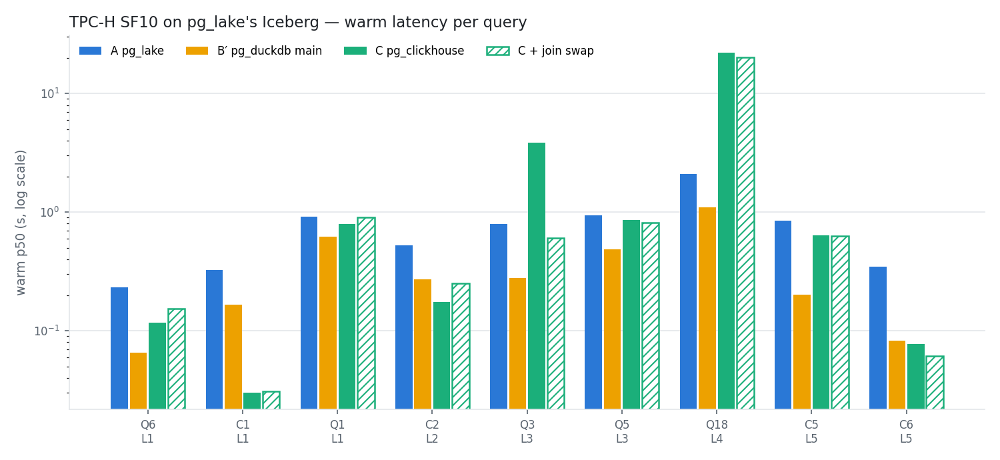

# Postgres에서 pg_lake의 Iceberg 테이블 조회하기: pg_duckdb vs pg_clickhouse

*Ken, ClickHouse Solutions Architect · 2026-09-25 ·
[English](pg-lake-duckdb-vs-clickhouse.en.md)*

> **밝혀 둘 점.** 필자는 ClickHouse에서 일합니다. 아래 내용은 모두 이 저장소의 실습으로 재현할
> 수 있습니다. pg_duckdb가 이긴 부분도 진 부분과 똑같이 그대로 적었습니다.

## 요약

- **pg_lake**를 쓰면 Postgres가 오래된 행을 REST 카탈로그(여기서는 Apache Polaris)에 등록된
  Apache Iceberg 테이블로 옮길 수 있습니다. 질문은 이 콜드 데이터의 분석을 어느 확장이 맡을지였습니다.
  후보는 별도 Postgres 안에서 DuckDB를 돌리는 **pg_duckdb**, 그리고 같은 Iceberg 파일을 읽는
  ClickHouse로 쿼리를 넘기는 **pg_clickhouse**입니다.
- **세 엔진이 같은 테이블을 읽게 하는 데 업스트림 수정이 두 건 필요했습니다.** ClickHouse는 pg_lake
  3.5.3의 manifest를 거부했고, pg_lake를 패치하고서야 읽었습니다
  ([pg_lake#659](https://github.com/Snowflake-Labs/pg_lake/issues/659)). 릴리스된 pg_duckdb 1.1.1은
  월 파티션 테이블에서 오류 없이 **틀린 답**을 냅니다
  ([duckdb-iceberg#699](https://github.com/duckdb/duckdb-iceberg/issues/699)). 맞는 답을 내는 것은
  main 브랜치뿐입니다.
- **스캔·집계는 비슷합니다.** 파티션 pruning이나 집계가 대부분인 쿼리는 pg_clickhouse가 이깁니다
  (C1 **30 ms** vs 166 ms). Q6 같은 작은 스캔은 pg_duckdb가 이깁니다(**65 ms** vs 116 ms).
- **조인은 기본 설정에서 pg_duckdb가 유리합니다.** Iceberg 위의 ClickHouse는 제대로 된 조인 순서를
  고르려면 설정 하나가 필요했습니다(Q3: 3.85 s → **0.61 s**). pg_clickhouse가 pushdown하지 못하는
  semi-join 때문에 Q18은 pg_duckdb보다 **20배 느렸습니다**.
- **OLTP 노드 부하**에서는 pg_clickhouse가 두드러집니다. 통째로 pushdown된 쿼리가 메인 Postgres에
  주는 부하는 **0.01–0.03 core-초**입니다. pg_duckdb도 메인 노드를 비워 두지만, hot 행 사본을 가진
  두 번째 Postgres가 필요합니다.

## 구성

흔한 "Postgres ILM" 설계는 최근 행을 heap 테이블에 두고 오래된 월을 Iceberg로 옮깁니다. 옮기는
일은 pg_lake가 하고, 테이블은 Iceberg REST 카탈로그에 등록됩니다. 그러면 Iceberg REST를 지원하는
엔진은 무엇이든 읽을 수 있습니다.

```
 pg-main: PostgreSQL 18.6
 ├── hot 행 (heap 테이블)
 ├── pg_lake 3.5.3 ─── 쓰기 ──►  Iceberg 테이블: MinIO(S3)의 Parquet + 메타데이터,
 │                               Apache Polaris 1.7(Iceberg REST)에 등록
 ├── A  pg_lake 자체 리더 ─────────────────────────── 읽기 ──┤
 └── C  pg_clickhouse 0.10 ──► ClickHouse 26.9 ─────── 읽기 ──┤
                               (DataLakeCatalog)              │
 pg-duck: PostgreSQL 18 + pg_duckdb                           │
 └── B/B′  DuckDB iceberg 확장 (REST ATTACH) ─────── 읽기 ──┘
```

| 경로 | Iceberg 파일을 읽는 주체 | CPU를 쓰는 곳 |
|---|---|---|
| **A** pg_lake 네이티브 | pg_lake에 내장된 DuckDB(`pgduck_server`) | 메인 Postgres 노드 |
| **B** pg_duckdb 1.1.1(릴리스) | DuckDB `iceberg` 확장, REST `ATTACH` | 별도 Postgres 노드 |
| **B′** pg_duckdb main(1.2.0-dev) | 동일, DuckDB 1.5.4 | 별도 Postgres 노드 |
| **C** pg_clickhouse 0.10.0 | ClickHouse `DataLakeCatalog` → Polaris | ClickHouse. Postgres는 계획과 행 수신만 |

ClickHouse 테이블에는 아무것도 적재하지 않습니다. 경로 C는 pg_lake의 Iceberg 파일을 그 자리에서
읽습니다. 이 실험의 요점이 바로 그것이었습니다.

**데이터와 규칙.**
- 데이터는 TPC-H SF10입니다. `lineitem`(6,000만 행)과 `orders`를 1998-02-01 기준으로 나눕니다.
  이후 행은 heap에 남고, 이전 월(lineitem 5,390만 행, 월별 파일 73개, 1.8 GB)은 `month(date)`로
  파티션한 Iceberg로 갑니다. 디멘션은 Iceberg 사본입니다.
- 엔진 컨테이너는 Docker VM 하나(12 vCPU Mac)에서 각각 **4 vCPU / 4 GB**로 제한했습니다. 측정 중에는
  측정 대상 엔진만 띄웁니다.
- 각 수치는 측정하지 않는 warm-up 뒤 **warm 5회의 중앙값**입니다. 모든 결과는 순서와 무관한 해시로
  경로 A와 대조합니다.

쿼리 9개는 다섯 tier로 나뉩니다. 스캔·집계(Q1, Q6, C1), 고카디널리티(C2), 조인(Q3, Q5), 복합(Q18),
ILM(C5는 hot과 cold에 걸침, C6는 키 단건 조회)입니다.

## 연결 방법

**pg_duckdb**는 Polaris 카탈로그를 세션마다 attach해야 해서, 실습은 PG18 login 이벤트 트리거를
씁니다. DuckDB가 subtransaction을 거부하므로 `EXCEPTION` 블록은 쓸 수 없습니다.

```sql
CREATE FUNCTION bench_attach_polaris() RETURNS event_trigger LANGUAGE plpgsql AS $$
BEGIN
  PERFORM duckdb.raw_query($q$CREATE SECRET IF NOT EXISTS polaris_s (TYPE iceberg,
      CLIENT_ID '…', CLIENT_SECRET '…',
      OAUTH2_SERVER_URI 'http://polaris:8181/api/catalog/v1/oauth/tokens')$q$);
  PERFORM duckdb.raw_query($q$ATTACH IF NOT EXISTS 'ilm' AS polaris (TYPE iceberg,
      SECRET polaris_s, ENDPOINT 'http://polaris:8181/api/catalog',
      ACCESS_DELEGATION_MODE 'none')$q$);
END $$;
CREATE EVENT TRIGGER bench_attach_polaris ON login EXECUTE FUNCTION bench_attach_polaris();
```

**pg_clickhouse**는 ClickHouse에 카탈로그를 가리키는 데이터베이스를 하나 만들고, 표준 foreign
server를 붙이면 됩니다. STS가 없는 MinIO에서는 `vended_credentials = false`가 필요합니다. 없으면
Polaris가 테이블 로드를 거부합니다.

```sql
-- ClickHouse
CREATE DATABASE polaris ENGINE = DataLakeCatalog('http://polaris:8181/api/catalog', '<s3 key>', '<s3 secret>')
SETTINGS catalog_type = 'rest', warehouse = 'ilm', catalog_credential = '<id>:<secret>',
         oauth_server_uri = 'http://polaris:8181/api/catalog/v1/oauth/tokens',
         storage_endpoint = 'http://minio:9000/warehouse', vended_credentials = false;
CREATE VIEW bench.lineitem_cold AS SELECT * FROM polaris.`tpch.lineitem_cold`;

-- Postgres
CREATE SERVER ch FOREIGN DATA WRAPPER clickhouse_fdw
  OPTIONS (driver 'binary', host 'clickhouse', port '9000', dbname 'bench');
IMPORT FOREIGN SCHEMA bench FROM SERVER ch INTO ch;
```

뷰를 두는 이유는 카탈로그 테이블 이름이 `tpch.lineitem_cold` 형태라 FDW가 그대로 가져올 수 없기
때문입니다.

## 의외 1: ClickHouse가 pg_lake 테이블을 읽지 못했다

ClickHouse의 첫 쿼리는 `No partition-spec in iceberg manifest file`로 실패했습니다. Iceberg 스펙은
모든 manifest 파일에 key-value 메타데이터(`schema`, `schema-id`, `partition-spec`,
`partition-spec-id`, `format-version`, `content`)를 요구합니다. 그런데 pg_lake 3.5.3은 Avro 기본값만
씁니다. pg_lake 자신의 DuckDB처럼 관대한 리더는 이를 무시하지만, 스펙을 엄격히 따르는 리더는
그렇지 않습니다.

pg_clickhouse가 아니라 쓰는 쪽의 버그입니다. fork에 패치를 올리고
[pg_lake#659](https://github.com/Snowflake-Labs/pg_lake/issues/659)로 보고했습니다. 실습은 그 패치로
pg_lake를 빌드하므로, **이 글의 경로 C 수치는 모두 "pg_lake + 패치" 기준**입니다. 패치가 없으면
ClickHouse는 테이블을 아예 읽지 못합니다.

## 의외 2: 릴리스된 pg_duckdb가 틀린 답을 낸다

pg_duckdb 1.1.1(DuckDB 1.4.3)이 계산한 Q6 매출은 다른 엔진과 달랐습니다. 월별 건수 C1은
**3행 대신 0행**을 반환했습니다. 오류는 나지 않았습니다.

이 빌드의 iceberg 확장은 `month()` 파티션 변환을 `days / 30`으로 계산합니다. 그래서 범위 조건에서
읽어야 할 파일을 pruning해 버립니다. 1994-01-01부터 읽는 조건이면 1994년 1–4월이 빠집니다. 이는
업스트림에서 이미 고친 [duckdb-iceberg#699](https://github.com/duckdb/duckdb-iceberg/issues/699)
입니다. pg_duckdb main(1.2.0-dev, DuckDB 1.5.4)에는 수정이 들어 있지만 아직 어느 릴리스에도 없어서,
[pg_duckdb#1083](https://github.com/duckdb/pg_duckdb/issues/1083)으로 릴리스를 요청했습니다.

**아래 pg_duckdb 수치는 main 빌드(B′) 기준입니다.** B 1.1.1은 틀린 답을 확인하는 데만 돌렸습니다.

## 결과



| Tier | 쿼리 | A pg_lake | B′ pg_duckdb | C pg_clickhouse | C + join swap |
|---|---|---:|---:|---:|---:|
| L1 | Q6 매출 예측 | 233 ms | **65 ms** | 116 ms | 153 ms |
| L1 | C1 분기 내 월별 건수 | 327 ms | 166 ms | **30 ms** | 31 ms |
| L1 | Q1 가격 요약 | 921 ms | **625 ms** | 797 ms | 905 ms |
| L2 | C2 고객 Top 100 | 524 ms | 270 ms | **175 ms** | 252 ms |
| L3 | Q3 배송 우선순위 | 799 ms | **278 ms** | 3.85 s | 608 ms |
| L3 | Q5 지역 공급자 매출 | 934 ms | **487 ms** | 863 ms | 811 ms |
| L4 | Q18 대량 구매 고객 | 2.09 s | **1.09 s** | 22.2 s | 20.2 s |
| L5 | C5 최근 12개월(hot + cold) | 844 ms | **200 ms** | 636 ms | 628 ms |
| L5 | C6 키 단건 조회(hot + cold) | 347 ms | 82 ms | 77 ms | **61 ms** |

정밀도에 대해: join swap 설정이 영향을 줄 수 없는 쿼리(Q6, C2)도 C의 두 실행 사이에 최대 30 %
움직였습니다. 그보다 작은 차이는 무승부로 보시면 됩니다.

**스캔·집계(L1–L2).**
- pruning이나 집계를 적극적으로 할 수 있는 곳에서는 pg_clickhouse가 이깁니다. C1은 한 분기의 월별
  행 수를 세는데, ClickHouse는 월별 파일 3개만 열어 30 ms에 답합니다.
- 작고 선택도 높은 스캔인 Q6는 pg_duckdb가 이깁니다.
- 전체 스캔(Q1)에서는 세 경로가 서로 1.5배 안쪽입니다.

**조인(L3–L4).** 기본 설정에서는 pg_duckdb가 빠르고, 격차는 거의 다 두 가지 원인으로 설명됩니다.

### Q3: Iceberg 위의 조인 순서

Q3의 pushdown된 SQL은 ClickHouse에서 직접 돌려도 3.5–3.7초입니다. 즉 pg_clickhouse가 시간을
더하는 것이 아닙니다. ClickHouse의 해시 조인은 **오른쪽** 테이블로 해시 테이블을 만듭니다. 생성된
SQL은 `customer ⋈ orders ⋈ lineitem` 순서라서, 5,400만 행의 `lineitem`이 빌드 쪽이 됩니다.

`query_plan_join_swap_table`의 기본값 `auto`가 이를 바로잡아야 하지만, 여기서는 그러지 않았습니다.
`DataLakeCatalog` 뒤의 테이블에는 행 수 추정치가 없기 때문으로 봅니다. Postgres에서 swap을 강제하면
해결됩니다.

```sql
SET pg_clickhouse.session_settings =
  'join_use_nulls 1, group_by_use_nulls 1, final 1, transform_null_in 0, query_plan_join_swap_table 1';
```

문자열에는 pg_clickhouse 기본값을 그대로 두세요. pushdown 정합성이 `join_use_nulls`와
`transform_null_in`에 달려 있습니다. swap을 켜면 Q3가 3.85초에서 **0.61초**로 줄고, Q5도 조금
나아집니다. Q3는 여전히 pg_duckdb(278 ms)가 앞서지만, 격차는 14배에서 약 2배로 줄어듭니다.

### Q18: Postgres에 남는 semi-join

Q18은 `o_orderkey IN (SELECT l_orderkey … GROUP BY l_orderkey HAVING sum(l_quantity) > 300)`로
주문을 거릅니다. pg_clickhouse 0.10.0은 3-way 조인과 서브쿼리를 **따로따로** 원격 쿼리 두 개로
넘깁니다. 그러면 조인 결과, 즉 cold lineitem 전체 행과 그 고객·주문 정보가 Postgres로 스트리밍되고,
semi-join은 Postgres가 합니다. 22초가 걸리고 메인 노드가 14 core-초를 씁니다. `IN`을 집계 서브쿼리와의
명시적 조인으로 바꿔 써도 계획은 같습니다.

ClickHouse 자체는 Q18을 약 4초에 돌립니다. Postgres에서 그 속도를 얻으려면 쿼리 전체가 한 번에
내려가야 합니다. `IN`을 담은 ClickHouse 뷰를 쓰면 됩니다.

```sql
-- ClickHouse
CREATE VIEW bench.orders_big AS
SELECT * FROM bench.orders_cold
WHERE o_orderkey IN (SELECT l_orderkey FROM bench.lineitem_cold
                     GROUP BY l_orderkey HAVING sum(l_quantity) > 300);
-- Postgres: IMPORT FOREIGN SCHEMA bench LIMIT TO (orders_big) FROM SERVER ch INTO ch;
-- 그다음 customer, ch.orders_big, lineitem을 평소처럼 조인
```

그러면 쿼리가 통째로 pushdown되고 결과도 같습니다. 8.2–8.9초가 걸렸고, join swap을 더하면
**4.2초**였습니다. 이 수치는 하니스가 아니라 psql에서 직접 잰 값입니다(3회). pg_duckdb의 1.09초보다는
여전히 느리지만, 더는 20배 차이가 아닙니다.

**ILM 뷰(L5).** C5와 C6는 heap과 Iceberg를 `UNION ALL` 뷰로 합치므로, 일의 일부는 항상 Postgres가
합니다.
- pg_duckdb는 hot 행의 로컬 사본을 읽어 C5를 이깁니다.
- 키 단건 조회인 C6는 60–80 ms로 비슷합니다.

## OLTP 노드가 치르는 비용

많은 팀에게 지연시간은 부차적입니다. 중요한 것은 분석이 primary를 느리게 만들지 않는 것입니다.
실습은 컨테이너별 cgroup CPU를 잽니다.

| 쿼리 | A: 메인 노드 | C: 메인 노드 | C: ClickHouse | B′: 두 번째 노드 |
|---|---:|---:|---:|---:|
| Q1 | 2.81 | 0.01 | 3.10 | 2.34 |
| Q6 | 0.34 | 0.01 | 0.29 | 0.13 |
| Q3 | 1.47 | 0.03 | 6.86 | 0.77 |
| Q5 | 2.07 | 0.01 | 2.86 | 1.37 |
| Q18 | 5.23 | **14.04** | 26.12 | 4.03 |
| C5 | 1.33 | 0.62 | 0.10 | 0.73 |

(쿼리당 core-초 중앙값)

- **pg_lake 자체 리더(A)**는 부하를 전부 primary에 올립니다.
- **pg_clickhouse(C)**는 쿼리가 pushdown되면 거의 아무것도 올리지 않습니다. pushdown되지 않으면
  (Q18) 아무것도 하지 않은 것보다도 나쁩니다.
- **pg_duckdb(B′)**도 primary를 쉬게 하지만, 레플리카나 별도 Postgres가 필요합니다. ILM 뷰를 위해
  hot 행을 그쪽에 복사해야 하는데, 실습에서는 `pg_dump`를 씁니다.

## 무엇을 고를까?

- **조인이 많은 ad-hoc SQL에는 pg_duckdb(main 빌드).** 대부분의 조인에서 가장 빠르고, 계획 전체가
  pushdown 경계 없이 한 엔진에서 돕니다. duckdb-iceberg month 변환 수정이 들어간 빌드를 고정하고,
  전용 Postgres를 주세요.
- **primary Postgres를 건드리지 않으려면 pg_clickhouse.** Postgres를 더 두지 않고도 분석 용량을
  늘릴 수 있습니다. 집계와 pruning이 잘 되는 필터에서 가장 강합니다.
  - Iceberg 기반 조인에는 `query_plan_join_swap_table 1`을 설정하세요.
  - `EXPLAIN (VERBOSE)`에서 `Remote SQL`에 들어가지 않은 부분을 확인하세요.
  - 집계 서브쿼리에 대한 semi-join은 ClickHouse 뷰로 옮기세요.
- **어느 쪽이든 Iceberg writer와 reader 조합을 먼저 검증하세요.** 여기서는 튜닝을 시작하기도 전에
  리더 셋 중 둘이 writer와 어긋났습니다.

## 한계

- SF10 데이터셋 하나를 노트북 VM 하나에서 돌린 결과입니다. 실행 간 노이즈는 최대 30 %였습니다.
- warm 실행만 쟀습니다. cold 캐시 실행과 동시성 테스트는 하지 않았습니다.
- 디멘션은 Iceberg에 두었습니다(D1). 디멘션을 heap에 두는 혼합 구성은 측정하지 않았습니다.
- pg_lake#659가 반영되기 전까지 경로 C는 패치한 pg_lake에서 돕니다.
- Q18 뷰 우회와 ClickHouse 직접 실행 수치는 하니스가 아니라 손으로 잰 값입니다.

## 재현

모든 것이 [clickhouse-hols](https://github.com/litkhai/clickhouse-hols) 저장소의
`local/pg-analytics`에 있습니다. Polaris, MinIO, 두 종류의 Postgres, ClickHouse를 띄우는 Docker
Compose와, 빌드·적재·검증·벤치마크 스크립트가 들어 있습니다.

```bash
cd local/pg-analytics
./00-setup.sh      # PG 18 + pg_lake(+ 패치) + pg_clickhouse 빌드, 스택 기동
./run-all.sh 10    # SF10 bulk 적재, 연동 게이트, 전 경로, 약 25분
./07-report.sh     # 표와 차트
```

쿼리별 최소–최대를 포함한 전체 수치는 [RESULTS.md](../RESULTS.md)에, 테스트 설계는
[docs/DESIGN.md](../docs/DESIGN.md)에 있습니다.
