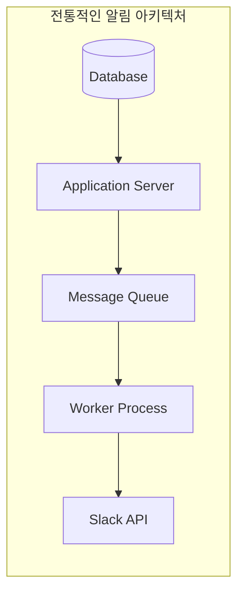
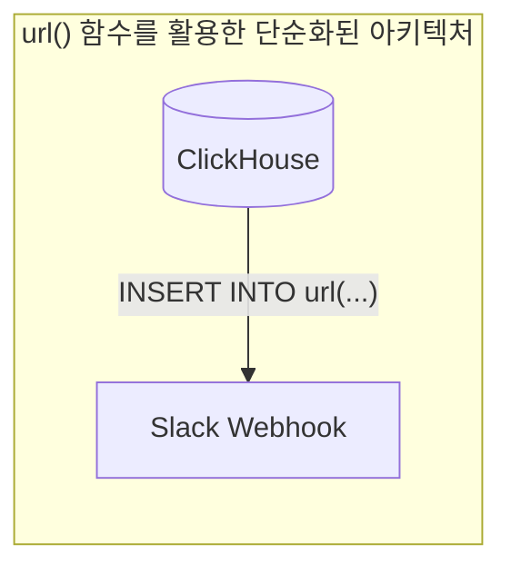
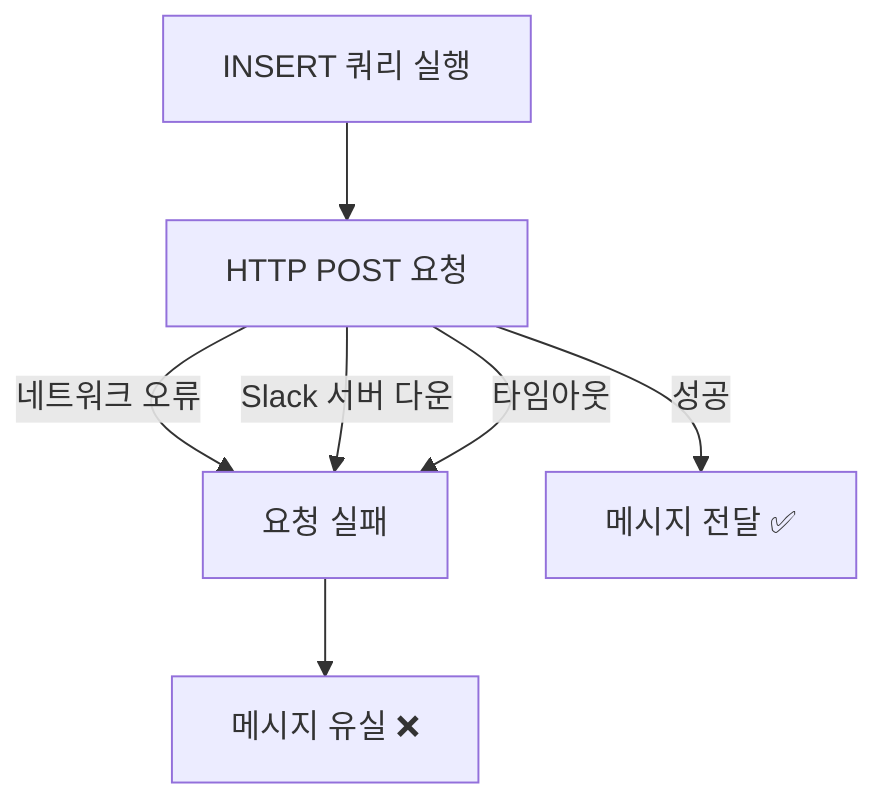
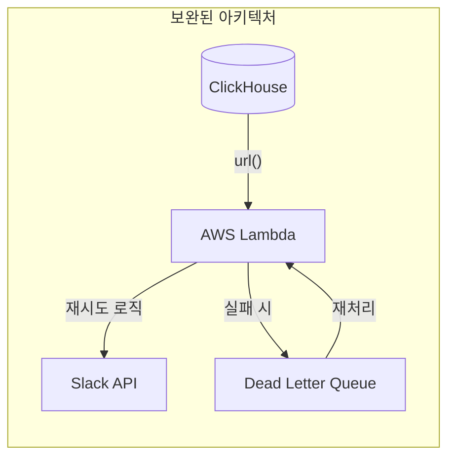
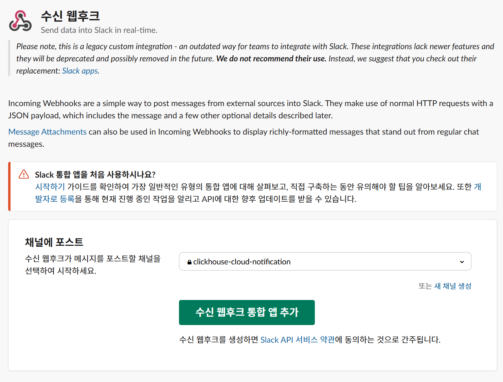
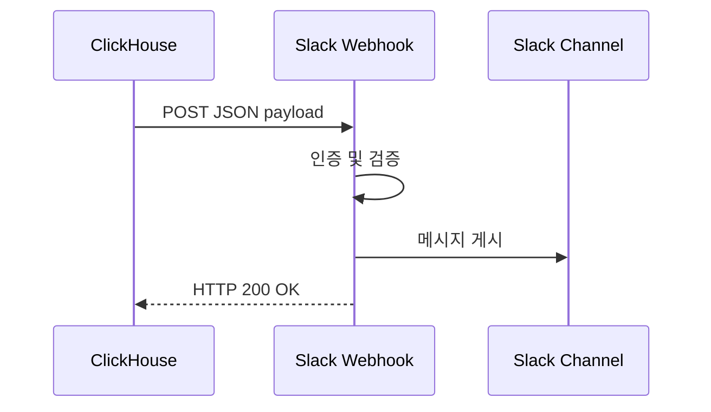
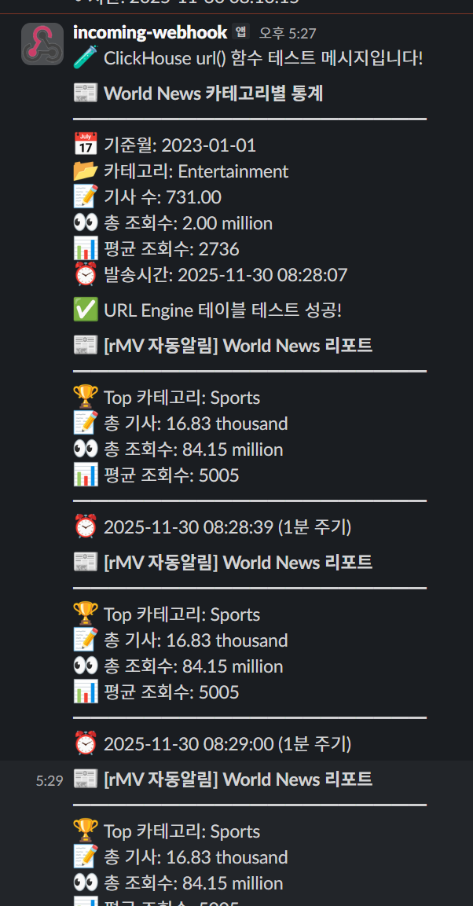
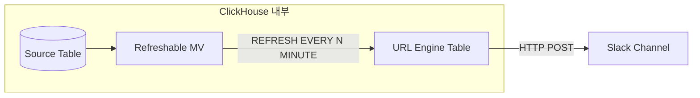
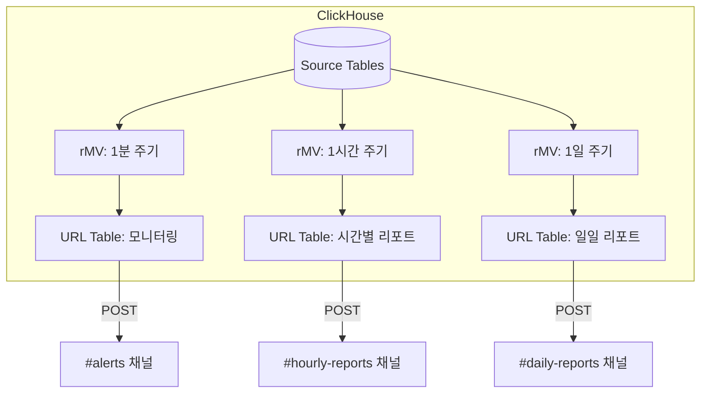

# Webhook-Based Slack Alerts with the url() Table Function

[English](#english) | [한국어](#한국어)

---

## English

> **Migrated, not verified.** Moved on 2026-10-06 from the author's notes site (clickhouse.kr), as written there. The steps and numbers have not been re-run in this repository. The English text is an LLM-assisted translation of the Korean original.

### Introduction: real-time alerting requirements of modern data systems

In an era when data-driven decision making is a core competitive advantage, real-time alerts on business events are no longer optional but essential. Immediate alerts are needed in many scenarios, such as a server monitoring threshold being exceeded, a sales target being reached or a fraudulent transaction being detected.

Traditionally, such an alerting system required a complex architecture:



This structure means managing several components, more points of failure and extra infrastructure cost. ClickHouse's `url()` table function is a powerful tool that dramatically reduces this complexity.

---

### The ClickHouse url() table function

#### Concept

The `url()` table function is a special ClickHouse feature that lets you treat an HTTP/HTTPS endpoint like a table. A SELECT query is automatically converted into a GET request, and an INSERT query into a POST request.

```sql
-- Basic syntax
url(URL, format, structure [, headers])

```

**Parameters:**

| Parameter | Description | Example |
| --- | --- | --- |
| URL | HTTP/HTTPS server address | `'https://hooks.slack.com/...'` |
| format | Data format | `JSONEachRow`, `CSV`, `TSV` and so on |
| structure | Column definition | `'text String'` |
| headers | HTTP headers (optional) | `headers('Content-Type'='application/json')` |

> 📚 Official documentation: ClickHouse url() Table Function

#### Strengths

The core strength of the `url()` function is that you can **communicate with external systems using only SQL**.



**Main strengths:**

1. **Zero extra infrastructure**: No separate application server, message queue or worker process is needed.
2. **SQL-based integration**: Webhook integration is possible with existing SQL knowledge. No new programming language or SDK to learn.
3. **Real-time processing**: The HTTP request is sent as soon as the query runs, so latency is minimal.
4. **Flexible data transformation**: ClickHouse's rich functions (JSON generation, string handling, aggregation and so on) let you shape the data as you like.
5. **Failover support**: You can specify failover addresses by using the `|` character in the URL pattern.

#### Limitations

Despite the powerful feature, there are limitations to consider in production.

#### 1. Possible message loss

The `url()` function sends the HTTP request synchronously and has no built-in retry mechanism on failure.



**Situations where loss can occur:**

- A temporary network failure
- Slack API server maintenance or outage
- A request timeout
- Rejection due to rate limiting

#### 2. Formatting constraints

It can be hard to make full use of Slack's rich message formatting (Block Kit). Because the JSON structure has to be generated as a SQL string, composing a complex message is cumbersome.

```sql
-- Building a complex Block Kit message in SQL hurts readability
SELECT concat(
    '{"blocks":[{"type":"section","text":{"type":"mrkdwn","text":"',
    '*Alert*: ', metric_name, ' is ', toString(value),
    '"}}]}'
) AS payload

```

#### 3. Additional techniques to compensate for the limitations

To build a reliable alerting system in production, consider the following complementary measures:



**Complementary measures:**

| Measure | Description | Applicable scenario |
| --- | --- | --- |
| Intermediate layer (Lambda) | Adds retry logic and error handling | Mission-critical alerts |
| Dead Letter Queue | Stores failed messages separately for reprocessing | Message loss must be prevented |
| Alert history table | Tracks delivery status and retries | When an audit log is needed |
| Idempotency keys | Prevent duplicate alerts | High-frequency alerts |

---

### A worked example: implementing Slack alerts

#### Setting up the Slack webhook

#### Creating a Slack app and issuing a webhook URL



1. Create a new app on the [Slack API site](https://api.slack.com/apps)
2. Enable it under **Features > Incoming Webhooks**
3. Click **Add New Webhook to Workspace** and select a channel
4. Copy the generated webhook URL

> 📚 Slack official documentation: Sending messages using incoming webhooks



#### Sending a basic alert

```sql
-- Send a Slack message in the simplest form
INSERT INTO FUNCTION url(
    'https://hooks.slack.com/services/YOUR/WEBHOOK/URL',
    'JSONEachRow',
    'text String'
)
SELECT '🚀 ClickHouse에서 보내는 첫 번째 메시지입니다!' AS text;

```

#### Data-driven dynamic alerts

An example alert based on the World News data used in the actual test:

```sql
-- Alert with World News statistics by category
INSERT INTO FUNCTION url(
    'https://hooks.slack.com/services/YOUR/WEBHOOK/URL',
    'JSONEachRow',
    'text String'
)
SELECT concat(
    '📰 *World News 카테고리별 통계*\n',
    '━━━━━━━━━━━━━━━━━━━━\n',
    '📅 기준월: ', toString(month), '\n',
    '📂 카테고리: ', category, '\n',
    '📝 기사 수: ', formatReadableQuantity(article_count), '\n',
    '👀 총 조회수: ', formatReadableQuantity(total_views), '\n',
    '📊 평균 조회수: ', toString(round(avg_views, 0)), '\n',
    '⏰ 발송시간: ', toString(now())
) AS text
FROM world_news_monthly_category_stats
ORDER BY total_views DESC
LIMIT 1;

```

You can see the following result.



#### Supported parameters

#### Customizing HTTP headers

```sql
INSERT INTO FUNCTION url(
    'https://your-endpoint.com/webhook',
    'JSONEachRow',
    'text String',
    headers(
        'Content-Type' = 'application/json',
        'Authorization' = 'Bearer your-token',
        'X-Custom-Header' = 'custom-value'
    )
)
SELECT 'Message with custom headers' AS text;

```

#### Support for various data formats

| Format | Use | Example |
| --- | --- | --- |
| JSONEachRow | REST API, webhook | Slack, Discord, Teams |
| CSV | Data transfer | Integration with external systems |
| TSV | Log transfer | Log collection systems |
| JSONAsString | Complex JSON | Custom payloads |

#### Failover URL setting

```sql
-- Automatically switch to the backup when the primary fails
INSERT INTO FUNCTION url(
    'https://primary.webhook.com|https://backup.webhook.com',
    'JSONEachRow',
    'text String'
)
SELECT 'High availability message' AS text;

```

---

### Automating periodic alerts with a Refreshable Materialized View

To implement periodic alerts with ClickHouse features alone, you need to combine a **Refreshable Materialized View (rMV)** with a **URL Engine table**.

> 📚 Official documentation: Refreshable Materialized View

#### Architecture overview



**Key points:**

- The `url()` function cannot be used directly in the SELECT clause of an rMV
- Work around it by specifying a **URL Engine table** as the target
- The rMV runs periodically and INSERTs into the URL table, which triggers an HTTP POST

#### Step 1: Create the URL Engine table

```sql
-- Create a URL Engine table that points to the Slack webhook
CREATE TABLE slack_webhook_table
(
    text String
)
ENGINE = URL(
    'https://hooks.slack.com/services/YOUR/WEBHOOK/URL',
    'JSONEachRow'
);

```

An INSERT into a URL Engine table automatically triggers an HTTP POST request to that URL.

```sql
-- Test: INSERT directly into the URL table
INSERT INTO slack_webhook_table
SELECT '✅ URL Engine 테이블 테스트 성공!' AS text;

```

#### Step 2: Create the Refreshable Materialized View

```sql
-- Create an rMV that runs every minute
CREATE MATERIALIZED VIEW world_news_slack_rmv
REFRESH EVERY 1 MINUTE APPEND
TO slack_webhook_table
AS
SELECT concat(
    '📰 *[자동알림] World News 리포트*\n',
    '━━━━━━━━━━━━━━━━━━━━\n',
    '🏆 Top 카테고리: ', category, '\n',
    '📝 총 기사: ', formatReadableQuantity(sum(article_count)), '\n',
    '👀 총 조회수: ', formatReadableQuantity(sum(total_views)), '\n',
    '📊 평균 조회수: ', toString(round(avg(avg_views), 0)), '\n',
    '━━━━━━━━━━━━━━━━━━━━\n',
    '⏰ ', toString(now()), ' (1분 주기)'
) AS text
FROM world_news_monthly_category_stats
GROUP BY category
ORDER BY sum(total_views) DESC
LIMIT 1;

```

**Main options:**

| Option | Description |
| --- | --- |
| `REFRESH EVERY 1 MINUTE` | Runs automatically every minute |
| `APPEND` | Required in ClickHouse Cloud (Replicated DB compatibility) |
| `TO slack_webhook_table` | Specifies the URL Engine table as the target |

#### Step 3: Monitor the rMV status

```sql
-- Check the rMV run status
SELECT
    database,
    view,
    status,
    last_success_time,
    last_refresh_time,
    next_refresh_time
FROM system.view_refreshes
WHERE view = 'world_news_slack_rmv';

```

**Actual test result:**

```text
┌─database─┬─view─────────────────┬─status────┬─last_success_time───┬─next_refresh_time───┐
│ default  │ world_news_slack_rmv │ Scheduled │ 2025-11-30 08:29:00 │ 2025-11-30 08:30:00 │
└──────────┴──────────────────────┴───────────┴─────────────────────┴─────────────────────┘

```

#### Step 4: Trigger a manual refresh (for testing)

```sql
-- Run immediately to test
SYSTEM REFRESH VIEW world_news_slack_rmv;

```

#### REFRESH options in detail

| Option | Description | Example |
| --- | --- | --- |
| `EVERY` | Run at a fixed interval | `REFRESH EVERY 1 HOUR` |
| `AFTER` | Wait time after the previous run completes | `REFRESH AFTER 30 SECOND` |
| `OFFSET` | Start time offset | `EVERY 1 DAY OFFSET 9 HOUR` (every day at 9 a.m.) |
| `RANDOMIZE` | Spread runs out (load distribution) | `RANDOMIZE FOR 5 MINUTE` |
| `DEPENDS ON` | Run after another rMV completes | `DEPENDS ON other_mv` |
| `APPEND` | Append to existing data (no overwrite) | Required in a Replicated environment |

#### Practical examples

#### Daily report at 9 a.m. every day

```sql
CREATE MATERIALIZED VIEW daily_report_mv
REFRESH EVERY 1 DAY OFFSET 9 HOUR APPEND
TO slack_webhook_table
AS
SELECT concat(
    '📈 *일일 리포트* (', toString(yesterday()), ')\n',
    '총 매출: $', formatReadableQuantity(sum(amount)), '\n',
    '주문 수: ', formatReadableQuantity(count())
) AS text
FROM orders
WHERE toDate(created_at) = yesterday();

```

#### Anomaly detection alert every 5 minutes

```sql
CREATE MATERIALIZED VIEW anomaly_alert_mv
REFRESH EVERY 5 MINUTE APPEND
TO slack_webhook_table
AS
SELECT concat(
    '🚨 *이상 탐지 경고*\n',
    '에러율: ', toString(round(error_rate * 100, 2)), '%\n',
    '임계값 초과!'
) AS text
FROM (
    SELECT
        countIf(status >= 500) / count() AS error_rate
    FROM access_logs
    WHERE timestamp >= now() - INTERVAL 5 MINUTE
)
WHERE error_rate > 0.05;  -- Alert only when above 5%

```

#### Hourly traffic summary (load distribution)

```sql
CREATE MATERIALIZED VIEW hourly_traffic_mv
REFRESH EVERY 1 HOUR RANDOMIZE FOR 5 MINUTE APPEND
TO slack_webhook_table
AS
SELECT concat(
    '📊 *시간별 트래픽*\n',
    '요청 수: ', formatReadableQuantity(count()), '\n',
    'P99 응답시간: ', toString(quantile(0.99)(response_time)), 'ms'
) AS text
FROM access_logs
WHERE timestamp >= now() - INTERVAL 1 HOUR;

```

#### rMV management commands

```sql
-- Pause the rMV
SYSTEM STOP VIEW world_news_slack_rmv;

-- Resume the rMV
SYSTEM START VIEW world_news_slack_rmv;

-- Run the rMV immediately
SYSTEM REFRESH VIEW world_news_slack_rmv;

-- Drop the rMV
DROP VIEW world_news_slack_rmv;

-- Drop the URL table
DROP TABLE slack_webhook_table;

```

---

### Overall architecture summary



---

### Summary

Combining ClickHouse's `url()` table function with a Refreshable Materialized View lets you build a periodic Slack alerting system **with ClickHouse alone, without extra infrastructure**.

**Key components:**

| Component | Role |
| --- | --- |
| URL Engine table | Abstracts the webhook endpoint as a table |
| Refreshable MV | Runs a query periodically and passes the result to the URL table |
| `APPEND` mode | Compatible with ClickHouse Cloud (Replicated) environments |

**Strengths:**

- ✅ Self-contained with ClickHouse features
- ✅ Alert logic defined in SQL alone
- ✅ Flexible scheduling options
- ✅ No extra infrastructure or cost

**Cautions:**

- ⚠️ No retry logic (messages can be lost)
- ⚠️ Complex message formatting is difficult
- ⚠️ `APPEND` mode is required in ClickHouse Cloud

**Recommended scenarios:**

- Sending periodic data reports
- Threshold-based monitoring alerts
- Quick alerting for development/test environments
- PoCs and prototyping

---

### References

- [ClickHouse url() Table Function official documentation](https://clickhouse.com/docs/sql-reference/table-functions/url)
- [ClickHouse URL Table Engine](https://clickhouse.com/docs/engines/table-engines/special/url)
- [Refreshable Materialized View](https://clickhouse.com/docs/materialized-view/refreshable-materialized-view)
- [Slack Incoming Webhooks](https://api.slack.com/messaging/webhooks)
- [Slack Message Formatting](https://api.slack.com/reference/surfaces/formatting)

---

## 한국어

> **이관본, 미검증.** 2026-10-06 작성자의 노트 사이트(clickhouse.kr)에서 원문 그대로 옮겼습니다. 이 저장소에서 단계와 수치를 다시 실행하지 않았습니다. 영어본은 한국어 원문을 LLM 도움으로 번역한 것입니다.

### 들어가며: 현대 데이터 시스템의 실시간 알림 요구사항

데이터 기반 의사결정이 핵심 경쟁력이 된 시대에서, 비즈니스 이벤트에 대한 실시간 알림은 선택이 아닌 필수가 되었습니다. 서버 모니터링 임계값 초과, 매출 목표 달성, 이상 거래 탐지 등 다양한 시나리오에서 즉각적인 알림이 필요합니다.

전통적으로 이러한 알림 시스템은 복잡한 아키텍처를 필요로 했습니다:


이 구조는 여러 컴포넌트의 관리, 장애 포인트 증가, 그리고 추가적인 인프라 비용을 수반합니다. ClickHouse의 `url()` 테이블 함수는 이러한 복잡성을 획기적으로 줄여주는 강력한 도구입니다.

---

### ClickHouse url() 테이블 함수

#### 개념

`url()` 테이블 함수는 HTTP/HTTPS 엔드포인트를 마치 테이블처럼 다룰 수 있게 해주는 ClickHouse의 특별한 기능입니다. SELECT 쿼리는 GET 요청으로, INSERT 쿼리는 POST 요청으로 자동 변환됩니다.

```sql
-- 기본 문법
url(URL, format, structure [, headers])

```

**파라미터 설명:**

| 파라미터 | 설명 | 예시 |
| --- | --- | --- |
| URL | HTTP/HTTPS 서버 주소 | `'https://hooks.slack.com/...'` |
| format | 데이터 포맷 | `JSONEachRow`, `CSV`, `TSV` 등 |
| structure | 컬럼 정의 | `'text String'` |
| headers | HTTP 헤더 (선택) | `headers('Content-Type'='application/json')` |

> 📚 공식 문서: ClickHouse url() Table Function

#### 장점 및 강력함

`url()` 함수의 핵심 강점은 **SQL만으로 외부 시스템과 통신**할 수 있다는 점입니다.


**주요 장점:**

1. **제로 인프라 추가**: 별도의 애플리케이션 서버, 메시지 큐, 워커 프로세스가 필요 없습니다.
2. **SQL 기반 통합**: 기존 SQL 지식만으로 웹훅 연동이 가능합니다. 새로운 프로그래밍 언어나 SDK 학습이 불필요합니다.
3. **실시간 처리**: 쿼리 실행 즉시 HTTP 요청이 발생하므로 지연 시간이 최소화됩니다.
4. **유연한 데이터 변환**: ClickHouse의 풍부한 함수들(JSON 생성, 문자열 처리, 집계 등)을 활용하여 원하는 형태로 데이터를 가공할 수 있습니다.
5. **Failover 지원**: URL 패턴에서 `|` 문자를 사용하여 장애 조치 주소를 지정할 수 있습니다.

#### 한계점

강력한 기능에도 불구하고, 프로덕션 환경에서 고려해야 할 한계점들이 존재합니다.

#### 1. 메시지 유실 가능성

`url()` 함수는 동기적으로 HTTP 요청을 수행하며, 실패 시 재시도 메커니즘이 내장되어 있지 않습니다.


**유실이 발생할 수 있는 상황:**

- 네트워크 일시적 장애
- Slack API 서버 점검 또는 장애
- 요청 타임아웃
- Rate limiting으로 인한 거부

#### 2. 포맷팅 제약

Slack의 풍부한 메시지 포맷팅(Block Kit)을 완전히 활용하기 어려울 수 있습니다. JSON 구조를 SQL 문자열로 생성해야 하므로 복잡한 메시지 구성이 번거롭습니다.

```sql
-- 복잡한 Block Kit 메시지를 SQL로 구성하면 가독성이 떨어짐
SELECT concat(
    '{"blocks":[{"type":"section","text":{"type":"mrkdwn","text":"',
    '*Alert*: ', metric_name, ' is ', toString(value),
    '"}}]}'
) AS payload

```

#### 3. 한계를 보완하기 위한 추가 기법

프로덕션 환경에서 안정적인 알림 시스템을 구축하려면 다음과 같은 보완 방안을 고려해야 합니다:


**보완 방안:**

| 방안 | 설명 | 적용 시나리오 |
| --- | --- | --- |
| 중간 계층 (Lambda) | 재시도 로직, 에러 핸들링 추가 | 미션 크리티컬 알림 |
| Dead Letter Queue | 실패 메시지 별도 저장 후 재처리 | 메시지 유실 방지 필수 |
| 알림 이력 테이블 | 발송 상태 추적 및 재시도 | 감사 로그 필요 시 |
| 멱등성 키 활용 | 중복 알림 방지 | 고빈도 알림 |

---

### 실제 예시: Slack 알림 구현

#### Slack Webhook 설정

#### Slack App 생성 및 Webhook URL 발급


1. [Slack API 사이트](https://api.slack.com/apps)에서 새 앱 생성
2. **Features > Incoming Webhooks** 메뉴에서 활성화
3. **Add New Webhook to Workspace** 클릭 후 채널 선택
4. 생성된 Webhook URL 복사

> 📚 Slack 공식 문서: Sending messages using incoming webhooks


#### 기본 알림 전송

```sql
-- 가장 간단한 형태의 Slack 메시지 전송
INSERT INTO FUNCTION url(
    'https://hooks.slack.com/services/YOUR/WEBHOOK/URL',
    'JSONEachRow',
    'text String'
)
SELECT '🚀 ClickHouse에서 보내는 첫 번째 메시지입니다!' AS text;

```

#### 데이터 기반 동적 알림

실제 테스트에서 사용한 World News 데이터 기반 알림 예시:

```sql
-- World News 카테고리별 통계 알림
INSERT INTO FUNCTION url(
    'https://hooks.slack.com/services/YOUR/WEBHOOK/URL',
    'JSONEachRow',
    'text String'
)
SELECT concat(
    '📰 *World News 카테고리별 통계*\n',
    '━━━━━━━━━━━━━━━━━━━━\n',
    '📅 기준월: ', toString(month), '\n',
    '📂 카테고리: ', category, '\n',
    '📝 기사 수: ', formatReadableQuantity(article_count), '\n',
    '👀 총 조회수: ', formatReadableQuantity(total_views), '\n',
    '📊 평균 조회수: ', toString(round(avg_views, 0)), '\n',
    '⏰ 발송시간: ', toString(now())
) AS text
FROM world_news_monthly_category_stats
ORDER BY total_views DESC
LIMIT 1;

```

다음과 같은 결과를 확인할 수 있습니다.


#### 지원 가능한 파라미터들

#### HTTP 헤더 커스터마이징

```sql
INSERT INTO FUNCTION url(
    'https://your-endpoint.com/webhook',
    'JSONEachRow',
    'text String',
    headers(
        'Content-Type' = 'application/json',
        'Authorization' = 'Bearer your-token',
        'X-Custom-Header' = 'custom-value'
    )
)
SELECT 'Message with custom headers' AS text;

```

#### 다양한 데이터 포맷 지원

| 포맷 | 용도 | 예시 |
| --- | --- | --- |
| JSONEachRow | REST API, Webhook | Slack, Discord, Teams |
| CSV | 데이터 전송 | 외부 시스템 연동 |
| TSV | 로그 전송 | 로그 수집 시스템 |
| JSONAsString | 복잡한 JSON | 커스텀 페이로드 |

#### Failover URL 설정

```sql
-- Primary 실패 시 Backup으로 자동 전환
INSERT INTO FUNCTION url(
    'https://primary.webhook.com|https://backup.webhook.com',
    'JSONEachRow',
    'text String'
)
SELECT 'High availability message' AS text;

```

---

### Refreshable Materialized View를 활용한 정기 알림 자동화

ClickHouse 기능만으로 정기적인 알림을 구현하려면 **Refreshable Materialized View (rMV)**와 **URL Engine 테이블**을 조합해야 합니다.

> 📚 공식 문서: Refreshable Materialized View

#### 아키텍처 개요


**핵심 포인트:**

- `url()` 함수는 rMV의 SELECT 절에서 직접 사용할 수 없음
- **URL Engine 테이블**을 타겟으로 지정하여 우회
- rMV가 주기적으로 실행되면서 URL 테이블에 INSERT → HTTP POST 발생

#### Step 1: URL Engine 테이블 생성

```sql
-- Slack Webhook을 가리키는 URL Engine 테이블 생성
CREATE TABLE slack_webhook_table
(
    text String
)
ENGINE = URL(
    'https://hooks.slack.com/services/YOUR/WEBHOOK/URL',
    'JSONEachRow'
);

```

URL Engine 테이블에 INSERT하면 자동으로 해당 URL로 HTTP POST 요청이 발생합니다.

```sql
-- 테스트: URL 테이블로 직접 INSERT
INSERT INTO slack_webhook_table
SELECT '✅ URL Engine 테이블 테스트 성공!' AS text;

```

#### Step 2: Refreshable Materialized View 생성

```sql
-- 1분 주기로 실행되는 rMV 생성
CREATE MATERIALIZED VIEW world_news_slack_rmv
REFRESH EVERY 1 MINUTE APPEND
TO slack_webhook_table
AS
SELECT concat(
    '📰 *[자동알림] World News 리포트*\n',
    '━━━━━━━━━━━━━━━━━━━━\n',
    '🏆 Top 카테고리: ', category, '\n',
    '📝 총 기사: ', formatReadableQuantity(sum(article_count)), '\n',
    '👀 총 조회수: ', formatReadableQuantity(sum(total_views)), '\n',
    '📊 평균 조회수: ', toString(round(avg(avg_views), 0)), '\n',
    '━━━━━━━━━━━━━━━━━━━━\n',
    '⏰ ', toString(now()), ' (1분 주기)'
) AS text
FROM world_news_monthly_category_stats
GROUP BY category
ORDER BY sum(total_views) DESC
LIMIT 1;

```

**주요 옵션 설명:**

| 옵션 | 설명 |
| --- | --- |
| `REFRESH EVERY 1 MINUTE` | 1분마다 자동 실행 |
| `APPEND` | ClickHouse Cloud 환경에서 필수 (Replicated DB 호환) |
| `TO slack_webhook_table` | URL Engine 테이블을 타겟으로 지정 |

#### Step 3: rMV 상태 모니터링

```sql
-- rMV 실행 상태 확인
SELECT
    database,
    view,
    status,
    last_success_time,
    last_refresh_time,
    next_refresh_time
FROM system.view_refreshes
WHERE view = 'world_news_slack_rmv';

```

**실제 테스트 결과:**

```text
┌─database─┬─view─────────────────┬─status────┬─last_success_time───┬─next_refresh_time───┐
│ default  │ world_news_slack_rmv │ Scheduled │ 2025-11-30 08:29:00 │ 2025-11-30 08:30:00 │
└──────────┴──────────────────────┴───────────┴─────────────────────┴─────────────────────┘

```

#### Step 4: 수동 Refresh 트리거 (테스트용)

```sql
-- 즉시 실행하여 테스트
SYSTEM REFRESH VIEW world_news_slack_rmv;

```

#### rMV REFRESH 옵션 상세

| 옵션 | 설명 | 예시 |
| --- | --- | --- |
| `EVERY` | 고정 주기 실행 | `REFRESH EVERY 1 HOUR` |
| `AFTER` | 이전 완료 후 대기 시간 | `REFRESH AFTER 30 SECOND` |
| `OFFSET` | 시작 시간 오프셋 | `EVERY 1 DAY OFFSET 9 HOUR` (매일 오전 9시) |
| `RANDOMIZE` | 분산 실행 (부하 분산) | `RANDOMIZE FOR 5 MINUTE` |
| `DEPENDS ON` | 다른 rMV 완료 후 실행 | `DEPENDS ON other_mv` |
| `APPEND` | 기존 데이터에 추가 (덮어쓰기 X) | Replicated 환경 필수 |

#### 실용적인 예시들

#### 매일 오전 9시 일일 리포트

```sql
CREATE MATERIALIZED VIEW daily_report_mv
REFRESH EVERY 1 DAY OFFSET 9 HOUR APPEND
TO slack_webhook_table
AS
SELECT concat(
    '📈 *일일 리포트* (', toString(yesterday()), ')\n',
    '총 매출: $', formatReadableQuantity(sum(amount)), '\n',
    '주문 수: ', formatReadableQuantity(count())
) AS text
FROM orders
WHERE toDate(created_at) = yesterday();

```

#### 5분마다 이상 탐지 알림

```sql
CREATE MATERIALIZED VIEW anomaly_alert_mv
REFRESH EVERY 5 MINUTE APPEND
TO slack_webhook_table
AS
SELECT concat(
    '🚨 *이상 탐지 경고*\n',
    '에러율: ', toString(round(error_rate * 100, 2)), '%\n',
    '임계값 초과!'
) AS text
FROM (
    SELECT
        countIf(status >= 500) / count() AS error_rate
    FROM access_logs
    WHERE timestamp >= now() - INTERVAL 5 MINUTE
)
WHERE error_rate > 0.05;  -- 5% 초과 시에만 알림

```

#### 시간별 트래픽 요약 (부하 분산)

```sql
CREATE MATERIALIZED VIEW hourly_traffic_mv
REFRESH EVERY 1 HOUR RANDOMIZE FOR 5 MINUTE APPEND
TO slack_webhook_table
AS
SELECT concat(
    '📊 *시간별 트래픽*\n',
    '요청 수: ', formatReadableQuantity(count()), '\n',
    'P99 응답시간: ', toString(quantile(0.99)(response_time)), 'ms'
) AS text
FROM access_logs
WHERE timestamp >= now() - INTERVAL 1 HOUR;

```

#### rMV 관리 명령어

```sql
-- rMV 일시 중지
SYSTEM STOP VIEW world_news_slack_rmv;

-- rMV 재개
SYSTEM START VIEW world_news_slack_rmv;

-- rMV 즉시 실행
SYSTEM REFRESH VIEW world_news_slack_rmv;

-- rMV 삭제
DROP VIEW world_news_slack_rmv;

-- URL 테이블 삭제
DROP TABLE slack_webhook_table;

```

---

### 전체 아키텍처 요약


---

### 정리

ClickHouse의 `url()` 테이블 함수와 Refreshable Materialized View를 조합하면, **추가 인프라 없이 ClickHouse만으로** 정기적인 Slack 알림 시스템을 구축할 수 있습니다.

**핵심 구성 요소:**

| 구성 요소 | 역할 |
| --- | --- |
| URL Engine 테이블 | Webhook 엔드포인트를 테이블로 추상화 |
| Refreshable MV | 주기적 쿼리 실행 및 결과를 URL 테이블로 전달 |
| `APPEND` 모드 | ClickHouse Cloud (Replicated) 환경 호환 |

**장점:**

- ✅ ClickHouse 기능만으로 완결
- ✅ SQL만으로 알림 로직 정의
- ✅ 유연한 스케줄링 옵션
- ✅ 추가 인프라/비용 불필요

**주의사항:**

- ⚠️ 재시도 로직 부재 (메시지 유실 가능)
- ⚠️ 복잡한 메시지 포맷팅 어려움
- ⚠️ ClickHouse Cloud에서는 `APPEND` 모드 필수

**권장 사용 시나리오:**

- 정기적인 데이터 리포트 발송
- 임계값 기반 모니터링 알림
- 개발/테스트 환경의 빠른 알림 구축
- PoC 및 프로토타이핑

---

### 참고 자료

- [ClickHouse url() Table Function 공식 문서](https://clickhouse.com/docs/sql-reference/table-functions/url)
- [ClickHouse URL Table Engine](https://clickhouse.com/docs/engines/table-engines/special/url)
- [Refreshable Materialized View](https://clickhouse.com/docs/materialized-view/refreshable-materialized-view)
- [Slack Incoming Webhooks](https://api.slack.com/messaging/webhooks)
- [Slack Message Formatting](https://api.slack.com/reference/surfaces/formatting)
