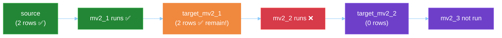
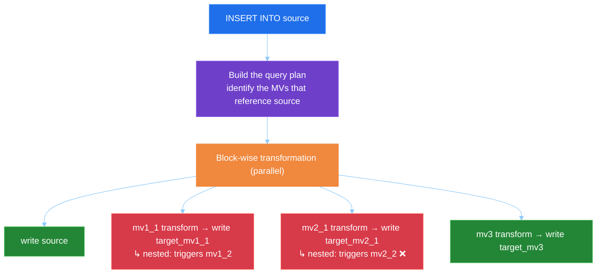
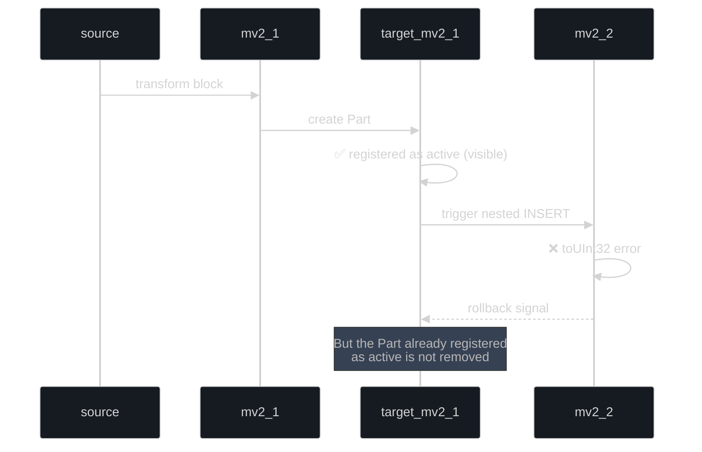
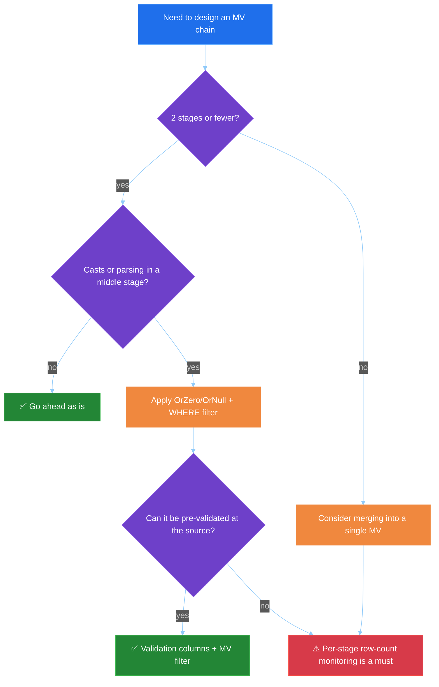
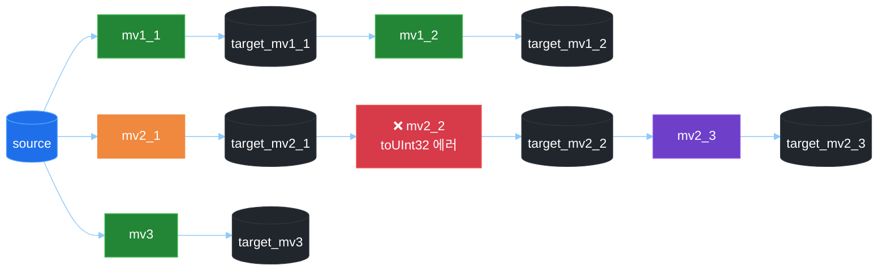
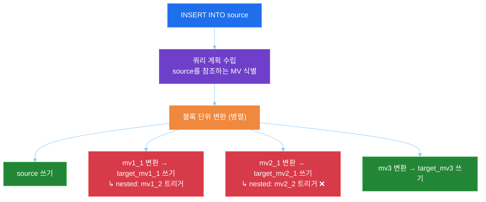
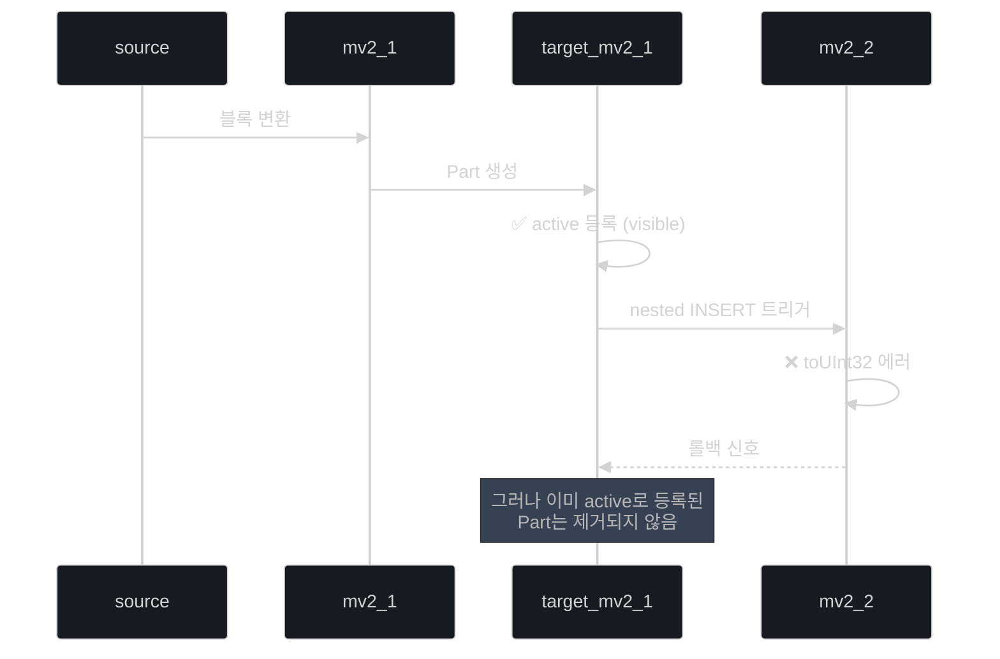
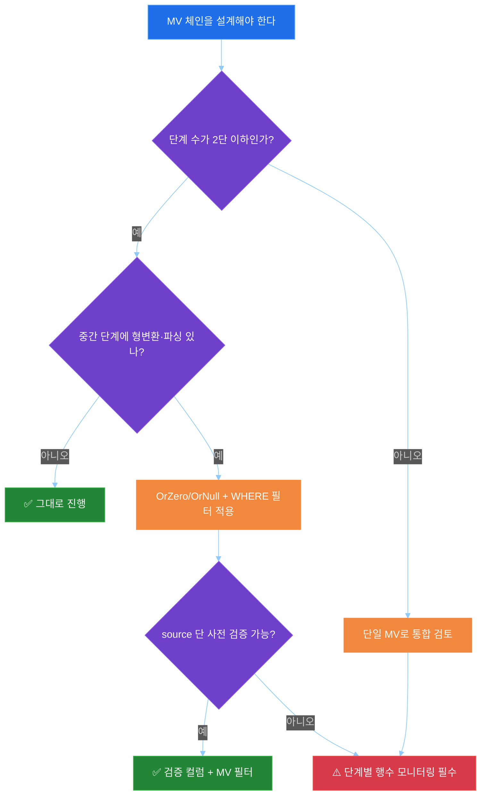

# Failure Propagation in a ClickHouse Materialized View Chain

[English](#english) | [한국어](#한국어)

---

## English

> **Migrated, not verified.** Moved on 2026-10-06 from the author's notes site (clickhouse.kr), as written there. The steps and numbers have not been re-run in this repository. The English text is an LLM-assisted translation of the Korean original.

This is an experiment note that empirically verifies how errors in the middle of a ClickHouse Materialized View chain propagate. We built three independent and dependent chains and deliberately triggered a `toUInt32` conversion error. We confirmed two key phenomena: **partial success within a chain** and **asymmetric failure propagation across chains**. We analyse the cause from the viewpoint of nested INSERTs and Part activation timing, and summarise the defensive patterns and monitoring strategies that apply when designing ClickPipes/MV pipelines.

---

### Introduction: the "partial success" trap of chained MVs

When you run ClickHouse at the centre of a data pipeline, you often end up building a structure like this.

> source → mv1 → target1 → mv2 → target2 → mv3 → target3
> 

It looks like a simple ETL chain, but in practice it is a structure in which **one INSERT fans out into several levels of nested INSERTs**. A natural question follows.

> "If an error occurs in the middle of the chain, how far does the data remain, and from where does it disappear?"
> 

Many people intuitively assume "either everything rolls back or everything succeeds". But a ClickHouse MV is not a transaction; it is a **block transformation pipeline**, so the real behaviour is much more subtle. This article checks that quantitatively with an experiment that injects an error on purpose.

---

### Test environment

#### Version and database

- **ClickHouse version**: 25.10.1.7140
- **Test database**: `mv_chain_test`
- **Test date**: 2026-01-17

#### Architecture

We built three chains, each with a different purpose.

- **Chain 1 (normal two-stage chain)**: the normal path that must succeed to the end
- **Chain 2 (chain with an error in the middle)**: the second MV deliberately raises a `toUInt32` conversion error
- **Chain 3 (independent single MV)**: a control separated from the other chains


#### MV definition summary

**Chain 1 (normal chain)**

- `mv1_1`: `source` → `target_mv1_1` (`data || '-step1'`)
- `mv1_2`: `target_mv1_1` → `target_mv1_2` (`data || '-step2'`)

**Chain 2 (error in the middle)**

- `mv2_1`: `source` → `target_mv2_1` (`data || '-chain2-step1'`)
- `mv2_2`: `target_mv2_1` → `target_mv2_2` (`toUInt32(data)`) ← ❌ where the error occurs
- `mv2_3`: `target_mv2_2` → `target_mv2_3` (`parsed_value || '-step3'`)

**Chain 3 (independent chain)**

- `mv3`: `source` → `target_mv3` (`data || '-independent'`)

---

### Running the test and the results

#### The insert attempt

```sql
INSERT INTO source VALUES
  (1, 'test1', '{"key": "value1"}'),
  (2, 'test2', '{"key": "value2"}');

```

#### The error that occurred

```text
Code: 6. DB::Exception: Cannot parse string 'test1-chain2-step1' as UInt32:
syntax error at begin of string.
Note: there are toUInt32OrZero and toUInt32OrNull functions,
which returns zero/NULL instead of throwing exception:
while executing 'FUNCTION toUInt32(__table1.data :: 0)':
while pushing to view mv_chain_test.mv2_2:
while pushing to view mv_chain_test.mv2_1.

```

The "location clues" in the error are interesting. `while pushing to view mv2_2` is followed by `while pushing to view mv2_1`. In other words, from ClickHouse's point of view it was **running mv2_2 as a nested stage of pushing mv2_1**.

#### Final state of each table

| Table | Rows | Result | Description |
| --- | --- | --- | --- |
| **source** | 2 | ✅ | Source data inserted normally |
| target_mv1_1 | 0 | ❌ | Start of Chain 1 — no data |
| target_mv1_2 | 0 | ❌ | End of Chain 1 — no data |
| **target_mv2_1** | **2** | ⚠️ | **Chain 2 — data remains up to the stage before the error** |
| target_mv2_2 | 0 | ❌ | Chain 2 — where the error occurred |
| target_mv2_3 | 0 | ❌ | Chain 2 — stage after the error not executed |
| **target_mv3** | **2** | ✅ | Independent chain — fully succeeded |

#### Actual written rows in the query log

```text
event_time: 2026-01-17 02:31:24.833412
type:       QueryStart
tables:     [source, target_mv1_1, target_mv1_2,
             target_mv2_1, target_mv2_2, target_mv2_3, target_mv3]

event_time: 2026-01-17 02:31:24.995574
type:       ExceptionWhileProcessing
read_rows:  10
written_rows: 8   ← the key point!

```

Even though an error occurred, `written_rows = 8`. The 2 source rows plus 3 successful MV targets (`source`, `target_mv2_1` and `target_mv3`, 2 rows each) = 8 rows. The query_log shows clearly that this is not "a total failure" but **"a stop after some rows had already been written"**.

---

### Three key findings

#### 1. Partial success within a chain

Chain 2 succeeded up to `mv2_1` and failed at `mv2_2`, but **the data in `target_mv2_1` remained.** So even within one chain, "the data up to the stage just before the error" can survive.



#### 2. Asymmetric impact across chains

The three chains branching from the same source all show different results.

| Chain | Structure | Result | Presumed cause |
| --- | --- | --- | --- |
| Chain 1 | 2 stages (nested) | ❌ Complete failure | Error propagated while waiting on the nested INSERT |
| Chain 2 | 3 stages (contains the error) | ⚠️ Only stage 1 succeeded | The mv2_1 Part had already been registered as active |
| Chain 3 | 1 stage (no nesting) | ✅ Complete success | Independent execution, committed quickly |

#### 3. Nested INSERTs are not atomic

In the flow `mv2_1` → `target_mv2_1` → `mv2_2`, the moment data enters `target_mv2_1` is **separate** from whether `mv2_2` succeeds. A nested INSERT is not a "single parent-child transaction"; it is closer to **separate writes in which each stage independently creates a Part and registers it as active**.

---

### How ClickHouse MVs execute

#### An MV is a block transformation pipeline, not a trigger

A common misconception is that "an MV is post-processing triggered after the source commit". In reality:



The key is that **the source write and all first-level MV writes happen in parallel in the same INSERT pipeline**. And the write of each first-level MV triggers its own second-level MV again in nested form.

#### Why partial success happens: Part activation timing

On INSERT, ClickHouse's MergeTree does the following:

1. Create a new Part in memory
2. **Register the Part as active** (from this point it is visible to SELECT)
3. Flush to disk

The problem is that an error in a nested INSERT can occur **after the parent write's Part has already been registered as active**.



In contrast, `mv1_1` in Chain 1 had a long transformation and nested wait, and the whole transaction was treated as failed **before its Part was registered as active**, so nothing survived. In the end, the asymmetric result "Chain 1 failed / Chain 2 partially succeeded / Chain 3 succeeded" is explained by **the difference in Part activation timing between chains**.

---

### Implications for ClickPipes / MV pipelines

This experiment is not just a curiosity; it ties directly to real operational risks.

#### 1. Data inconsistency from partial success

When you run S3 → source → MV chains with ClickPipes and an error happens once in the middle:

- `target_mv2_1` has data
- the stages from `target_mv2_2` onward have none

If a downstream system refers only to `target_mv2_2`, it sees **"data that does not exist"**, and alerts and reports can go out of step.

#### 2. Harder reprocessing

Simply inserting from the source again accumulates duplicates in `target_mv2_1`. In the end, safe recovery requires knowing "how far the data remains and from where it must be refilled".

#### 3. More complex monitoring

The more stages a chain has, the harder it is to trace "where it broke". Monitoring that compares per-stage row counts and last processing times is essential.

---

### Recommended response patterns

#### 1. Minimise chain length

Where possible, prefer **a single MV that does the whole transformation at once** over a multi-stage chain.

```sql
-- ❌ risky: 3-stage chain
source → mv1 → target1 → mv2 → target2 → mv3 → target3

-- ✅ recommended: do all the needed transformations in a single MV
CREATE MATERIALIZED VIEW mv_all TO target_final
AS SELECT
    id,
    transform1(data) AS step1,
    transform2(transform1(data)) AS step2,
    transform3(transform2(transform1(data))) AS step3
FROM source;

```

#### 2. Use defensive functions

ClickHouse has no SQL-level try-catch, so **the `*OrZero` / `*OrNull` family of functions** and **WHERE pre-filters** are effectively the standard defence.

```sql
-- ❌ risky version
CREATE MATERIALIZED VIEW mv2_2 AS
SELECT id, toUInt32(data) AS parsed_value
FROM target_mv2_1;

-- ✅ safe version
CREATE MATERIALIZED VIEW mv2_2 AS
SELECT id, toUInt32OrZero(data) AS parsed_value
FROM target_mv2_1
WHERE match(data, '^[0-9]+$');

```

#### 3. Put validation columns on the source in advance

If you classify data that could cause conversion errors at the source, the MV "always sees only valid data".

```sql
CREATE TABLE source (
    id UInt32,
    data String,
    json_data String,
    data_is_numeric UInt8 DEFAULT match(data, '^[0-9]+$'),
    json_is_valid UInt8 DEFAULT isValidJSON(json_data),
    ts DateTime DEFAULT now()
) ENGINE = MergeTree()
ORDER BY id;

CREATE MATERIALIZED VIEW mv2_1 AS
SELECT ...
FROM source
WHERE data_is_numeric = 1 AND json_is_valid = 1;

```

#### 4. Monitor per-stage row counts

```sql
SELECT 'source'        AS stage, count() AS rows, max(ts) AS last_ts FROM source
UNION ALL
SELECT 'target_mv2_1', count(), max(processed_at) FROM target_mv2_1
UNION ALL
SELECT 'target_mv2_2', count(), max(processed_at) FROM target_mv2_2;

```

It also helps to set up a query that detects mismatches automatically.

```sql
SELECT
    (SELECT count() FROM source)       AS src,
    (SELECT count() FROM target_mv2_1) AS t1,
    (SELECT count() FROM target_mv2_2) AS t2,
    src - t1 AS missing_in_t1,
    t1  - t2 AS missing_in_t2;

```

#### 5. Prepare a safe reprocessing query

When reprocessing from a partial-success state, the key is to "not touch rows that are already in".

```sql
INSERT INTO target_mv2_2
SELECT
    id,
    'mv2_2' AS step,
    toUInt32OrZero(data) AS parsed_value,
    now() AS processed_at
FROM target_mv2_1
WHERE id NOT IN (SELECT id FROM target_mv2_2)
  AND match(data, '^[0-9]+$');

```

---

### Decision flowchart



---

### Conclusion

What this experiment confirmed quantitatively:

1. **Partial success within a chain really happens.** Chain 2's `target_mv2_1` kept its data after the error.
2. **An MV chain is not a single transaction.** Each stage of a nested INSERT follows its own independent Part activation flow.
3. **Results across chains are asymmetric.** Differences in Part activation timing decided the fate of the chains branching from the same source.
4. **ClickHouse has no try-catch.** So defence has to combine "functions + pre-validation + monitoring".

In practice, it is worth remembering:

> **"The stability of an MV chain should be judged not by whether errors never happen, but by whether the structure can recover when they do."**
> 

Keeping chains short, not being afraid of `OrZero/OrNull`, and making per-stage row-count monitoring the default is the most realistic line of defence.

---

### References

- [ClickHouse Materialized Views](https://clickhouse.com/docs/en/guides/developer/cascading-materialized-views)
- [ClickHouse Type Conversion Functions (`toUInt32OrZero`, `toUInt32OrNull`)](https://clickhouse.com/docs/en/sql-reference/functions/type-conversion-functions)
- [ClickHouse MergeTree Engine](https://clickhouse.com/docs/en/engines/table-engines/mergetree-family/mergetree)
- [ClickPipes Overview](https://clickhouse.com/docs/en/integrations/clickpipes)

---

*Test date: January 17, 2026 · ClickHouse 25.10.1.7140 · DB: `mv_chain_test`*

---

## 한국어

> **이관본, 미검증.** 2026-10-06 작성자의 노트 사이트(clickhouse.kr)에서 원문 그대로 옮겼습니다. 이 저장소에서 단계와 수치를 다시 실행하지 않았습니다. 영어본은 한국어 원문을 LLM 도움으로 번역한 것입니다.

ClickHouse의 Materialized View 체인에서 중간 단계의 에러가 어떻게 전파되는지를 실증적으로 검증한 실험 노트입니다. 3개의 독립적·종속적 체인을 구성하고 의도적으로 `toUInt32` 변환 에러를 발생시킨 결과, **체인 내 부분 성공(partial success)** 과 **체인 간 비대칭적 실패 전파** 라는 두 가지 핵심 현상을 확인했습니다. Nested INSERT와 Part 활성화 타이밍의 관점에서 원인을 분석하고, ClickPipes/MV 파이프라인 설계 시 적용 가능한 방어적 패턴과 모니터링 전략을 정리했습니다.

---

### 들어가며: 체인 MV의 “부분 성공”이라는 함정

ClickHouse를 데이터 파이프라인의 중심에 두고 운영하다 보면 다음과 같은 구조를 자주 만들게 됩니다.

> source → mv1 → target1 → mv2 → target2 → mv3 → target3
> 

언뜻 보면 단순한 ETL 체인이지만, 실제로는 **하나의 INSERT가 여러 단계의 nested INSERT로 확산**되는 구조입니다. 그렇다면 자연스럽게 다음 질문이 따라옵니다.

> “체인 중간 단계에서 에러가 발생하면 데이터는 어디까지 남고, 어디부터 사라질까?”
> 

많은 사람들이 직관적으로 “전부 롤백되거나, 전부 성공하거나 둘 중 하나”라고 생각합니다. 하지만 ClickHouse의 MV는 트랜잭션이 아니라 **블록 변환 파이프라인**이기 때문에, 실제 동작은 그보다 훨씬 미묘합니다. 이 글에서는 의도적으로 에러를 주입한 실험을 통해 이 부분을 정량적으로 확인합니다.

---

### 테스트 환경

#### 버전 및 데이터베이스

- **ClickHouse 버전**: 25.10.1.7140
- **테스트 데이터베이스**: `mv_chain_test`
- **테스트 수행일**: 2026-01-17

#### 아키텍처

3개의 체인을 구성했고, 각 체인은 의도가 다릅니다.

- **Chain 1 (정상 2단계 체인)**: 끝까지 성공해야 하는 정상 경로
- **Chain 2 (중간 단계 에러 체인)**: 두 번째 MV에서 의도적으로 `toUInt32` 변환 에러 발생
- **Chain 3 (독립 단일 MV)**: 다른 체인과 분리된 통제군



#### MV 정의 요약

**Chain 1 (정상 체인)**

- `mv1_1`: `source` → `target_mv1_1` (`data || '-step1'`)
- `mv1_2`: `target_mv1_1` → `target_mv1_2` (`data || '-step2'`)

**Chain 2 (중간 단계 에러)**

- `mv2_1`: `source` → `target_mv2_1` (`data || '-chain2-step1'`)
- `mv2_2`: `target_mv2_1` → `target_mv2_2` (`toUInt32(data)`) ← ❌ 에러 발생 지점
- `mv2_3`: `target_mv2_2` → `target_mv2_3` (`parsed_value || '-step3'`)

**Chain 3 (독립 체인)**

- `mv3`: `source` → `target_mv3` (`data || '-independent'`)

---

### 테스트 실행과 결과

#### 삽입 시도

```sql
INSERT INTO source VALUES
  (1, 'test1', '{"key": "value1"}'),
  (2, 'test2', '{"key": "value2"}');

```

#### 발생한 에러

```text
Code: 6. DB::Exception: Cannot parse string 'test1-chain2-step1' as UInt32:
syntax error at begin of string.
Note: there are toUInt32OrZero and toUInt32OrNull functions,
which returns zero/NULL instead of throwing exception:
while executing 'FUNCTION toUInt32(__table1.data :: 0)':
while pushing to view mv_chain_test.mv2_2:
while pushing to view mv_chain_test.mv2_1.

```

에러의 “위치 단서”가 흥미롭습니다. `while pushing to view mv2_2` 다음에 `while pushing to view mv2_1`이 따라옵니다. 즉 ClickHouse 입장에서는 **mv2_1을 푸시하는 과정의 nested 단계로서 mv2_2를 실행**하고 있었던 것입니다.

#### 각 테이블의 최종 상태

| 테이블 | 행 수 | 결과 | 설명 |
| --- | --- | --- | --- |
| **source** | 2 | ✅ | 원본 데이터 정상 삽입 |
| target_mv1_1 | 0 | ❌ | Chain 1 시작점 — 데이터 없음 |
| target_mv1_2 | 0 | ❌ | Chain 1 끝점 — 데이터 없음 |
| **target_mv2_1** | **2** | ⚠️ | **Chain 2 — 에러 이전 단계까지 데이터 잔존** |
| target_mv2_2 | 0 | ❌ | Chain 2 — 에러 발생 지점 |
| target_mv2_3 | 0 | ❌ | Chain 2 — 에러 이후 단계 미실행 |
| **target_mv3** | **2** | ✅ | 독립 체인 — 완전히 성공 |

#### Query Log로 본 실제 written rows

```text
event_time: 2026-01-17 02:31:24.833412
type:       QueryStart
tables:     [source, target_mv1_1, target_mv1_2,
             target_mv2_1, target_mv2_2, target_mv2_3, target_mv3]

event_time: 2026-01-17 02:31:24.995574
type:       ExceptionWhileProcessing
read_rows:  10
written_rows: 8   ← 핵심!

```

에러가 발생했음에도 `written_rows = 8`입니다. 원본 2행 + 성공한 MV 3개(`source`, `target_mv2_1`, `target_mv3` 각각 2행) = 8행. **"전체 실패"가 아니라 "일부는 이미 쓰여진 상태에서 중단된 것"** 임을 query_log가 명확히 보여줍니다.

---

### 핵심 발견 3가지

#### 1. 체인 내 부분 성공 (Partial Success)

Chain 2는 `mv2_1`까지 성공하고 `mv2_2`에서 실패했지만, **`target_mv2_1`의 데이터는 그대로 남았습니다.** 즉 같은 체인 안에서도 “에러 직전 단계까지의 데이터”는 살아남을 수 있습니다.


#### 2. 체인 간 비대칭적 영향

같은 source에서 분기된 3개의 체인이 모두 다른 결과를 보입니다.

| 체인 | 구조 | 결과 | 원인 추정 |
| --- | --- | --- | --- |
| Chain 1 | 2단계 (nested 존재) | ❌ 완전 실패 | nested INSERT 대기 중 에러 전파 |
| Chain 2 | 3단계 (에러 포함) | ⚠️ 1단계만 성공 | mv2_1 Part가 이미 active 등록됨 |
| Chain 3 | 1단계 (nested 없음) | ✅ 완전 성공 | 독립 실행, 빠르게 커밋 완료 |

#### 3. Nested INSERT는 원자적이지 않다

`mv2_1` → `target_mv2_1` → `mv2_2` 라는 흐름에서, `target_mv2_1`에 데이터가 들어가는 시점은 `mv2_2`의 성공 여부와 **분리되어** 있습니다. 즉 nested INSERT는 “부모-자식 단일 트랜잭션”이 아니라, **각 단계가 독립적으로 Part를 생성하고 active 등록하는 별개의 쓰기**에 가깝습니다.

---

### ClickHouse MV 실행 메커니즘

#### MV는 트리거가 아니라 블록 변환 파이프라인

흔한 오해는 “MV는 source가 커밋된 후 트리거되는 후처리”라는 것입니다. 실제로는 다음과 같습니다.



핵심은 **source 쓰기와 모든 1차 MV 쓰기가 동일한 INSERT 파이프라인에서 병렬로 발생**한다는 점입니다. 그리고 각 1차 MV의 쓰기는 자신의 2차 MV를 다시 nested 형태로 트리거합니다.

#### 왜 부분 성공이 발생하는가: Part 활성화 타이밍

ClickHouse의 MergeTree는 INSERT 시점에 다음을 수행합니다.

1. 새 Part를 메모리에 생성
2. Part를 **active 상태로 등록** (이 시점부터 SELECT에서 보임)
3. 디스크에 flush

문제는 nested INSERT의 에러가 발생하는 시점이 **부모 쓰기의 Part가 이미 active로 등록된 이후**일 수 있다는 것입니다.



반면 Chain 1의 `mv1_1`은 변환과 nested 대기가 길어지면서 **자신의 Part가 active로 등록되기 전에** 전체 트랜잭션이 실패 처리되어 살아남지 못했습니다. 결국 “체인 1 실패 / 체인 2 부분 성공 / 체인 3 성공”이라는 비대칭 결과는 **각 체인의 Part 활성화 타이밍 차이** 로 설명됩니다.

---

### ClickPipes / MV 파이프라인에 주는 시사점

이번 실험은 단순한 호기심 차원의 이슈가 아니라, 다음과 같은 실제 운영 리스크와 직결됩니다.

#### 1. 부분 성공으로 인한 데이터 불일치

ClickPipes로 S3 → source → MV 체인을 운영 중일 때 중간 단계에서 한 번 에러가 나면:

- `target_mv2_1`에는 데이터가 있고
- `target_mv2_2` 이후 단계에는 데이터가 없음

다운스트림 시스템이 `target_mv2_2`만 참조한다면 **"존재하지 않는 데이터"** 로 인식되어 알람·리포트가 어긋날 수 있습니다.

#### 2. 재처리의 난이도 증가

단순히 source에서 다시 넣으면 `target_mv2_1`에 중복이 누적됩니다. 결국 “어디까지 남았고, 어디부터 다시 채워야 하는지”를 알아야 안전한 복구가 가능합니다.

#### 3. 모니터링의 복잡성

체인의 단계가 늘어날수록 “어디서 끊겼는지”를 추적하기 어려워집니다. 단계별 행 수와 최종 처리 시각을 비교하는 모니터링이 필수입니다.

---

### 권장 대응 패턴

#### 1. 체인 길이 최소화

가능하면 다단 체인 대신 **단일 MV로 한 번에 변환**하는 형태를 선호합니다.

```sql
-- ❌ 위험: 3단 체인
source → mv1 → target1 → mv2 → target2 → mv3 → target3

-- ✅ 권장: 단일 MV에서 필요한 변환을 모두 수행
CREATE MATERIALIZED VIEW mv_all TO target_final
AS SELECT
    id,
    transform1(data) AS step1,
    transform2(transform1(data)) AS step2,
    transform3(transform2(transform1(data))) AS step3
FROM source;

```

#### 2. 방어적 함수 사용

ClickHouse는 SQL 레벨의 try-catch가 없기 때문에 **`*OrZero` / `*OrNull` 계열 함수**와 **WHERE 사전 필터**가 사실상 표준 방어책입니다.

```sql
-- ❌ 위험한 버전
CREATE MATERIALIZED VIEW mv2_2 AS
SELECT id, toUInt32(data) AS parsed_value
FROM target_mv2_1;

-- ✅ 안전한 버전
CREATE MATERIALIZED VIEW mv2_2 AS
SELECT id, toUInt32OrZero(data) AS parsed_value
FROM target_mv2_1
WHERE match(data, '^[0-9]+$');

```

#### 3. 검증 컬럼을 source에 미리 박아두기

변환 에러를 일으킬 만한 데이터를 source 단에서 미리 분류해 두면, MV는 "항상 유효한 데이터만" 보게 됩니다.

```sql
CREATE TABLE source (
    id UInt32,
    data String,
    json_data String,
    data_is_numeric UInt8 DEFAULT match(data, '^[0-9]+$'),
    json_is_valid UInt8 DEFAULT isValidJSON(json_data),
    ts DateTime DEFAULT now()
) ENGINE = MergeTree()
ORDER BY id;

CREATE MATERIALIZED VIEW mv2_1 AS
SELECT ...
FROM source
WHERE data_is_numeric = 1 AND json_is_valid = 1;

```

#### 4. 단계별 행 수 모니터링

```sql
SELECT 'source'        AS stage, count() AS rows, max(ts) AS last_ts FROM source
UNION ALL
SELECT 'target_mv2_1', count(), max(processed_at) FROM target_mv2_1
UNION ALL
SELECT 'target_mv2_2', count(), max(processed_at) FROM target_mv2_2;

```

불일치 자동 감지 쿼리도 함께 구성해 두면 좋습니다.

```sql
SELECT
    (SELECT count() FROM source)       AS src,
    (SELECT count() FROM target_mv2_1) AS t1,
    (SELECT count() FROM target_mv2_2) AS t2,
    src - t1 AS missing_in_t1,
    t1  - t2 AS missing_in_t2;

```

#### 5. 안전한 재처리 쿼리 준비

부분 성공 상태에서 재처리할 때는 “이미 들어간 행은 건드리지 않는” 방식이 핵심입니다.

```sql
INSERT INTO target_mv2_2
SELECT
    id,
    'mv2_2' AS step,
    toUInt32OrZero(data) AS parsed_value,
    now() AS processed_at
FROM target_mv2_1
WHERE id NOT IN (SELECT id FROM target_mv2_2)
  AND match(data, '^[0-9]+$');

```

---

### 의사결정 플로우차트



---

### 결론

이번 실험에서 정량적으로 확인한 것은 다음과 같습니다.

1. **체인 내 부분 성공이 실제로 발생한다.** Chain 2의 `target_mv2_1`은 에러 이후에도 데이터를 보유했다.
2. **MV 체인은 단일 트랜잭션이 아니다.** Nested INSERT의 각 단계는 독립적인 Part 활성화 흐름을 따른다.
3. **체인 간 결과는 비대칭이다.** Part 활성화 타이밍 차이로 같은 source에서 분기된 체인들의 운명이 갈렸다.
4. **ClickHouse는 try-catch가 없다.** 따라서 방어는 “함수 + 사전 검증 + 모니터링”의 조합으로 풀어야 한다.

실무적으로는 다음을 기억해 두면 좋습니다.

> **"MV 체인의 안정성은 ‘에러가 안 나는 것’이 아니라 ‘에러가 나도 복구할 수 있는 구조인가’로 평가해야 한다."**
> 

체인 길이를 짧게 유지하고, `OrZero/OrNull`을 두려워하지 말고, 단계별 행 수 모니터링을 기본값으로 가져가는 것이 가장 현실적인 방어선입니다.

---

### 참고 자료

- [ClickHouse Materialized Views](https://clickhouse.com/docs/en/guides/developer/cascading-materialized-views)
- [ClickHouse Type Conversion Functions (`toUInt32OrZero`, `toUInt32OrNull`)](https://clickhouse.com/docs/en/sql-reference/functions/type-conversion-functions)
- [ClickHouse MergeTree Engine](https://clickhouse.com/docs/en/engines/table-engines/mergetree-family/mergetree)
- [ClickPipes Overview](https://clickhouse.com/docs/en/integrations/clickpipes)

---

*테스트 수행일: 2026년 1월 17일 · ClickHouse 25.10.1.7140 · DB: `mv_chain_test`*
